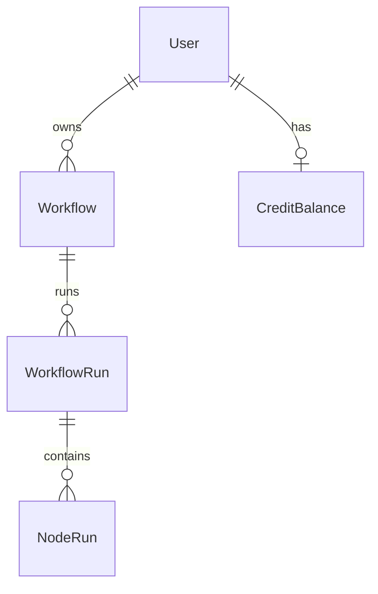

# Database

Galaxy persists data in **PostgreSQL** via Prisma in the **galaxy-temp-backend** repo. The frontend does not connect to the database directly; it calls `/api/*` (proxied to the backend). This document describes the schema evaluators need when reading API responses and history UI.

**Authoritative schema:** `galaxy-temp-backend/prisma/schema.prisma`  
**Full reference:** same file in the backend repo at `docs/DATABASE.md`

---

## Overview

| Model | Purpose |
|-------|---------|
| `User` | Clerk `userId` as primary key |
| `Workflow` | Saved graph (`nodes`, `edges` JSON), webhooks, status |
| `WorkflowRun` | One execution; scope, status, `orchestratorRunId`, `inputValues` |
| `NodeRun` | Per-node status, I/O, provider audit, `creditCost` |
| `CreditBalance` | User balance in **microcredits** (1M = 1.00 credit) |
| `CreditLedger` | Hold, deduction, refund, initial grant |
| `ApiKey` | Dashboard API keys (masked) |



---

## What the frontend reads

| UI | API / data |
|----|------------|
| Dashboard workflow list | `GET /api/workflows` |
| Canvas graph | `GET/PATCH /api/workflows/[id]` — `nodes`, `edges` |
| Run / history | `GET /api/workflows/[id]/history` — `WorkflowRun` + `NodeRun[]` |
| Live run | Trigger `useRealtimeRun(orchestratorRunId)` metadata; restore via active run + node-runs |
| Credit badge | `GET /api/credits/balance` |
| Cost estimate | Computed client-side from synced `@galaxy/shared` `credits.base` |

**Not in DB:** canvas viewport ( `localStorage` ). **Not per run yet:** graph snapshot at execution time.

---

## `NodeRun` fields used in UI

History panel and run modals display:

- `status`, `durationMs`, `inputs`, `output`
- `providerUsed`, `providerAttempts`, `logs`, `creditCost`
- `error` on failure

`providerAttempts` is JSON: list of `{ providerId, status, durationMs, error? }`.

---

## Credits (display)

- Balance from API is in **microcredits**.
- Canvas estimate: `estimateWorkflowCostMillions` → show as `~X.XXM` (÷ 1_000_000).
- Per-run credits in history sum `NodeRun.creditCost`.

Hold/reconcile logic runs only on the backend (`lib/credits.ts`).

---

## Local setup

Database commands run in **galaxy-temp-backend**:

```bash
pnpm db:push
pnpm db:seed
```

See backend `docs/DATABASE.md` for ER diagram, ledger types, and reconcile flow.
