# Thinkly Future Growth & Disruption Strategy

**Version:** 1.0 · **Date:** June 2026  
**Audience:** Founders, YC application, engineering roadmap, M&A narrative  
**Companion docs:** `docs/SYSTEM_DEEP_DIVE.md`, `learning/CHAT_SYSTEM_DESIGN.md` (local), `design_decisions.md`

---

## Table of contents

1. [Executive summary](#1-executive-summary)
2. [North star: what we are (and are not)](#2-north-star-what-we-are-and-are-not)
3. [The unique product thesis](#3-the-unique-product-thesis)
4. [Current platform base (what we already built)](#4-current-platform-base-what-we-already-built)
5. [Market context & sizing](#5-market-context--sizing)
6. [Competitive landscape](#6-competitive-landscape)
7. [Why competitors fail — and how we win](#7-why-competitors-fail--and-how-we-win)
8. [Product architecture: layers & flow](#8-product-architecture-layers--flow)
9. [Complementary capabilities (MVP → platform)](#9-complementary-capabilities-mvp--platform)
10. [Vertical wedges & GTM](#10-vertical-wedges--gtm)
11. [Acquisition & strategic buyer map](#11-acquisition--strategic-buyer-map)
12. [Technology stack & implementation phases](#12-technology-stack--implementation-phases)
13. [YC pitch playbook (per phase)](#13-yc-pitch-playbook-per-phase)
14. [Risks, moat timeline, and follow-ups](#14-risks-moat-timeline-and-follow-ups)
15. [Research bibliography](#15-research-bibliography)
16. [Out-of-the-box thesis: The Sparkline](#16-out-of-the-box-thesis-what-people-actually-need-beyond-infrastructure)
17. [YC cohort scan (W25–W26)](#17-yc-cohort-scan-last-4-5-batches-what-they-solve-vs-whats-empty)
18. [Eight unique Sparkline propositions](#18-eight-unique-sparkline-propositions-pitch-ready)
19. [Proposition comparison matrix](#19-proposition-comparison-matrix)
20. [Recommended GTM stack](#20-recommended-go-to-market-stack-simple-for-users-deep-under-hood)
21. [YC pitch reframing (Sparkline + GCR)](#21-yc-pitch-reframing-sparkline--gcr)
22. [Additional bibliography (§16–21)](#22-additional-research-bibliography-16-21)
23. [Deep dive: Shram AI & Activepieces](#23-deep-dive-shram-ai--activepieces)
24. [Vertical Opportunity Map: 24 Sparklines](#24-vertical-opportunity-map-24-sparklines-beyond-18)
25. [Meta-theses: Credential Economy & Catalog Factories](#25-meta-theses-credential-economy-catalog-factories-moment-os)
26. [Audience projection matrix](#26-audience-projection-normal-users-professionals-companies)
27. [Dark-horse wedge picks for YC](#27-dark-horse-wedge-picks-for-yc-2026-filter)
28. [Bibliography (§24–27)](#28-bibliography-24-27)
29. [The one product (emulsified)](#29-the-one-product-emulsified--why-verticals-are-templates-not-the-company)
30. [Default blueprint: “Finish My Idea”](#30-default-blueprint-finish-my-idea-product-skeleton)
31. [Document audit: what to lead vs plumbing](#31-document-audit-what-to-lead-vs-plumbing)
32. [Higher-level unique ideas (7 iterations)](#32-higher-level-unique-ideas-seven-iterations)
33. [Impact niches — researched & ranked](#33-impact-niches-researched-ranked)
34. [Master narrative synthesis](#34-master-narrative-synthesis)
35. [Blunt truth: escaping the W26 workflow pile](#35-blunt-truth-escaping-the-w26-workflow-pile)
36. [Sendable refined: discreet, private, honestly moated](#36-sendable-refined-discreet-private-honestly-moated)
37. [Platform moats beyond Sendable (defendable)](#37-platform-moats-beyond-sendable-defendable)
38. [Pressure test: will this actually work?](#38-pressure-test-will-this-actually-work)
39. [Strategic recommendation: what to do now](#39-strategic-recommendation-what-to-do-now)
40. [Production system blueprint (whole picture)](#40-production-system-blueprint-whole-picture)
    - [40.16 Production technology complement audit](#4016-production-technology-complement-audit-what-40-missed)
41. [Sharpened product idea — what Thinkly actually is (refined)](#41-sharpened-product-idea--what-thinkly-actually-is-refined)
42. [Full production system blueprint v2 — real stack, real difficulty to copy](#42-full-production-system-blueprint-v2--real-stack-real-difficulty-to-copy)
43. [The B2B case: software businesses run on](#43--the-b2b-case-software-businesses-run-on)
    - [43.1 The agency problem in plain language](#431-the-agency-problem-in-plain-language)
    - [43.2 Three B2B profiles](#432-three-b2b-profiles)
    - [43.3 The B2B feature roadmap](#433-the-b2b-feature-roadmap)
    - [43.4 Pricing architecture](#434-pricing-architecture)
    - [43.5 GTM into agencies — three entry points](#435-gtm-into-agencies--three-entry-points)
    - [43.6 B2B validation test](#436-b2b-validation-test-parallel-to-consumer-cohort)
    - [43.7 Why this is the "stays" side of the line](#437-why-this-is-the-stays-side-of-the-line)

---

## 1. Executive summary

Thinkly should not compete as “another node canvas for AI creatives.” That lane is crowded, well-funded, and already consolidating:

- **Figma** acquired **Weavy → Figma Weave** (Oct 2025) for node-based multi-model creative pipelines ([Figma blog](https://www.figma.com/blog/welcome-weavy-to-figma/)).
- **Adobe** shipped **Project Graph** at MAX 2025 — node workflows that become shareable “Capsules” inside Creative Cloud ([Adobe blog](https://blog.adobe.com/en/publish/2025/11/25/introducing-project-graph-creative-workflows-reimagined)).
- **Canva** acquired **Simtheory + Ortto** (Apr 2026) to own agentic AI + marketing automation end-to-end ([TechCrunch](https://techcrunch.com/2026/04/08/canva-doubles-down-on-ai-and-marketing-automation-with-simtheory-ortto-acquisitions/)).
- **Magnific Spaces**, **Wireflow**, **ComfyUI App Mode**, and **Magica** (formerly Galaxy AI) all target visual multi-step creative generation.

**What we sell:** **Sparkline** — finish your creative idea (talk to Brain or tinker on canvas) and get a **polished pack** you’re proud to send (§16, §29).

**What we build under that:** Trigger.dev orchestration, Brain + MCP (chat builds graphs), canvas handoff, blueprint graphs, Barba workspace shell — plus **platform plumbing** (microcredit ledger, per-node run records, optional approvals/provenance) so multi-step runs behave predictably at scale. **The ledger is not the pitch** — it is infrastructure every serious pipeline needs, similar to how Stripe powers checkout but nobody buys Shopify “because of auth capture.” See §29.7.

| Layer | Role | Primary sell? |
|-------|------|----------------|
| **Finish-line UX** | Brain chat → pack; canvas optional | **Yes — this is the product** |
| **Chat → graph → run** | MCP + orchestrator + realtime in chat | **Yes — simple + studio modes** |
| Canvas / models | Pro creative control | Supporting (studio mode) |
| Runtime + credit ledger | Holds, reconcile on cancel, usage visibility | **Plumbing** — needed, not differentiated alone |
| MCP / API | Agents and integrations run your graphs | Supporting (distribution) |
| Approvals + provenance export | Enterprise compliance | Addon for org tier |

**MVP wedge (revenue in 90 days):** Ship **§30 “Finish My Idea”** template + Brain — one general flow; optional pitch or product sub-templates in gallery.

**Vision:** The default place creative work **actually finishes** — templates for speed, canvas for craft, plumbing for reliability when teams scale.

---

## 2. North star: what we are (and are not)

### We are

- A **governed execution runtime** for multi-modal AI pipelines (image, video, audio, LLM).
- An **MCP-native creative control plane** — agents propose and execute; the runtime enforces policy.
- A **microcredit-native billing primitive** — holds per run, reconcile on node success, refund on cancel (already in `thinkly-backend/lib/credits.ts`).
- A **blueprint system** — versioned graphs with inspectable node-runs (Observatory/replay).
- A **workspace** where Flow, Chat, and Playground are one product (Barba shell + Dynamic Island).

### We are not (positioning)

| Avoid positioning as | Why |
|------------------------|-----|
| “Magica / Galaxy clone” | Agent + model aggregation; weak moat; Magica already MCP + agent-first ([Medium, May 2026](https://medium.com/tanda-ai-art-library/how-magica-is-turning-ai-tools-into-autonomous-creative-pipelines-ddbdbee8f5cf)) |
| “Sim for creatives” | Sim (YC X25, $7M Series A) owns horizontal agent DAGs + observability ([YC](https://www.ycombinator.com/companies/sim), [HN launch](https://news.ycombinator.com/item?id=46234186)) |
| “Another infinite canvas” | Magnific Spaces, Wireflow, Weave — infinite canvas is table stakes ([Magnific Spaces](https://www.magnific.com/spaces)) |
| “AI wrapper SaaS” | 16% of 2025 startup shutdowns were AI wrappers with no data moat ([SimpleClosure analysis, 2025](https://www.linkedin.com/posts/itamarnovick_simpleclosure-just-released-the-2025-startup-activity-7417987759791063040-fA26)) |

### One-line pitch

**Public (use this):** *“Finish what you started — talk or tinker, get a pack you’re proud to send.”* (§29, §34)

**Retired investor shorthand:** “Stripe + Git for creative AI pipelines…” — over-indexes ledger/MCP; see §31 audit.

---

## 3. The unique product thesis

### 3.1 Problem (2026)

Enterprises adopted agents faster than they adopted **governance** for creative output:

1. **Spend chaos** — GitHub Copilot moved to pooled AI credits; CFOs need caps per team ([GitHub Docs](https://docs.github.com/copilot/concepts/billing/usage-based-billing-for-organizations-and-enterprises)). Creative AI is worse: video models cost orders of magnitude more than text tokens ([Zenskar CFO guide](https://www.zenskar.com/blog/token-based-pricing)).
2. **Agent sprawl** — Salesforce Agentforce (18,500 customers, 3B+ monthly workflows), HubSpot Breeze, Canva Simtheory — agents *execute* but creative media is still a black box ([Dupple, May 2026](https://dupple.com/blog/marketing-news-today)).
3. **Liability cliff** — EU AI Act Article 50 transparency enforceable **Aug 2, 2026** — machine-readable marking, provenance, disclosure ([EU digital strategy](https://digital-strategy.ec.europa.eu/en/policies/regulatory-framework-ai), [SoftwareSeni C2PA urgency](https://www.softwareseni.com/eu-ai-act-and-content-provenance-regulations-making-c2pa-urgent-in-2026/)).
4. **Tool fragmentation** — Figma Weave’s thesis: creatives juggle Figma, Midjourney, Runway, Photoshop ([LinkedIn synthesis](https://www.linkedin.com/posts/mehmetturan_figma-acquires-weavy-a-workflow-tool-with-activity-7390312100587302912-6h3P)). Agents don’t fix fragmentation if each hop is ungoverned.

### 3.2 Insight

**The scarce asset is not another model router — it is trusted execution.**

When Figma bought Weavy, they bought **reproducible creative process on a canvas**. When Adobe built Project Graph, they bought **workflows as shareable Capsules**. Neither productized:

- Per-run **credit holds** with partial capture on cancel
- **Per-node audit ledger** tied to model + parameters + cost
- **Human-in-the-loop interrupts** at graph nodes (not just chat)
- **MCP exposure** of *your* workflows as governed tools for external agents
- **Provenance package export** (C2PA manifest + JSON audit) per asset

Thinkly’s orchestrator + credits + MCP already implement 3 of 5. The GCR thesis completes the story.

### 3.3 The four primitives (unique stack)

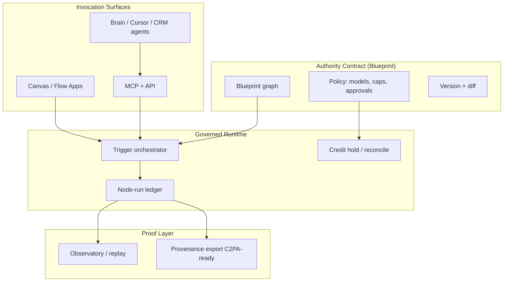
```mermaid
flowchart TB
  subgraph Authority["Authority Contract (Blueprint)"]
    B[Blueprint graph]
    P[Policy: models, caps, approvals]
    V[Version + diff]
  end

  subgraph Runtime["Governed Runtime"]
    O[Trigger orchestrator]
    H[Credit hold / reconcile]
    N[Node-run ledger]
  end

  subgraph Surfaces["Invocation Surfaces"]
    UI[Canvas / Flow Apps]
    MCP[MCP + API]
    AG[Brain / Cursor / CRM agents]
  end

  subgraph Proof["Proof Layer"]
    OBS[Observatory / replay]
    PRV[Provenance export C2PA-ready]
  end

  B --> O
  P --> H
  O --> N
  UI --> O
  MCP --> O
  AG --> MCP
  N --> OBS
  N --> PRV
```

#### Primitive 1 — Blueprint as authority contract

A blueprint is not “saved nodes.” It is a **policy-bearing artifact**:

- Allowed node types / model routes (provider chain from `@thinkly/shared`)
- Max spend per run / per day (microcredits)
- Required approval nodes before publish/export nodes
- Input schemas (request fields → `requestInputs` node)

**Differentiator vs chat agents:** Magica’s agent plans in natural language; if the plan drifts, spend and liability drift with it. Blueprint + runtime = **machine-enforceable** policy.

#### Primitive 2 — Microcredit ledger as CFO primitive

Already implemented: estimate → hold → per-node debit → reconcile/refund.

**Productize for enterprise:**

- Team pools (like Copilot Enterprise credit pools)
- Per-workflow budgets
- “Agent spend” vs “human spend” attribution (MCP session key → ledger row)

**Differentiator vs flat subscriptions:** AI wrapper startups die on unit economics when API cost > subscription ([Baytech executive playbook](https://www.baytechconsulting.com/blog/why-generic-ai-startups-are-dead-executive-playbook-moats)).

#### Primitive 3 — Reverse MCP (workflows as governed tools)

Pattern validated by CARTO, Google Gemini Agent Platform, mcp-agent ([CARTO MCP blog](https://carto.com/blog/carto-mcp-server-turn-your-ai-agents-into-geospatial-experts/), [Google Cloud MCP docs](https://docs.cloud.google.com/gemini-enterprise-agent-platform/reference/use-agent-platform-mcp)).

Thinkly twist: each published workflow becomes an MCP tool **`run_blueprint_<slug>`** with:

- JSON schema from request fields
- Automatic credit check before execution
- Streaming node results via existing SSE/token path

**Use case:** Marketing ops keeps Salesforce Agentforce; creative execution stays in Thinkly with budgets. Agentforce doesn’t need Runway keys — it calls Thinkly MCP.

#### Primitive 4 — Provenance from execution ledger

EU AI Act expects: model ID, generation parameters, human review, tamper-evident records ([Augment Code EU guide](https://www.augmentcode.com/guides/eu-ai-act-2026)).

Thinkly’s node-run table **is** the audit trail. Export path:

- JSON manifest per asset (workflow version, node path, model, prompt hash, timestamps, credit cost)
- Optional C2PA Content Credentials embedding on export nodes
- Human approval events from HITL nodes

**Differentiator vs post-hoc labeling:** Provenance captured at execution, not pasted on after export.

### 3.4 Named product concepts (unique uses of our base)

| Concept | What it is | Why unique |
|---------|------------|------------|
| **Authority Gates** | LangGraph-style `interrupt()` at specific nodes; resume via Brain or Slack/email | HITL on **graph**, not chat ([LangGraph HITL patterns](https://subagentic.ai/howtos/langgraph-human-in-the-loop-agentic-workflows/)) |
| **Spend Capsules** | Adobe “Capsules” meet Stripe: packaged blueprint + UI + **hard budget envelope** | Figma Weave Capsules lack enterprise ledger ([Adobe Project Graph](https://blog.adobe.com/en/publish/2025/11/25/introducing-project-graph-creative-workflows-reimagined)) |
| **Creative Treasury** | Finance dashboard: pools, forecasts, agent attribution | CFO playbook for usage billing ([BillingPlatform UBB](https://billingplatform.com/whitepaper/cfo-playbook-ubb)) |
| **Blueprint Exchange** | Marketplace of governed templates (credits flow to author) | ComfyHub shares graphs; we share **runnable + billed** apps ([Comfy App Mode](https://blog.comfy.org/p/from-workflow-to-app-introducing)) |
| **Agent Handoff Protocol** | Brain proposes blueprint diff → human accepts in Playground via Barba + Island | Honeycomb Canvas shows investigations; we show **creative diffs** with execution preview |

### 3.5 Hero user story (unique, not Observatory)

> **Head of Creative Ops at a 200-person e-commerce brand**

1. Agency builds “SKU → 6 ad variants” blueprint in Playground.
2. Ops sets **$50/run cap**, **Flux not SDXL**, **legal approval node** before export.
3. Salesforce Agentforce (post-Qualified acquisition) receives “new spring collection” campaign task.
4. Agent calls **Thinkly MCP** `run_blueprint_spring_ads` with product URLs — not individual model APIs.
5. Run pauses at legal gate; lawyer approves in Thinkly mobile/web notification.
6. Assets export with **provenance JSON** for EU retailer partners.
7. Finance sees **agent-attributed spend** in Creative Treasury — not a surprise OpenRouter invoice.

Observatory helps debug step 4. It is not the product. **GCR is the product.**

---

## 4. Current platform base (what we already built)

### 4.1 Two-repo architecture

| Repo | Role |
|------|------|
| `thinkly-frontend` | Next.js workspace UI, canvas (`@xyflow/react`), Barba transitions, realtime run UI |
| `thinkly-backend` | Prisma/Postgres, Trigger.dev orchestrator, MCP route, credits, public API `/api/v1/*` |

Frontend rewrites `/api/*` → backend. Shared node definitions synced via `pnpm sync-shared`.

### 4.2 Execution spine (moat foundation)

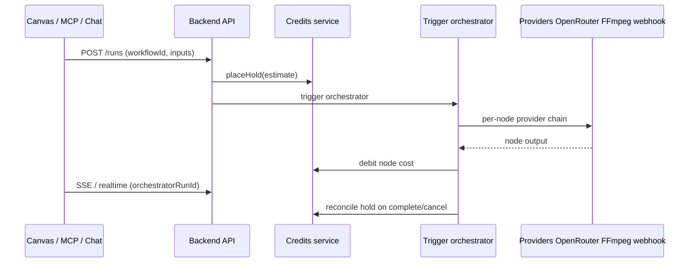
```mermaid
sequenceDiagram
  participant UI as Canvas / MCP / Chat
  participant API as Backend API
  participant CR as Credits service
  participant TR as Trigger orchestrator
  participant PR as Providers OpenRouter FFmpeg webhook

  UI->>API: POST /runs (workflowId, inputs)
  API->>CR: placeHold(estimate)
  API->>TR: trigger orchestrator
  TR->>PR: per-node provider chain
  PR-->>TR: node output
  TR->>CR: debit node cost
  UI->>API: SSE / realtime (orchestratorRunId)
  TR->>CR: reconcile hold on complete/cancel
```

Key paths: `trigger/workflowOrchestrator.ts`, `lib/credits.ts`, `trigger/provider-chain.ts`.

### 4.3 MCP server (agent surface)

- Hosted: `POST /api/mcp` — 20 tools proxying `/api/v1/*` with `gx_` bearer
- Catalog: `lib/mcp/node-catalog.ts`, `lib/mcp-tools.ts`
- **Gap to close:** mint `publicAccessToken` on `POST /api/v1/runs` for client SSE (today internal `node-runs/token`)

### 4.4 Workspace shell (UX moat for pros)

- Barba dual-root transitions (`lib/workspace/transitions.ts`)
- Persistent Dynamic Island (`WorkspacePersistentIsland`) — Flow ↔ Chat ↔ Playground without losing run context
- Documented in `design_decisions.md` §7–9

### 4.5 Chat (designed, not shipped)

Three modes in `learning/CHAT_SYSTEM_DESIGN.md`:

1. **Node Helper** — catalog in context
2. **Thinkly Chat** — blueprint authoring
3. **Brain** — per-workflow MCP agent, read-only canvas in chat, edit handoff via Barba

Stack planned: Vercel AI SDK v5 + OpenRouter + `@ai-sdk/mcp` + Mem0 later.

### 4.6 What we lack vs vision

| Capability | Status |
|------------|--------|
| Chat persistence / threads | Mock UI only |
| HITL interrupt nodes | Not in graph engine |
| Flow Apps (publish blueprint as app) | `readOnly` canvas exists; no App Builder |
| C2PA export | Not built |
| Team credit pools | Single-user ledger |
| Blueprint Exchange | Not built |
| `publicAccessToken` on run create | Gap documented |

---

## 5. Market context & sizing

### 5.1 TAM layers

| Market | 2026 estimate | Source |
|--------|---------------|--------|
| Generative AI in digital marketing | $4.35B → $13.25B by 2030 (32% CAGR) | [Research and Markets](https://www.researchandmarkets.com/reports/6226201/generative-ai-in-digital-marketing-market-report) |
| Creative automation AI | $8.4B → $42.6B by 2034 (19.6% CAGR) | [DataIntelo](https://dataintelo.com/report/creative-automation-ai-market) |
| Marketing automation software | $8.2B → $19.1B by 2033 | [Persistence MR](https://www.persistencemarketresearch.com/market-research/marketing-automation-software-market.asp) |
| Enterprise agentic AI (CRM) | Agentforce 18.5k customers, 3B workflows/month | [Dupple](https://dupple.com/blog/marketing-news-today) |

**SAM (realistic):** Governed creative execution for mid-market brands + agencies — **$2–5B** (orchestration + compliance slice of creative automation).

**SOM (3-year):** Vertical wedge e-commerce ad packs + agency seats — **$20–80M ARR** at 500–2,000 paying orgs.

### 5.2 Timing catalysts

1. **Aug 2026 EU AI Act Article 50** — provenance becomes procurement requirement, not nice-to-have.
2. **Agent M&A wave** — Salesforce (Qualified), Canva (Simtheory), Figma (Weavy) — buyers need **execution layers** for media, not just text agents.
3. **Usage-based pricing norm** — 61–70% of SaaS moving to usage/credits ([Stigg](https://www.stigg.io/blog-posts/usage-based-pricing), Gartner cited therein).
4. **YC batch signal** — vertical workflow agents (Semble construction, Ressl field services) beat horizontal wrappers ([YC Semble](https://www.ycombinator.com/companies/semble-ai), [Ressl W26](https://www.ycombinator.com/companies/ressl-ai)).

---

## 6. Competitive landscape

### 6.1 Matrix (2026)

| Player | Category | Strengths | Weakfalls | Thinkly counter |
|--------|----------|-----------|-----------|-----------------|
| **Figma Weave** | Node canvas + multi-model | Brand, craft, Capsules, Sora/Veo/Flux ([weave.figma.com](https://weave.figma.com/)) | Separate billing from Figma; creator-focused; weak enterprise ledger ([FAQ](https://help.figma.com/hc/en-us/articles/35965787376919-Figma-Weave-FAQ)) | GCR + MCP for **orgs**; prove spend & provenance |
| **Adobe Project Graph** | CC-native workflows | Distribution, Firefly, enterprise DAM | Closed ecosystem; slow to ship; Adobe stack lock-in | Open MCP + API; neutral runtime |
| **Canva + Simtheory** | Design → full marketing OS | 11k Ortto customers, agent infra ([BusinessWire Apr 2026](https://www.businesswire.com/news/home/20260408469702/en/Canva-Acquires-Simtheory-and-Ortto-Boosting-AI-and-Marketing-Power)) | Canva creative ≠ developer-grade orchestration; acquisition integration risk | **Embed/runtime** inside Canva-class partners |
| **Magica (Galaxy AI)** | Agent + model hub | Agent-first, MCP, 3000+ models narrative ([Medium](https://medium.com/tanda-ai-art-library/how-magica-is-turning-ai-tools-into-autonomous-creative-pipelines-ddbdbee8f5cf)) | Wrapper risk; opaque agent plans; unclear enterprise audit | Blueprint authority + ledger |
| **Sim (YC X25)** | Agent workflow builder | 27k GitHub stars, HITL, MCP, traces ([Sim](https://www.ycombinator.com/companies/sim)) | General-purpose; not creative/media depth; not credit-native for video | Vertical creative + microcredit video economics |
| **Magnific Spaces** | Infinite canvas workflows | Templates, team collab, Workflow Apps ([docs](https://www.magnific.com/ai/docs/spaces-overview)) | Credit bundles; 3-space limits on free tier; Freepik ecosystem | Unlimited governed runs; API deployment |
| **Wireflow** | Canvas + API deploy | 15+ models, pay-per-use, unlimited spaces ([wireflow.ai](https://www.wireflow.ai/freepik-spaces-alternative)) | Less agent/MCP story; younger brand | MCP + agent governance |
| **ComfyUI App Mode** | Open workflow → app | ComfyHub, URL sharing, OSS community ([Comfy blog Mar 2026](https://blog.comfy.org/p/from-workflow-to-app-introducing)) | Ops burden; no managed ledger; technical users | Managed GCR with same “app” UX |
| **Activepieces (YC S22)** | OSS Zapier + MCP toolkit | MIT, self-host, 22k+ stars, flows as MCP tools ([YC](https://www.ycombinator.com/companies/activepieces)) | Linear builder; app plumbing not creative craft; runtime limits | Multi-modal **completion** + credit governance (§23) |
| **Shram AI** | AI EA / meta-work | Gmail/WhatsApp follow-ups, on-device memory ([shram.ai](https://www.shram.ai/)) | Not creative production; request access | Partner: Shram reminds → Thinkly finishes artifact |
| **n8n / Zapier AI** | Integration automation | 1000s connectors | Not media pipeline native; weak creative provenance | Creative-specific runtime |
| **Cloudinary / Mux** | Media infra + DAM | Scale, CDN, Indivio automation ([Cloudinary](https://cloudinary.com/guides/alternative/mux-alternative)) | Not agent orchestration layer | Partner: we execute; they store/deliver |
| **Zeely / Adwisely** | Shopify ad tools | Fast Meta launch ([Zeely](https://zeely.ai/blog/best-shopify-apps-to-increase-your-sales-in-2026/)) | Black-box creatives; no custom pipelines | Governed blueprint per brand |

### 6.2 Positioning map

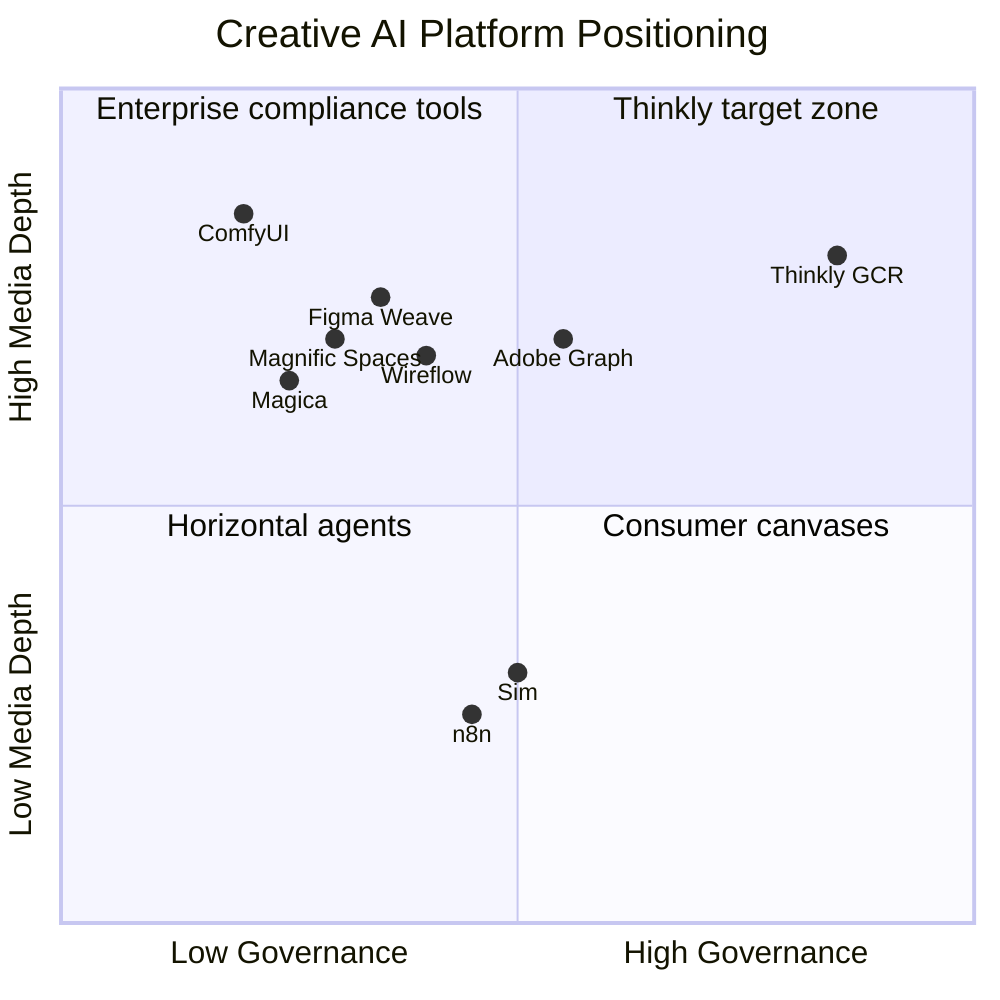
```mermaid
quadrantChart
  title Creative AI Platform Positioning
  x-axis Low Governance --> High Governance
  y-axis Low Media Depth --> High Media Depth
  quadrant-1 Thinkly target zone
  quadrant-2 Enterprise compliance tools
  quadrant-3 Horizontal agents
  quadrant-4 Consumer canvases
  Figma Weave: [0.35, 0.75]
  Adobe Graph: [0.55, 0.70]
  Magica: [0.25, 0.65]
  Sim: [0.50, 0.30]
  Magnific Spaces: [0.30, 0.70]
  Wireflow: [0.40, 0.68]
  ComfyUI: [0.20, 0.85]
  Thinkly GCR: [0.85, 0.80]
  n8n: [0.45, 0.25]
```

---

## 7. Why competitors fail — and how we win

### 7.1 Failure patterns (research-backed)

| Pattern | Evidence | Thinkly response |
|---------|----------|------------------|
| **API wrapper, no moat** | 16% of 2025 shutdowns were AI cos without data moat; Series A shutdowns 2.5× YoY ([Novick / SimpleClosure](https://www.linkedin.com/posts/itamarnovick_simpleclosure-just-released-the-2025-startup-activity-7417987759791063040-fA26)) | Ledger + blueprint versions = accumulated **execution data** (cost, failure rates, model routes) |
| **Flat sub vs token economics** | Founders reprice within months; margins unclear ([Zenskar](https://www.zenskar.com/blog/token-based-pricing)) | Native microcredits; margin on orchestration fee + credit markup |
| **Sherlocked by platform** | OpenAI AgentKit, Canva agents, Shopify Sidekick ([OpenAI vs n8n vs Sim](https://www.sim.ai/blog/openai-vs-n8n-vs-sim)) | Be the **neutral runtime** platforms embed via MCP/API |
| **Canvas without compliance** | EU Aug 2026 deadline ([EU AI Act](https://digital-strategy.ec.europa.eu/en/policies/regulatory-framework-ai)) | Provenance export from node-runs |
| **Agent without visibility** | Magica agent black-box multi-step | Observable graph + Observatory replay |
| **Integration spaghetti** | 70% plumbing in n8n-class tools ([LinkedIn automation comparison](https://www.linkedin.com/posts/dmitry-gomel-engineering-executive_automation-tools-with-agentic-llm-support-activity-7413948729608761344-wxcH)) | Creative-native nodes, not 1000 generic blocks |

### 7.2 Moat timeline

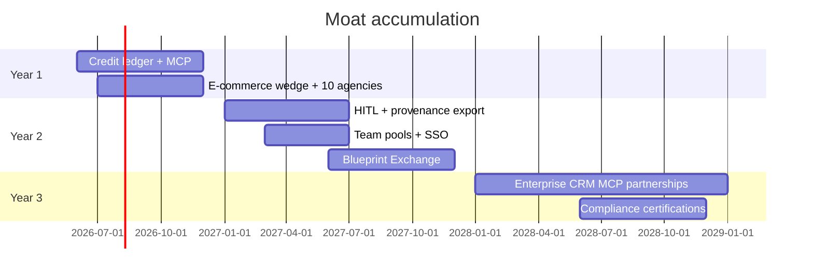
```mermaid
gantt
  title Moat accumulation
  dateFormat YYYY-MM
  section Year 1
  Credit ledger + MCP           :2026-06, 6M
  E-commerce wedge + 10 agencies  :2026-07, 5M
  section Year 2
  HITL + provenance export      :2027-01, 6M
  Team pools + SSO              :2027-03, 4M
  Blueprint Exchange            :2027-06, 6M
  section Year 3
  Enterprise CRM MCP partnerships :2028-01, 12M
  Compliance certifications       :2028-06, 6M
```

---

## 8. Product architecture: layers & flow

### 8.1 Layer model

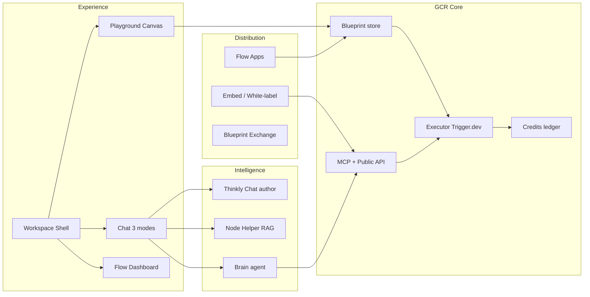
```mermaid
flowchart LR
  subgraph Experience
    W[Workspace Shell]
    F[Flow Dashboard]
    C[Chat 3 modes]
    P[Playground Canvas]
  end

  subgraph GCR Core
    BP[Blueprint store]
    EX[Executor Trigger.dev]
    CR[Credits ledger]
    MCP[MCP + Public API]
  end

  subgraph Distribution
    APP[Flow Apps]
    EMB[Embed / White-label]
    MKT[Blueprint Exchange]
  end

  subgraph Intelligence
    BR[Brain agent]
    NH[Node Helper RAG]
    TC[Thinkly Chat author]
  end

  W --> F & C & P
  P --> BP
  C --> BR & NH & TC
  BR --> MCP
  BP --> EX
  EX --> CR
  MCP --> EX
  APP --> BP
  EMB --> MCP
```

### 8.2 User journey (MVP → vision)

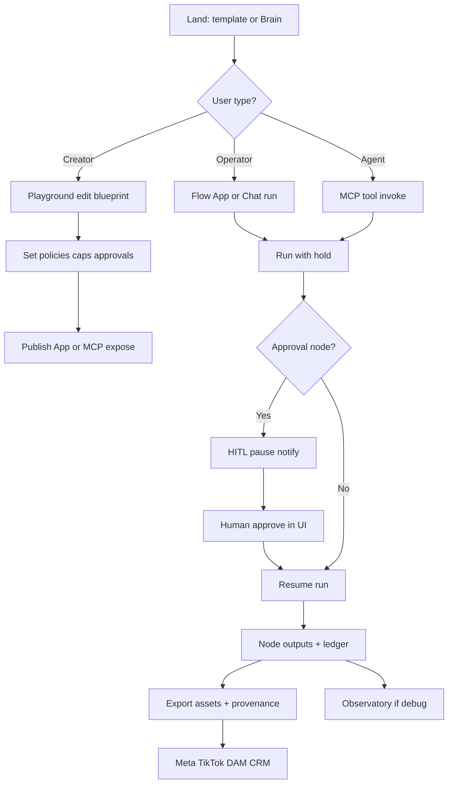
```mermaid
flowchart TD
  A[Land: template or Brain] --> B{User type?}
  B -->|Creator| C[Playground edit blueprint]
  B -->|Operator| D[Flow App or Chat run]
  B -->|Agent| E[MCP tool invoke]
  C --> F[Set policies caps approvals]
  F --> G[Publish App or MCP expose]
  D --> H[Run with hold]
  E --> H
  H --> I{Approval node?}
  I -->|Yes| J[HITL pause notify]
  J --> K[Human approve in UI]
  K --> L[Resume run]
  I -->|No| L
  L --> M[Node outputs + ledger]
  M --> N[Export assets + provenance]
  M --> O[Observatory if debug]
  N --> P[Meta TikTok DAM CRM]
```

---

## 9. Complementary capabilities (MVP → platform)

These **amplify GCR** but are not the core thesis alone.

### 9.1 Three chat modes

| Chat | Role | GCR link |
|------|------|----------|
| Node Helper | Catalog / RAG for nodes | Reduces bad graphs → fewer failed holds |
| Thinkly Chat | NL → blueprint JSON | Authoring surface for authority contracts |
| Brain | MCP agent per workflow | **Governed** agent — tools = MCP, spend = ledger |

### 9.2 Flow Apps (Comfy App Mode pattern)

- App Builder: expose request fields + hide graph ([Comfy docs](https://docs.comfy.org/interface/app-mode))
- Share URL + embed iframe
- **Plus:** per-app credit policy and provenance template

### 9.3 Run Observatory + replay

- Production debugging for node failures
- **Plus:** replay with diff against blueprint version (regression testing for creative pipelines)

### 9.4 MCP as product surface

- Cursor/Claude Desktop parity
- Session keys via Unkey (planned in chat RFC)
- Rate limits per key → attribution in Creative Treasury

### 9.5 Blueprint audit + provenance

- Immutable run record: `workflowVersion`, `nodeRunId`, `model`, `inputHash`, `microcredits`, `approvedBy`
- Export: JSON + optional C2PA ([C2PA urgency](https://www.softwareseni.com/eu-ai-act-and-content-provenance-regulations-making-c2pa-urgent-in-2026/))

### 9.6 Embed / white-label API

- Agencies resell governed runtimes to clients
- Revenue: platform fee + credit markup

### 9.7 Feature priority matrix

| Feature | MVP | V1 | Vision | Moat contribution |
|---------|-----|-----|--------|-------------------|
| Brain + MCP run in chat | ✓ | | | High |
| Credit holds (existing) | ✓ | | | High |
| E-commerce ad wedge | ✓ | | | Revenue |
| Flow Apps lite | | ✓ | | Distribution |
| HITL nodes | | ✓ | | Governance |
| Provenance export | | ✓ | | Compliance |
| Observatory | | ✓ | | Ops |
| Team credit pools | | | ✓ | Enterprise |
| Blueprint Exchange | | | ✓ | Network |
| C2PA embedding | | | ✓ | Compliance |

---

## 10. Vertical wedges & GTM

### 10.1 Primary wedge: E-commerce ad factory

**ICP:** Shopify brands $2M–$50M revenue, 5–50 SKUs/month creative refresh.

**Workflow:** Product URL / catalog CSV → scrape images → lifestyle scenes → 15s video → VO → captions → aspect variants.

**Why now:** Shopify Agentic Commerce + Sidekick Pulse monitor ROAS and propose creative shifts ([Shopify 2026 guide](https://wearepresta.com/shopify-ai-the-definitive-strategic-blueprint-for-2026/)) — but **execution** of new creatives is still fragmented (Zeely, Adwisely, manual).

**GTM:**

1. 5 design partners (agencies with 10+ Shopify clients)
2. Template marketplace seed: 20 blueprints
3. Shopify app (catalog sync) — Phase 2
4. Case study: cost per asset vs agency + time to launch

**Pricing:** Platform $199–499/mo + credits (usage); agency tier $999/mo + pooled credits.

### 10.2 Secondary wedges

| Vertical | Blueprint | Buyer |
|----------|-----------|-------|
| **Localization** | Video → translate VO + lip-sync + subtitle burn | Media companies EU |
| **Real estate** | Listing photos → staged video tours | Prop tech |
| **UGC for SaaS** | Feature screenshot → demo video + changelog clip | PLG SaaS marketing |
| **Agency white-label** | Client-branded Flow Apps | Creative agencies |

### 10.3 GTM flow


```mermaid
flowchart LR
  PLG[Free templates + MCP] --> AG[Agency partners]
  AG --> ENT[Enterprise SSO pools]
  ENT --> OEM[Embed in CRM DAM]
```

---

## 11. Acquisition & strategic buyer map

### 11.1 Thesis: buyers want **execution + governance**, not another canvas

| Acquirer | Recent moves | What Thinkly offers | Deal shape |
|----------|--------------|---------------------|------------|
| **Figma** | Weavy → Weave; separate credit systems ([pricing](https://weave.figma.com/pricing)) | Enterprise ledger + MCP; **governance layer for Weave** | Tech acqui-hire + integrate GCR under weave |
| **Adobe** | Project Graph, Invoke team, Frame.io ($1.275B historically) | Firefly-agnostic runtime; Capsules with **audit** | Component sale or partnership |
| **Canva** | Simtheory, Ortto, MagicBrief, MangoAI ([TechCrunch](https://techcrunch.com/2026/04/08/canva-doubles-down-on-ai-and-marketing-automation-with-simtheory-ortto-acquisitions/)) | **Media execution** for agentic marketing stack | Acqui-hire if wedge proves ROI metrics |
| **Salesforce** | Agentforce scale; Qualified for SDR agents ([LinkedIn](https://www.linkedin.com/posts/martykihn_agentic-agentforce-rpa-activity-7407844381967368192-MGgA)) | MCP creative tools for campaigns with caps | Partnership → acquire |
| **HubSpot** | Breeze agents, outcome pricing $0.50/conversation ([Dupple](https://dupple.com/blog/marketing-news-today)) | Governed creative runs inside marketing hub | OEM embed |
| **Shopify** | Sidekick, Agentic Commerce, Checkout MCP ([Winter 2026](https://www.controlf5.in/shopify-winter-edition-2026/)) | **Creative execution** for Sidekick Pulse loops | App + strategic investment |
| **Cloudinary** | DAM + Indivio video automation ([Mux vs Cloudinary](https://cloudinary.com/guides/alternative/mux-alternative)) | Orchestration upstream of DAM | Partnership |
| **Atlassian / Notion** | Workflow + AI docs | Embeddable runtime | Less likely near-term |
| **Perplexity / OpenAI** | Agent platforms | Neutral creative tool layer | Strategic partnership |

### 11.2 Competitive acquisition risk

If we stay “canvas only,” **Figma/Adobe/Canva win by default**. If we own **GCR**, we become **acquirable as infrastructure** (like Stripe Treasury, Segment, or Frame.io) rather than as a feature.

### 11.3 M&A readiness checklist

- [ ] 3 enterprise logos with >$50k ARR
- [ ] MCP SLA + audit docs
- [ ] Provenance export used in 1 EU customer contract
- [ ] Clean cap table + IP on orchestrator
- [ ] No single-provider dependency >60% margin exposure

---

## 12. Technology stack & implementation phases

### 12.1 Stack (target)

| Layer | Choice | Notes |
|-------|--------|-------|
| Frontend | Next.js 15, Barba, `@xyflow/react`, Vercel AI SDK v5 | Chat streaming, tool UI |
| Backend | Next API routes, Prisma, Postgres | Existing |
| Orchestration | Trigger.dev v3 | `workflowOrchestrator`, wait tokens |
| Realtime | Trigger realtime + SSE tokens | Close `publicAccessToken` gap |
| LLM routing | OpenRouter | Already in provider chain |
| MCP | `@ai-sdk/mcp`, hosted `/api/mcp` | Brain + external agents |
| Auth keys | Unkey session keys for MCP | Planned |
| Memory | Mem0 or pgvector for Brain | Phase 2 |
| Provenance | `c2pa-node` or Cloudinary signing API | Phase 3 |
| Billing expand | Stripe Billing + usage records | Map microcredits → invoices |
| Observability | Trigger logs + custom Observatory UI | Phase 2 |

### 12.2 Phase 0 — Foundation ( weeks 1–4 )

**Goal:** Brain can run workflows in chat with live node progress.

| Task | Implementation |
|------|----------------|
| Mint SSE token on `POST /api/v1/runs` | Extend run create response; reuse `node-runs/token` logic |
| Vercel AI SDK chat route | `app/api/chat/brain/route.ts` streaming |
| MCP client in Brain | `@ai-sdk/mcp` → `https://.../api/mcp` with user session key |
| Read-only canvas in chat | `Canvas readOnly` + highlight active node from run metadata |
| Barba handoff | Island state preserves `orchestratorRunId` on “Edit in Playground” |

**Exit criteria:** Demo video: Cursor or in-app Brain runs workflow, shows node progress, credits decrement.

### 12.3 Phase 1 — MVP wedge ( weeks 5–12 )

**Goal:** 3 paying agencies on e-commerce ad blueprint.

| Task | Implementation |
|------|----------------|
| Template: SKU → ad pack | 8–12 node blueprint + request fields |
| Product URL input node | Webhook or scraper task |
| Flow App lite | Hide graph; expose 3 inputs (URL, style, aspect) |
| Agency dashboard | Run history + cost per asset |
| Stripe credits top-up | Map packages to microcredits |

### 12.4 Phase 2 — GCR core ( months 4–8 )

| Task | Implementation |
|------|----------------|
| Policy engine on blueprint | JSON schema: `maxMicrocredits`, `allowedNodeTypes`, `modelAllowlist` |
| HITL interrupt node | Trigger `wait.forToken` + notification; resume API |
| Observatory v1 | Timeline from `node_runs`; replay with same inputs |
| Team workspace | Org table; pooled credits |
| Provenance JSON export | Bundle on export nodes |

### 12.5 Phase 3 — Platform ( months 9–18 )

| Task | Implementation |
|------|----------------|
| Blueprint Exchange | Publish template; rev-share credits |
| MCP `run_blueprint_*` dynamic tools | Register published workflows as tools |
| C2PA embed on image/video export | Compliance package |
| Shopify app | Catalog sync → batch runs |
| SSO SAML + audit log export | Enterprise |

### 12.6 Phase diagram

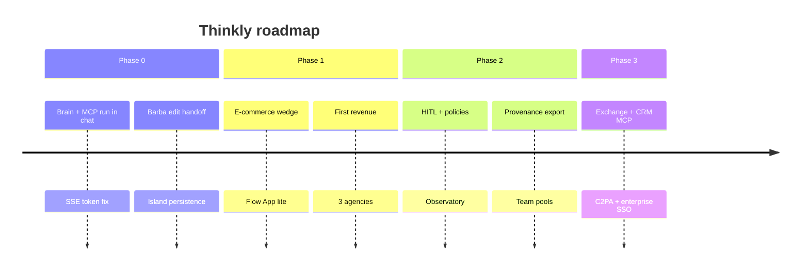
```mermaid
timeline
  title Thinkly roadmap
  section Phase 0
    Brain + MCP run in chat : SSE token fix
    Barba edit handoff : Island persistence
  section Phase 1
    E-commerce wedge : Flow App lite
    First revenue : 3 agencies
  section Phase 2
    HITL + policies : Observatory
    Provenance export : Team pools
  section Phase 3
    Exchange + CRM MCP : C2PA + enterprise SSO
```

---

## 13. YC pitch playbook (per phase)

### Phase 0 — “Does the agent actually run creative pipelines?”

| Question | Answer |
|----------|--------|
| **What do you do?** | Governed runtime for multi-step AI media pipelines; agents invoke via MCP without bypassing budgets. |
| **Why now?** | EU AI Act Aug 2026; agent M&A (Figma, Canva, Salesforce); CFOs demand usage billing. |
| **Who is the customer?** | Creative ops at e-commerce brands and agencies. |
| **How do you know people want this?** | Agencies already stitch 5 tools; Shopify Sidekick proposes creative changes but can’t execute governed pipelines. |
| **What’s your unfair advantage?** | Production orchestrator + microcredit ledger already shipped; not starting from LangGraph demos. |
| **Competitor?** | Figma Weave = canvas; we = authority layer. Sim = horizontal agents; we = creative + credits. |

### Phase 1 — “Will they pay?”

| Question | Answer |
|----------|--------|
| **Revenue?** | $X MRR from N agencies; $Y average credits/month. |
| **CAC / LTV?** | Agency brings 10 clients; one sale → 10 Flow Apps. |
| **Unit economics?** | Z% gross margin after provider cost + orchestration fee. |
| **Why not Canva?** | Canva buys agents (Simtheory); we’re neutral runtime they can embed. |

### Phase 2 — “Is this a company or a feature?”

| Question | Answer |
|----------|--------|
| **Moat?** | Execution ledger data; blueprint library; compliance exports in contracts. |
| **Expansion?** | CRM agents call our MCP; same runtime, new vertical templates. |
| **Enterprise?** | 2 logos with SSO; legal uses provenance export. |

### Phase 3 — “Can this be huge?”

| Question | Answer |
|----------|--------|
| **TAM?** | $8B+ creative automation; we take orchestration + compliance slice. |
| **Exit?** | Infrastructure acquisition (Figma governance for Weave, Salesforce campaign execution, Cloudinary upstream). |
| **Vision?** | Every governed creative asset traces to a blueprint version and credit line — like GL entries for creative spend. |

---

## 14. Risks, moat timeline, and follow-ups

### 14.1 Risks

| Risk | Mitigation |
|------|------------|
| Provider price wars | Multi-provider chains already in shared definitions; route to cheapest acceptable quality |
| Figma/Adobe ship ledger | Move faster on enterprise + MCP; be neutral across tools |
| Sim adds video nodes | Vertical depth + compliance + credit native video |
| Wrapper stigma | Never pitch “chat with models”; pitch GCR |
| Trigger.dev vendor lock | Orchestrator abstracted; Postgres holds state |
| EU compliance complexity | Start JSON audit; C2PA later with partner |

### 14.2 Open questions (follow-ups)

1. **Wedge validation:** Interview 15 e-commerce creative leads — budget authority for AI spend?
2. **Legal:** Is provenance JSON sufficient for first EU customers pre-C2PA?
3. **Pricing:** Credit markup % vs platform fee — test 2×2 matrix with agencies.
4. **Partnership:** Cloudinary vs self-hosted asset storage for exports.
5. **Open source:** Should MCP tool schemas be OSS for developer adoption (Sim playbook)?

### 14.3 Success metrics

| Horizon | Metric |
|---------|--------|
| 90 days | 3 paying agencies; 500+ governed runs/month |
| 12 months | $1M ARR; 40% runs via MCP/agent |
| 24 months | 5 enterprise contracts; provenance in 2 RFPs |
| 36 months | Category label: “creative execution governance” |

---

## 15. Research bibliography

Research synthesized from 40+ targeted queries across batches (competitive, M&A, compliance, YC, market sizing, failure analysis). Primary sources:

- [Figma Weave acquisition blog](https://www.figma.com/blog/welcome-weavy-to-figma/)
- [Figma Weave FAQ & pricing](https://help.figma.com/hc/en-us/articles/35965787376919-Figma-Weave-FAQ)
- [Adobe Project Graph](https://blog.adobe.com/en/publish/2025/11/25/introducing-project-graph-creative-workflows-reimagined)
- [Canva acquires Simtheory and Ortto — TechCrunch](https://techcrunch.com/2026/04/08/canva-doubles-down-on-ai-and-marketing-automation-with-simtheory-ortto-acquisitions/)
- [ComfyUI App Mode launch](https://blog.comfy.org/p/from-workflow-to-app-introducing)
- [Magnific Spaces overview](https://www.magnific.com/ai/docs/spaces-overview)
- [Wireflow vs Freepik Spaces](https://www.wireflow.ai/freepik-spaces-alternative)
- [Sim — Y Combinator](https://www.ycombinator.com/companies/sim)
- [Sim HN launch — observability, MCP, HITL](https://news.ycombinator.com/item?id=46234186)
- [Magica / Galaxy AI pipeline narrative](https://medium.com/tanda-ai-art-library/how-magica-is-turning-ai-tools-into-autonomous-creative-pipelines-ddbdbee8f5cf)
- [AI wrapper shutdown data — SimpleClosure](https://www.linkedin.com/posts/itamarnovick_simpleclosure-just-released-the-2025-startup-activity-7417987759791063040-fA26)
- [Generic AI startups unfundable — Baytech](https://www.baytechconsulting.com/blog/why-generic-ai-startups-are-dead-executive-playbook-moats)
- [EU AI Act Article 50 — EC](https://digital-strategy.ec.europa.eu/en/policies/regulatory-framework-ai)
- [C2PA urgency EU 2026 — SoftwareSeni](https://www.softwareseni.com/eu-ai-act-and-content-provenance-regulations-making-c2pa-urgent-in-2026/)
- [Digital provenance — Devoteam](https://www.devoteam.com/expert-view/digital-provenance-explained/)
- [Token-based pricing CFO guide — Zenskar](https://www.zenskar.com/blog/token-based-pricing)
- [GitHub Copilot AI credits pooling](https://docs.github.com/copilot/concepts/billing/usage-based-billing-for-organizations-and-enterprises)
- [CARTO MCP server pattern](https://carto.com/blog/carto-mcp-server-turn-your-ai-agents-into-geospatial-experts/)
- [Google Gemini Agent Platform MCP](https://docs.cloud.google.com/gemini-enterprise-agent-platform/reference/use-agent-platform-mcp)
- [LangGraph HITL workflows](https://subagentic.ai/howtos/langgraph-human-in-the-loop-agentic-workflows/)
- [Salesforce Qualified acquisition — agentic SDR](https://www.linkedin.com/posts/martykihn_agentic-agentforce-rpa-activity-7407844381967368192-MGgA)
- [HubSpot agentic AI Spring 2026 — Futurum](https://futurumgroup.com/insights/can-hubspots-agentic-ai-bet-disrupt-enterprise-crms-old-guard/)
- [Agentforce / Breeze scale — Dupple](https://dupple.com/blog/marketing-news-today)
- [Shopify AI / Sidekick / Agentic Commerce](https://wearepresta.com/shopify-ai-the-definitive-strategic-blueprint-for-2026/)
- [Generative AI digital marketing market — Research and Markets](https://www.researchandmarkets.com/reports/6226201/generative-ai-in-digital-marketing-market-report)
- [Creative automation AI market — DataIntelo](https://dataintelo.com/report/creative-automation-ai-market)
- [YC vertical agents — Semble AI](https://www.ycombinator.com/companies/semble-ai), [Ressl AI](https://www.ycombinator.com/companies/ressl-ai)
- [Cloudinary media platform scope](https://cloudinary.com/guides/alternative/mux-alternative)
- [Zeely / Adwisely Shopify ad automation](https://zeely.ai/blog/best-shopify-apps-to-increase-your-sales-in-2026/)

---

## 16. Out-of-the-box thesis: what people actually need (beyond infrastructure)

The Governed Creative Runtime (§3) is the **moat layer** investors and acquirers understand. But **users and companies adopt products that finish a painful human job** — not “orchestration.”

Research across creative ops, YC cohorts, and professional pain surveys converges on one gap:

> **Everyone can *start* creating with AI. Almost nobody can reliably *finish* — polish, present, approve, and ship — without losing the idea, the brand, or their sanity.**

| Stat | Source |
|------|--------|
| 89% of design/creative pros scrutinize AI-assisted output more heavily | [FilterGrade / Founder Reports, Apr 2026](https://filtergrade.com/hidden-cost-of-ai-in-creative-workflow/) |
| 77% feel bogged down by low-priority tasks; 86% at/over capacity | [Superside Breakpoint 2026](https://www.superside.com/blog/breakpoint) |
| 84% worry about brand continuity with AI; demand for content doubled | [Adobe creative survey, Apr 2026](https://blog.adobe.com/en/publish/2026/04/17/creatives-say-ai-helping-them-meet-growing-demand-content-improving-their-work) |
| Well-structured briefs cut revision cycles from 3.2 → 1.4 | [CMO Creative Ops guide](https://tdsdaas.one/insights/cmo-guide-to-creative-operations/) |
| 67% of agency project time is *wait* (approval, content, client) not work | [Agency 1-week vs 6-week case study](https://blog.vibecoder.me/agency-case-study-1-week-vs-6-week-delivery) |
| Creative teams manage 6–8 AI subscriptions; 2–3 hrs/week admin | [The Daring Creatives](https://www.thedaringcreatives.com/why-your-ai-productivity-stack-is-actually-making-you-slower/) |

**Thinkly’s out-of-the-box standing point:**

### The Sparkline — from spark in your head to something you’re proud to send

Not another canvas. Not another chat. A **completion system**: your half-formed idea enters one end; a **polished, presentable creative pack** leaves the other — with your taste, brand, and judgment baked in at each step.

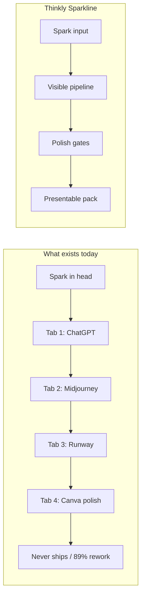
```mermaid
flowchart LR
  subgraph Before["What exists today"]
    S[Spark in head] --> T1[Tab 1: ChatGPT]
    T1 --> T2[Tab 2: Midjourney]
    T2 --> T3[Tab 3: Runway]
    T3 --> T4[Tab 4: Canva polish]
    T4 --> X[Never ships / 89% rework]
  end

  subgraph Sparkline["Thinkly Sparkline"]
    I[Spark input] --> W[Visible pipeline]
    W --> P[Polish gates]
    P --> O[Presentable pack]
  end
```

GCR (credits, MCP, audit) runs **under** Sparkline. Users feel: *“I finally finished something beautiful.”* CFOs feel: *“Spend and liability are controlled.”*

---

## 17. YC cohort scan (last 4–5 batches): what they solve vs what’s empty

Method: per-company product searches across W25, X25 (Spring 2025), S25, F25, W26 — 50+ company-level lookups, synthesized with [CB Insights X25 agentic map](https://www.cbinsights.com/research/y-combinator-spring25-agentic-ai/), [Extruct W26 batch](https://www.extruct.ai/data-room/ycombinator-companies-w26/), [New Economies F25 map](https://www.neweconomies.co/p/y-combinator-f25-the-full-batch).

### 17.1 Pattern: YC funds **completion in vertical workflows**, not infinite canvases

| Pattern | Examples | What they own |
|---------|----------|---------------|
| **Brief → deployed outcome** | [CharacterQuilt W26](https://www.ycombinator.com/companies/characterquilt) — brief → live HubSpot/Marketo campaigns in ~1 hr | Marketing *deployment* + brand-aware assets |
| **Ops glue → finished work** | [Combinely X25](https://www.ycombinator.com/companies/combinely) — tax/accounting deliverables in Outlook | Vertical coworker inside existing tools |
| **Data → validated truth** | [Sieve X25](https://www.ycombinator.com/companies/sieveai) — AI extract + human review → clean API | Accuracy-critical pipelines |
| **Field back-office** | [Ressl W26](https://www.ycombinator.com/companies/ressl-ai), [Cohesive X25](https://www.ycombinator.com/companies/cohesive) ($880K rev, 350 customers) | SMB ops automation |
| **Legal workflow completion** | [Third Chair X25](https://www.ycombinator.com/companies/third-chair) — detect → evidence → demand letter | Regulated end-to-end with human review |
| **Content → published + attributed** | [Relixir X25](https://www.ycombinator.com/companies/relixir) — GEO content auto-published to CMS | Text-forward AI search visibility |
| **Horizontal agent DAG** | [Sim X25](https://www.ycombinator.com/companies/sim) — 27k GitHub stars, traces, MCP | General automation + observability |
| **Construction / regulated** | [Semble F25](https://www.ycombinator.com/companies/semble-ai) | Vertical workflow agents |

### 17.2 Crowded outside YC but same lane

| Company | Funding / signal | Lane |
|---------|----------------|------|
| [Flora](https://techcrunch.com/2026/01/27/node-based-design-tool-flora-raises-42m-from-redpoint-ventures/) | $52M Series A; Pentagram; “Techniques” = packaged workflows | Infinite canvas for pros |
| Figma Weave, Adobe Graph, Magnific Spaces | Platform M&A / ship | Node canvas + models |
| mStudio, DeepFiction | Indie film pipeline | Script → storyboard → film |

### 17.3 The empty quadrant (Thinkly’s opportunity)

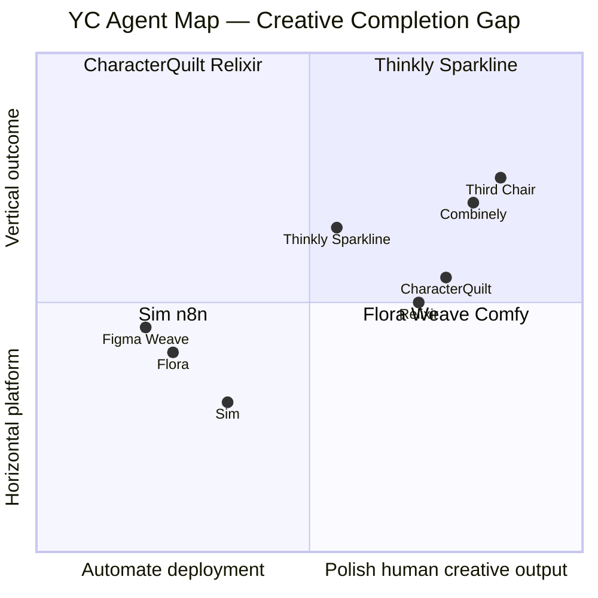
```mermaid
quadrantChart
  title YC Agent Map — Creative Completion Gap
  x-axis Automate deployment --> Polish human creative output
  y-axis Horizontal platform --> Vertical outcome
  quadrant-1 Thinkly Sparkline
  quadrant-2 CharacterQuilt Relixir
  quadrant-3 Sim n8n
  quadrant-4 Flora Weave Comfy
  CharacterQuilt: [0.75, 0.55]
  Relixir: [0.70, 0.50]
  Combinely: [0.80, 0.70]
  Third Chair: [0.85, 0.75]
  Sim: [0.35, 0.30]
  Flora: [0.25, 0.40]
  Figma Weave: [0.20, 0.45]
  Thinkly Sparkline: [0.55, 0.65]
```

**Nobody in YC W25–W26 owns:** *“I have a creative vision in my head → help me **finish** it so it looks intentional, on-brand, and ready for a client/investor/audience.”*

- CharacterQuilt stops at **marketing system deployment** (emails in HubSpot) — not cinematic craft, film, pitch narrative, or portfolio storytelling.
- Relixir stops at **GEO text in CMS** — not visual brand worlds, video, or multi-format packs.
- Flora/Weave optimize **exploration** on canvas — not *commitment to ship* or anti–idea-fragmentation psychology.
- Sim optimizes **enterprise agent plumbing** — not creative taste and presentation quality.

**Partnership wedge (not compete head-on):** Thinkly = **visual/creative completion layer** behind CharacterQuilt’s Design Agent or Relixir’s content ops (they generate/deploy; we **polish multi-modal packs** with visible pipelines).

---

## 18. Eight unique Sparkline propositions (pitch-ready)

Each proposition is a **workflow product** built on the same Thinkly graph + Brain + credits — different entry copy, templates, and export packs.

### 18.1 Sparkline Core (meta-product)

| | |
|---|---|
| **One-liner** | Turn sparks into shippable creative — without tab chaos. |
| **Who** | Solo creators, designers, marketers with 6–8 AI tools |
| **Pain** | Generation is fast; **finishing** eats 89% more review time ([FilterGrade](https://filtergrade.com/hidden-cost-of-ai-in-creative-workflow/)) |
| **Workflow** | Voice/text “spark” → Brain expands to shot list / asset list → visible graph runs → polish gates → export pack (folder + share link) |
| **Time saved** | 15–20 hrs/month integration maintenance ([Daring Creatives](https://www.thedaringcreatives.com/why-your-ai-productivity-stack-is-actually-making-you-slower/)); 17 hrs/week claimed by AI users reallocated to *finish* not *hunt tabs* |
| **Why Thinkly** | One graph replaces 6 subscriptions; run ledger proves what was used |
| **YC Q: Why you?** | We already run multi-modal pipelines in production; Flora raised $52M on canvas — we own **completion** |

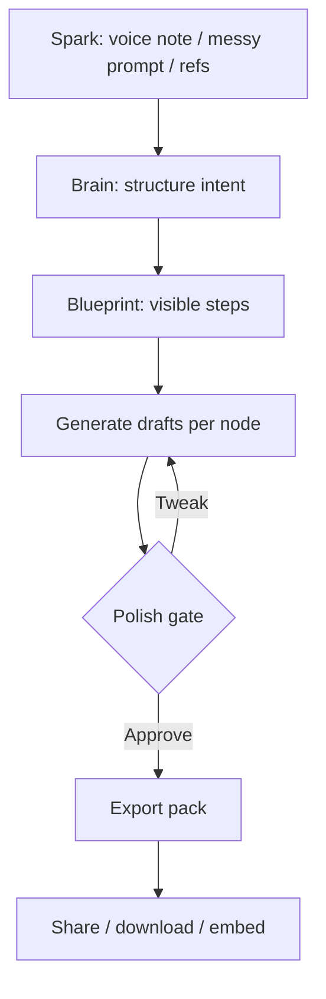
```mermaid
flowchart TD
  A[Spark: voice note / messy prompt / refs] --> B[Brain: structure intent]
  B --> C[Blueprint: visible steps]
  C --> D[Generate drafts per node]
  D --> E{Polish gate}
  E -->|Tweak| D
  E -->|Approve| F[Export pack]
  F --> G[Share / download / embed]
```

---

### 18.2 Showcase Factory (freelancers & job-seeking designers)

| | |
|---|---|
| **One-liner** | Portfolio showcases in an afternoon — not two weeks in Framer. |
| **Who** | UX/product designers, juniors, career switchers |
| **Pain** | Case studies are “dead” — hiring managers skim 30–60 sec ([Femke van Schoonhoven](https://www.linkedin.com/posts/femkesvs_showcases-the-new-portfolio-case-study-activity-7301414073458442240-Wpyf)); building case studies = Figma → Framer loop ([Medium Jun 2026](https://medium.com/@tanujabodas23/from-framer-to-claude-code-rebuilding-my-portfolio-with-ai-0f2e92b9a23f)) |
| **Workflow** | Upload project screenshots + 3 bullets → LLM narrative arc → hero motion clip + annotated stills + impact metrics slide → hosted showcase URL |
| **Time saved** | 2 weeks → 1 day (portfolio builders report 3 days with AI code; we remove code entirely) |
| **Nodes** | Image upscale → layout variants → short video Ken Burns → VO caption → social crop pack |
| **Moat** | Template library of **showcase structures** that convert (not generic case study essays) |

**Pitch to user:** *“Stop writing 5,000-word case studies. Ship showcases that hiring managers actually read.”*

---

### 18.3 Pitch Cinema (founders & fundraising)

| | |
|---|---|
| **One-liner** | Investor story as **visual cinema** — deck + hero film + product shots in one session. |
| **Who** | Pre-seed–Series A founders (YC applicant sweet spot) |
| **Pain** | Agencies charge $10k+ for narrative + vibrant design ([Ink Narrates fintech deck](https://www.inknarrates.com/post/fintech-pitch-deck)); founders tweak deck at 2am; investors spend ~10 sec/slide ([Allied VC](https://www.allied.vc/guides/how-to-use-storytelling-in-pitch-decks)) |
| **Workflow** | Paste one-liner + metrics → narrative arc (Problem→Turn→Hero) → per-slide visual generation → 30–60s product story video → export PDF + MP4 + Notion embed |
| **Time saved** | 3 weeks agency → same afternoon; founders “stop tweaking at 2am” |
| **Nodes** | LLM storyboard → consistent style reference node → slide images → motion typography → VO |
| **GTM** | Free for YC applicants; watermark until paid — viral loop in batch |

**Pitch to user:** *“Your story, polished enough that investors repeat it Monday morning — without hiring Ink Narrates.”*

---

### 18.4 Director Mode (filmmakers, ad directors, content studios)

| | |
|---|---|
| **One-liner** | Script to watchable first cut in hours — storyboard-first, not prompt roulette. |
| **Who** | Indie filmmakers, agency motion teams, YouTube storytellers |
| **Pain** | Skipping storyboard wastes $80+ in regen credits ([Apatero pipeline](https://apatero.com/blog/ai-short-film-creation-complete-pipeline-2026)); mStudio/others own session UX — teams still need **model-agnostic** pipelines |
| **Workflow** | Script paste → scene breakdown → character sheet node (lock refs) → storyboard frames (I2V seeds) → per-shot video → assembly timeline export |
| **Time saved** | 20–40 hrs for 3–5 min film → 1–4 hrs first pass ([mStudio](https://mstudio.ai/blog/ai-filmmaking/script-to-storyboard-to-film-ai-workflow)) |
| **Thinkly edge** | Swap Seedance/Kling/Veo per node; Observatory debugs which shot broke continuity |

**Pitch to user:** *“Direct AI like film — shot list in, animatic out. No more black-box prompt gambling.”*

---

### 18.5 Brand Lock Pipelines (brand & marketing teams)

| | |
|---|---|
| **One-liner** | Your brand guidelines become a **pipeline**, not a PDF nobody reads. |
| **Who** | Brand managers, creative ops, multi-market enterprises |
| **Pain** | 84% fear brand drift with AI ([Adobe](https://blog.adobe.com/en/publish/2026/04/17/creatives-say-ai-helping-them-meet-growing-demand-content-improving-their-work)); static PDFs useless at scale ([Brand Algorithm](https://www.the-brand-algorithm.com/ai-brand-voice-and-governance/)); shadow AI breaks governance ([CMSWire DAM](https://www.cmswire.com/digital-asset-management/ai-broke-your-content-governance-now-what/)) |
| **Workflow** | Upload brand kit + tone doc → RAG-injected LLM nodes + locked style reference image → every asset scored against voice rules → only passing assets export |
| **Time saved** | Revision cycles 3.2 → 1.4 ([CMO guide](https://tdsdaas.one/insights/cmo-guide-to-creative-operations/)); less “brand police” review |
| **Enterprise hook** | Same pipeline for EU AI Act provenance export (§9.5) |

**Pitch to user:** *“Scale output without sounding like six different robots.”*

---

### 18.6 Brief Closure (agencies & in-house creative ops)

| | |
|---|---|
| **One-liner** | No production until the brief is **complete** — then auto-build the whole pack. |
| **Who** | Agencies &lt;10 people, DTC creative teams |
| **Pain** | Three bottlenecks: vague brief, feedback chaos, handoff hell ([Like2Byte](https://like2byte.com/creative-workflow-agencies/)); brief-writing 2–3 hrs of file-finding ([Recharm](https://www.recharm.com/blog/creative-workflow-management)); 67% agency time is wait ([Vibe Coder](https://blog.vibecoder.me/agency-case-study-1-week-vs-6-week-delivery)) |
| **Workflow** | Structured brief form (objective, audience, exclusions) → **gate: brief completeness** → auto blueprint from template → internal review node → client preview Flow App → export to DAM |
| **Time saved** | 6-week project → 1-week pattern when intake + checkpoints systemized |
| **Product UX** | Client sees App Mode; team sees graph; same run |

**Pitch to user:** *“The brief writes the pipeline. Production starts when clarity exists — not when Slack gets noisy.”*

---

### 18.7 Finish One (anti–idea fragmentation)

| | |
|---|---|
| **One-liner** | One idea. One pipeline. Shipped this week. |
| **Who** | Paralyzed visionaries — 20 unfinished side projects ([DEV](https://dev.to/devprom/i-have-20-unfinished-side-projects-heres-the-honest-psychological-reason-5h71)); creative pros asking one idea to be income + identity + masterpiece ([Jessica Abel](https://jessicaabel.com/why-you-cant-commit-to-one-idea/)) |
| **Pain** | New ideas reopen optionality; project plateau → new shiny idea ([Good.is idea-to-idea syndrome](https://www.good.is/articles/how-to-overcome-idea-to-idea-syndrome)) |
| **Workflow** | Brain interview: “What job is this idea doing?” → pick ONE template → **commitment mode** (hide model picker, fixed path) → daily polish gate notification → celebration export |
| **Time saved** | Psychological: finish 1 project/month vs 0; practical: no tool-switching |
| **Differentiator** | No other AI tool **constrains** exploration to force completion — intentional anti-feature |

**Pitch to user:** *“Your 20th folder isn’t the problem. Not finishing is. We built a product that helps you ship one beautiful thing.”*

---

### 18.8 Taste Signature (creative directors & aesthetic-led brands)

| | |
|---|---|
| **One-liner** | Upload what you love → get a **reusable taste pipeline** your whole team runs. |
| **Who** | Creative directors, moodboard-led brands (fashion parallel: [F* Word moodboard→tech pack](https://thefword.ai/ai-fashion-moodboard-generator-for-brands)) |
| **Pain** | Moodboards are dead-end JPEGs; “pretty picture ≠ product blueprint” ([The F Word](https://thefword.ai/ai-fashion-images-dont-solve-product-development)); Lapel founder ex-Midjourney — taste is infrastructure ([Startup Intros](https://startupintros.com/orgs/lapel)) |
| **Workflow** | 10–20 reference images → embedding cluster + LLM “taste brief” → saved as **Taste Capsule** blueprint → any spark run inherits palette, composition, pacing rules |
| **Time saved** | Eliminates “try 50 prompts to find the vibe” — vibe is node 0 |
| **Moat** | Taste library compounds per user/org (network of Capsules) |

**Pitch to user:** *“Your aesthetic isn’t a moodboard. It’s a button your team presses.”*

---

### 18.9 GEO Visual Pack (B2B marketing — Relixir adjacency)

| | |
|---|---|
| **One-liner** | AI search doesn’t just need articles — it needs **visual proof**. We generate the pack. |
| **Who** | B2B marketers using GEO tools ([Relixir](https://www.ycombinator.com/launches/NZH-relixir-the-ai-geo-generative-engine-optimization-platform)) |
| **Pain** | Relixir/Rex auto-publish text; brands still need diagrams, social proof visuals, short explainers for citations |
| **Workflow** | Article outline from GEO gap → infographic nodes → product UI mock → 15s explainer video → CMS-ready asset bundle |
| **GTM** | Partner API with Relixir/Scrunch class players; Thinkly = visual layer |

---

### 18.10 Compliance Creative (Third Chair adjacency)

| | |
|---|---|
| **One-liner** | Marketing assets that **pass legal** before they pass design review. |
| **Who** | Media/entertainment brands ([Third Chair](https://www.ycombinator.com/companies/third-chair) expanding to marketing compliance) |
| **Workflow** | Asset gen → rights check node → claim verification LLM → human legal gate → export with audit JSON |
| **Pattern** | Sieve’s AI + human review ([Sieve launch](https://www.ycombinator.com/launches/NY1-sieve-helps-hedge-funds-extract-and-clean-data-from-any-source-directly-into-their-existing-tools)) applied to creative |

---

## 19. Proposition comparison matrix

| Proposition | Virality | Enterprise $ | Speed to revenue | Creative soul | Uses graph uniquely |
|-------------|----------|--------------|------------------|---------------|---------------------|
| Sparkline Core | Medium | Medium | Medium | ★★★★★ | ★★★★ |
| Showcase Factory | High (job market) | Low | Fast | ★★★★ | ★★★ |
| **Pitch Cinema** | **Very high (YC/founders)** | Medium | **Fast** | ★★★★★ | ★★★★ |
| Director Mode | Medium | High | Medium | ★★★★★ | ★★★★★ |
| Brand Lock | Low | **Very high** | Slow | ★★★ | ★★★★ |
| Brief Closure | Medium | High | **Fast** | ★★★★ | ★★★★★ |
| Finish One | High (creators) | Low | Fast | ★★★★★ | ★★★ |
| Taste Signature | Medium | High | Medium | ★★★★★ | ★★★★★ |
| GEO Visual Pack | Low | Medium | Partner | ★★★ | ★★★ |
| Compliance Creative | Low | High | Slow | ★★ | ★★★★ |

---

## 20. Recommended go-to-market stack (simple for users, deep under hood)

**Public story (one sentence):**  
*Thinkly finishes your creative ideas — from spark to something you’re proud to send.*

**Launch stack (90 days):**

1. **PLG hook:** Pitch Cinema free tier (founders) + Showcase Factory (designers) — watermark, credit limits.
2. **Revenue hook:** Brief Closure for 5 boutique agencies (e-commerce + DTC).
3. **Enterprise narrative:** Brand Lock + GCR for one brand team (compliance in RFP).

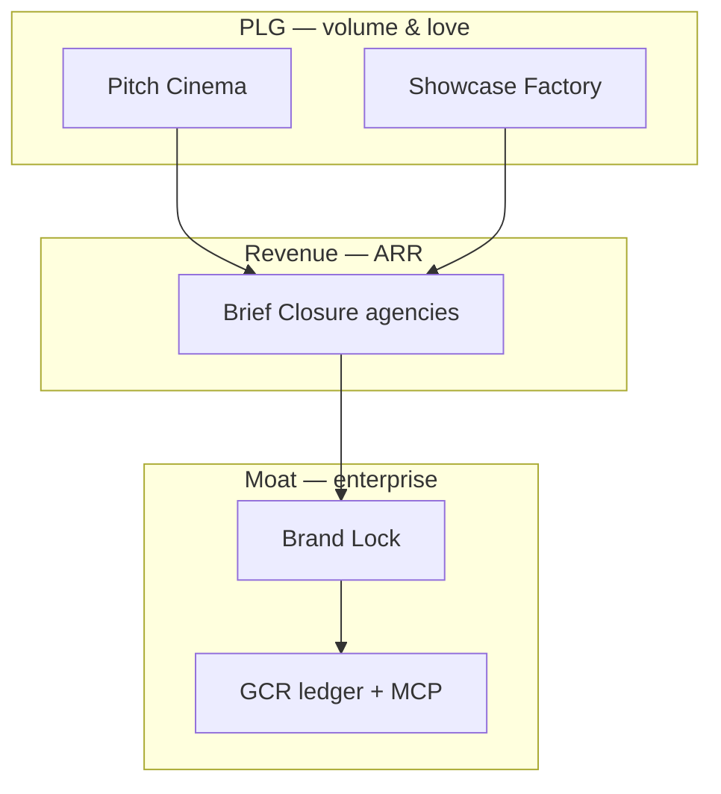
```mermaid
flowchart TB
  subgraph PLG["PLG — volume & love"]
    PC[Pitch Cinema]
    SF[Showcase Factory]
  end

  subgraph Revenue["Revenue — ARR"]
    BC[Brief Closure agencies]
  end

  subgraph Moat["Moat — enterprise"]
    BL[Brand Lock]
    GCR[GCR ledger + MCP]
  end

  PC --> BC
  SF --> BC
  BC --> BL
  BL --> GCR
```

**Simplicity UX principles (regardless of wedge):**

| User sees | System does |
|-----------|-------------|
| “Describe your spark” | Brain → blueprint |
| Progress steps with previews | Orchestrator + SSE |
| “Approve / tweak this step” | HITL wait token |
| One download button | Multi-format export pack |
| Optional “Show pipeline” | Full Playground for power users |

Never lead with nodes. Lead with **finished artifact**.

---

## 21. YC pitch reframing (Sparkline + GCR)

| Old framing (infrastructure) | New framing (human + company need) |
|-------------------------------|-------------------------------------|
| Governed creative runtime | **We finish creative work people can't finish alone** |
| MCP control plane | Agents and tools feed one completion pipeline |
| Microcredit ledger | Teams scale output without surprise bills |
| vs Magica/Flora | They explore; we **ship** |
| vs CharacterQuilt | They deploy to HubSpot; we **polish what gets deployed** (partner or acquire target) |
| vs Sim | They wire Salesforce; we wire **taste and presentation** |
| TAM | Every creative who saved 17 hrs/week generating but lost it reviewing ([Adobe](https://blog.adobe.com/en/publish/2026/04/17/creatives-say-ai-helping-them-meet-growing-demand-content-improving-their-work)) |

**YC questions for Sparkline wedge:**

| Question | Answer |
|----------|--------|
| What do you do in one sentence? | We turn half-formed creative ideas into polished, presentable packs — video, visuals, narrative — in one guided pipeline. |
| What’s broken today? | AI made starting free; finishing is 89% more review work and 6–8 tool subscriptions. |
| Who’s desperate? | Founders pitching; freelancers hiring; agency owners whose briefs are Slack messages. |
| Why not Flora/Figma? | $52M on exploration canvas; we’re the **finish line** — complementary, acquirable together. |
| Why now? | Content demand doubled; teams at capacity; EU compliance Aug 2026; YC batch is all agents that need **visual completion**. |
| What’s your unfair advantage? | Production graph executor + credits already live; not a demo DAG. |
| How do you make money? | Pro $29–49/mo + credits; Agency $299+; Enterprise brand pipelines. |
| 10 customers? | 500 Pitch Cinema founders; 5 agencies on Brief Closure; 1 brand on Brand Lock. |

---

## 22. Additional research bibliography (§16–21)

YC cohort & creative completion research (50+ targeted searches):

- [CharacterQuilt W26 — YC](https://www.ycombinator.com/companies/characterquilt), [how it works](https://www.characterquilt.com/how-it-works), [agentic stack blog](https://www.characterquilt.com/blog/agentic-marketing-stack)
- [Combinely X25 — YC](https://www.ycombinator.com/companies/combinely)
- [Cohesive X25 — YC](https://www.ycombinator.com/companies/cohesive), [$880K rev analysis](https://startuply.vc/article/cohesive-s-agentic-crm-hit-880k-in-revenue-from-350-blue-collar-shops-1drbrk)
- [Sieve X25 — YC](https://www.ycombinator.com/companies/sieveai), [launch](https://www.ycombinator.com/launches/NY1-sieve-helps-hedge-funds-extract-and-clean-data-from-any-source-directly-into-their-existing-tools)
- [Third Chair X25 — YC](https://www.ycombinator.com/companies/third-chair)
- [Relixir X25 — launch](https://www.ycombinator.com/launches/NZH-relixir-the-ai-geo-generative-engine-optimization-platform)
- [Ressl W26 — YC](https://www.ycombinator.com/companies/ressl-ai)
- [Semble F25 — YC](https://www.ycombinator.com/companies/semble-ai)
- [YC X25 agentic AI — CB Insights](https://www.cbinsights.com/research/y-combinator-spring25-agentic-ai/)
- [W26 batch — Extruct](https://www.extruct.ai/data-room/ycombinator-companies-w26/)
- [F25 batch — New Economies](https://www.neweconomies.co/p/y-combinator-f25-the-full-batch)
- [Flora $42M — TechCrunch](https://techcrunch.com/2026/01/27/node-based-design-tool-flora-raises-42m-from-redpoint-ventures/)
- [Flora launch — TechCrunch 2025](https://techcrunch.com/2025/03/02/flora-is-building-an-ai-powered-infinite-canvas-for-creative-professionals/)
- Creative pain: [FilterGrade](https://filtergrade.com/hidden-cost-of-ai-in-creative-workflow/), [Superside Breakpoint](https://www.superside.com/blog/breakpoint), [Daring Creatives subscriptions](https://www.thedaringcreatives.com/why-your-ai-productivity-stack-is-actually-making-you-slower/)
- Brand governance: [CMSWire DAM](https://www.cmswire.com/digital-asset-management/ai-broke-your-content-governance-now-what/), [Markup AI brand automation](https://markup.ai/blog/brand-consistency-automation-in-the-ai-era/), [Starr Conspiracy voice governance](https://www.thestarrconspiracy.com/insights/guides/ai-content-brand-voice-governance-problem)
- Agency workflow: [Like2Byte bottlenecks](https://like2byte.com/creative-workflow-agencies/), [Recharm DTC](https://www.recharm.com/blog/creative-workflow-management), [Agency 1-week case](https://blog.vibecoder.me/agency-case-study-1-week-vs-6-week-delivery), [Content ops approval stats](https://www.digitalapplied.com/blog/content-operations-statistics-2026-team-workflow)
- Idea fragmentation: [Jessica Abel commitment](https://jessicaabel.com/why-you-cant-commit-to-one-idea/), [DEV 20 projects](https://dev.to/devprom/i-have-20-unfinished-side-projects-heres-the-honest-psychological-reason-5h71)
- Portfolio: [Femke showcases](https://www.linkedin.com/posts/femkesvs_showcases-the-new-portfolio-case-study-activity-7301414073458442240-Wpyf), [Framer→code portfolio](https://medium.com/@tanujabodas23/from-framer-to-claude-code-rebuilding-my-portfolio-with-ai-0f2e92b9a23f)
- Pitch decks: [Ink Narrates](https://www.inknarrates.com/post/fintech-pitch-deck), [Allied VC storytelling](https://www.allied.vc/guides/how-to-use-storytelling-in-pitch-decks), [LeanPivot narrative](https://leanpivot.ai/playbook-08-funding-scale/narrative-pitch-deck/)
- Filmmaking: [mStudio pipeline](https://mstudio.ai/blog/ai-filmmaking/script-to-storyboard-to-film-ai-workflow), [Apatero short film](https://apatero.com/blog/ai-short-film-creation-complete-pipeline-2026), [Lumeflow storyboard workflow](https://www.lumeflow.ai/ai-tips/gpt-image-to-seedance-workflow/)
- Fashion moodboard gap: [The F Word stack](https://thefword.ai/the-ai-fashion-stack-creative-direction-to-launch), [moodboard generator](https://thefword.ai/ai-fashion-moodboard-generator-for-brands)
- [Lapel — ex-Midjourney founder](https://startupintros.com/orgs/lapel)

---

## 23. Deep dive: Shram AI & Activepieces

User-requested competitive analysis (June 2026). Both are relevant to Thinkly’s workflow/MCP story but solve **different jobs** than Sparkline creative completion.

### 23.1 Shram AI — profile

| Attribute | Detail |
|-----------|--------|
| **Product** | AI work companion — “finds your tasks and finishes the boring ones” |
| **Website** | [shram.ai](https://www.shram.ai/) (pivoted from shram.io in 2025) |
| **Founders** | Jay Gadekar (CEO) & Ojasvika Sahu — architects-turned-founders, design-first ([Razorpay Rize](https://rizevault.razorpay.com/p/architects-who-learned-to-build-in)) |
| **YC?** | **No** — Razorpay Rize community; **bootstrapped** (declined VC including OpeCha per founder story) |
| **Team / scale** | ~6–38 employees cited across sources; Inc42 reports ~$2.8M revenue narrative on LinkedIn |
| **Status** | Request-access / early rollout (WhatsApp, Gmail, Calendar) |

**What Shram does (3-step loop):**

1. **Finds** — Watches communication apps; detects stale threads, needed follow-ups, scheduling gaps.
2. **Drafts** — On-device memory retains context (e.g. “revised proposal” promised two months ago).
3. **Finishes** — Surfaces a one-tap task; executes send/scheduling when you approve.

**Additional features:**

- **AI to-do list that writes itself** — voice/screen context, “tap your EA on the shoulder” UX ([event page](https://www.shram.ai/event)).
- **Work reports** — Monthly AI summaries of contributions, progress, feedback for performance conversations ([LinkedIn launch](https://www.linkedin.com/posts/jaygadekar_our-vision-at-shram-has-always-been-to-recognise-activity-7309982473159925761-Vaas)).
- Long-term vision: **Modularity** (future cities) — Shram as stepping stone ([Rize profile](https://rizevault.razorpay.com/p/architects-who-learned-to-build-in)).

**Philosophy overlap with Thinkly:**

| Shared | Shram only | Thinkly only |
|--------|------------|--------------|
| Reduce meta-work friction | Relationship / comms follow-up | Multi-modal **artifact** production |
| Design-human, invisible UX | Gmail, WhatsApp, Calendar native | Graph canvas, video/image/audio nodes |
| Memory across activity | On-device private memory | Blueprint versions + run ledger |
| “Finish boring work” | Draft email, schedule meeting | Polish pitch deck, ad pack, showcase |

**Verdict vs Thinkly:** **Not a direct competitor.** Shram owns **conversational meta-work** (don’t let deals go cold). Thinkly owns **creative completion** (turn sparks into polished media). 

**Partnership story (strong):**

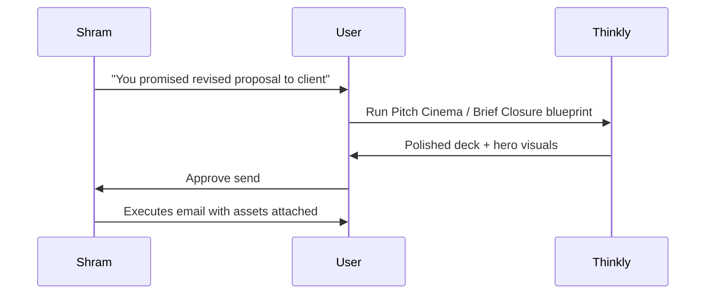
```mermaid
sequenceDiagram
  participant S as Shram
  participant U as User
  participant T as Thinkly

  S->>U: "You promised revised proposal to client"
  U->>T: Run Pitch Cinema / Brief Closure blueprint
  T->>U: Polished deck + hero visuals
  U->>S: Approve send
  S->>U: Executes email with assets attached
```

**YC pitch line:** “Shram remembers you owe a proposal; Thinkly **makes** the proposal worth sending.”

---

### 23.2 Activepieces — profile

| Attribute | Detail |
|-----------|--------|
| **Product** | Open-source, AI-first no-code business automation (Zapier alternative) |
| **YC batch** | **Summer 2022 (S22)** — [YC company page](https://www.ycombinator.com/companies/activepieces) |
| **Founders** | Ashraf Samhouri (CEO, 3× founder) & Mohammad AbuAboud (CTO, ex-Google) |
| **License** | Community Edition **MIT**; enterprise features commercial ([GitHub](https://github.com/activepieces/activepieces)) |
| **GitHub** | **22k+ stars**, 350+ contributors, 320+ releases (v0.85, Jun 2026) |
| **Revenue** | ~**$1.7M ARR** (2024, [Latka](https://getlatka.com/companies/activepieces.com)); LinkedIn cites ~$1.67M total funding |
| **Team** | ~10–18 people, San Francisco |
| **Positioning** | “Give AI to every team” — agents + workflows + MCP ([activepieces.com](https://www.activepieces.com/)) |

**Core product mechanics:**

| Layer | Capability |
|-------|------------|
| **Builder** | Drag-and-drop **linear** flows (Zapier-like), not node-graph canvas |
| **Pieces** | 280–450+ integrations as TypeScript npm packages; **60% community-contributed** |
| **MCP** | Every piece → MCP tool; flows callable from Claude/Cursor/Windsurf ([MCP blog](https://www.activepieces.com/blog/what-is-mcp)) |
| **Agents** | AI Agent library, AI SDK in builder, “Meeting Summarizer”, “Inbox Zero Bot” |
| **Deploy** | Cloud ($15/mo+ for 10k tasks) or **self-hosted unlimited executions** |
| **Enterprise** | RBAC, SSO path, SOC 2 narrative, embed in products (MIT-friendly) |

**Launch use cases (still representative):** CRM lead flow, Slack notifications, PDF → summarize → proofreading team ([YC launch](https://www.ycombinator.com/launches/HrV-activepieces-open-source-alternative-to-zapier)).

**Creative / media capabilities (2026):**

- OpenAI piece: DALL·E image generation ([generate-image action](https://github.com/activepieces/activepieces/blob/main/packages/pieces/community/openai/src/lib/actions/generate-image.ts)).
- Google Gemini piece: **Veo** text/image-to-video ([PR #12293](https://github.com/activepieces/activepieces/pull/12293)).
- Community pieces requested: HeyGen, Vadoo AI video ([GitHub issues](https://github.com/activepieces/activepieces/issues/7894)).

These are **single-step app actions** chained in linear flows — not orchestrated multi-node creative pipelines with fan-in, provider fallback, or per-node cost holds.

**Strengths (why they win):**

| Strength | Evidence |
|----------|----------|
| Open-source + MIT | Embed in products; no n8n “sustainable use” restrictions ([n8nlab comparison](https://n8nlab.io/blog/n8n-vs-activepieces-self-hosted-automation-comparison)) |
| MCP at scale | “Largest open source MCP toolkit” — 280+ tools ([GitHub README](https://github.com/activepieces/activepieces)) |
| Self-host economics | Unlimited tasks on CE; beats Zapier at volume ([NextAutomation](https://nextautomation.us/blog/make-vs-activepieces)) |
| Approachable UI | Non-technical teams vs n8n learning curve ([BotCampusAI 2026](https://www.botcampus.ai/n8n-vs-activepieces-vs-zapier-whats-the-best-automation-tool-in-2026)) |
| AI-native marketing | Agent library, copilot in builder, AI-first homepage |

**Weakfalls (research-backed):**

| Weakfall | Source |
|----------|--------|
| **Not a creative canvas** | Linear trigger→action; no visual storyboard / infinite canvas |
| **Runtime limits** | ~10 min max, ~1 GB memory default ([agentsindex.ai compare](https://agentsindex.ai/compare/activepieces-vs-n8n)) |
| **Thinner complex logic** | Nested loops, error propagation weaker than n8n ([n8nlab](https://n8nlab.io/blog/n8n-vs-activepieces-self-hosted-automation-comparison)) |
| **Integration depth** | ~450 pieces vs n8n 1,100+; Zapier 7,000+ ([OSSAlt](https://ossalt.com/guides/open-source-alternative-to-zapier-2026)) |
| **AI agents = app glue** | CRM→Slack, not governed multi-step **media** with brand locks |
| **No creative economics** | No microcredit holds for $2/video model chains |
| **Maturity** | Younger than n8n; enterprise audit/RBAC still maturing |

**Verdict vs Thinkly:** **Adjacent competitor on MCP/workflows, not on Sparkline.**

| Dimension | Activepieces | Thinkly |
|-----------|--------------|---------|
| **Job** | Automate business app **plumbing** | **Finish** creative artifacts |
| **UX** | Linear flow builder | Node graph + Flow Apps + Chat Sparkline |
| **MCP role** | 280 generic SaaS tools | **Creative runtime** + `run_blueprint_*` |
| **Execution** | Single-piece actions | DAG orchestrator, provider chains, fan-in |
| **Billing** | Per-task cloud or free self-host | **Microcredit holds** per node (video-safe) |
| **User feels** | “My CRM talks to Slack” | “My idea became a pitch deck” |
| **Open source** | MIT core — strong | Could OSS MCP schemas; runtime proprietary |

**Where Activepieces is dangerous:** If they add a “creative flow template” marketplace, they could encroach on **Brief Closure** from the automation side — but without canvas craft, taste signatures, or credit-native video economics.

**Where Thinkly is dangerous to them:** Teams that try to chain HeyGen + OpenAI + FFmpeg in Activepieces hit runtime limits and no visual debugging — Thinkly’s Observatory + graph is the ops layer they lack.

**Integration path (don’t fight, wire):**

- Thinkly blueprint exposed as **Activepieces piece/MCP tool** (`run_thinkly_blueprint`).
- Activepieces handles CRM trigger → Thinkly produces ad pack → Activepieces posts to Slack/Meta.
- Thinkly stays **creative completion**; Activepieces stays **enterprise automation fabric**.

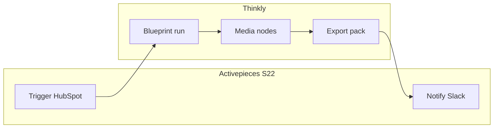
```mermaid
flowchart LR
  subgraph AP["Activepieces S22"]
    T[Trigger HubSpot]
    N[Notify Slack]
  end

  subgraph Thinkly
    B[Blueprint run]
    M[Media nodes]
    E[Export pack]
  end

  T --> B
  B --> M --> E
  E --> N
```

---

### 23.3 Comparative positioning (Shram + Activepieces + Thinkly)

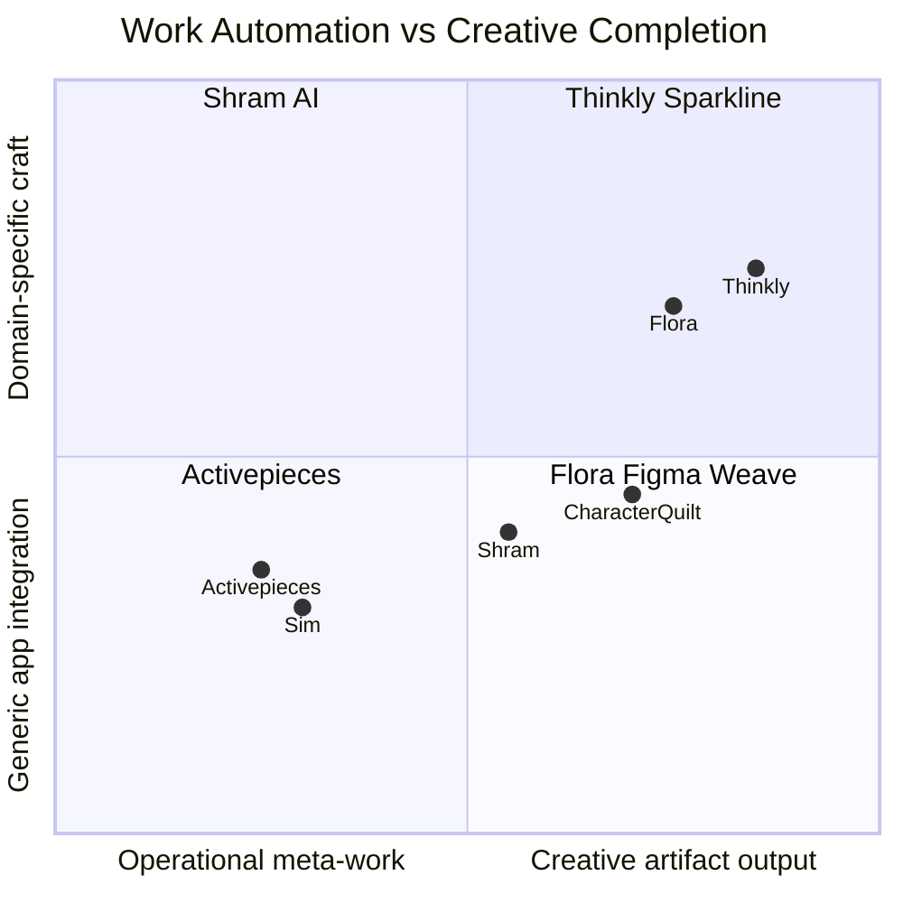
```mermaid
quadrantChart
  title Work Automation vs Creative Completion
  x-axis Operational meta-work --> Creative artifact output
  y-axis Generic app integration --> Domain-specific craft
  quadrant-1 Thinkly Sparkline
  quadrant-2 Shram AI
  quadrant-3 Activepieces
  quadrant-4 Flora Figma Weave
  Activepieces: [0.25, 0.35]
  Shram: [0.55, 0.40]
  Thinkly: [0.85, 0.75]
  Sim: [0.30, 0.30]
  CharacterQuilt: [0.70, 0.45]
  Flora: [0.75, 0.70]
```

### 23.4 YC pitch: answering “what about Activepieces?”

| Question | Answer |
|----------|--------|
| Isn’t Activepieces already MCP + workflows? | Yes — for **HubSpot → Slack**. We’re MCP + workflows for **moodboard → pitch film**. |
| They have 22k GitHub stars | Stars measure **plumbing** adoption; we target **creative pros** who don’t think in Zapier. |
| They’re open source | We can **integrate** as a piece; our moat is governed **media** execution, not 400 SaaS connectors. |
| Could they add video? | They add **single** Veo steps; we orchestrate **chains** with holds, replay, provenance. |

### 23.5 YC pitch: answering “what about Shram?”

| Question | Answer |
|----------|--------|
| Shram also “finishes” work | They finish **follow-ups**; we finish **creative packs**. Complementary. |
| They have memory | Conversation memory ≠ **brand-locked multi-modal pipeline**. |
| Design-first founders | Same ethos — human UX — different surface (EA vs Sparkline). |

### 23.6 Bibliography (§23)

- [Shram.ai](https://www.shram.ai/), [Shram event / origin story](https://www.shram.ai/event)
- [Razorpay Rize — architects who built Shram](https://rizevault.razorpay.com/p/architects-who-learned-to-build-in)
- [Shram work-report — Jay Gadekar](https://www.linkedin.com/posts/jaygadekar_our-vision-at-shram-has-always-been-to-recognise-activity-7309982473159925761-Vaas)
- [Inc42 Shram profile](https://inc42.com/company/shram/)
- [Activepieces — YC](https://www.ycombinator.com/companies/activepieces), [YC launch](https://www.ycombinator.com/launches/HrV-activepieces-open-source-alternative-to-zapier)
- [Activepieces GitHub](https://github.com/activepieces/activepieces), [MCP blog](https://www.activepieces.com/blog/what-is-mcp), [AI agent platforms 2026](https://www.activepieces.com/blog/top-6-ai-agent-platforms)
- [Latka — $1.7M ARR](https://getlatka.com/companies/activepieces.com)
- [n8n vs Activepieces vs Zapier — BotCampusAI](https://www.botcampus.ai/n8n-vs-activepieces-vs-zapier-whats-the-best-automation-tool-in-2026)
- [Activepieces vs n8n — agentsindex](https://agentsindex.ai/compare/activepieces-vs-n8n), [n8nlab review](https://n8nlab.io/blog/n8n-vs-activepieces-self-hosted-automation-comparison)
- [Gemini Veo video piece PR](https://github.com/activepieces/activepieces/pull/12293)

---

## 24. Vertical Opportunity Map: 24 Sparklines Beyond §18

§18 defined **horizontal** Sparklines (Pitch Cinema, Brief Closure, Brand Lock, etc.) — products any creative pro might use. This section maps **vertical** Sparklines: pipelines where the *input shape*, *approval gates*, and *output pack* are dictated by an industry moment.

**Why a workflow graph wins here (not another “AI video generator”):**

| One-shot generator | Thinkly graph |
|--------------------|---------------|
| Single MP4 from prompt | **Pack**: hero video + 3 social cuts + stills + copy variants |
| No audit trail | **Provenance**: which model, which source photo, which human approved |
| Batch = run prompt 50× | **Blueprint**: one graph, N inputs, credit holds per SKU |
| “Trust us” for claims | **Truth nodes**: crowdfunding/clinical copy bounded to source doc |
| Brand drift across runs | **Brand Lock node** upstream of every generative step |
| Hidden failure | **HITL gate** before export (clinician, client, legal) |

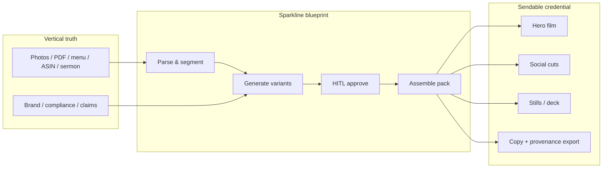
```mermaid
flowchart LR
  subgraph inputs [Vertical truth]
    RAW[Photos / PDF / menu / ASIN / sermon]
    RULES[Brand / compliance / claims]
  end
  subgraph graph [Sparkline blueprint]
    PARSE[Parse & segment]
    GEN[Generate variants]
    GATE[HITL approve]
    PACK[Assemble pack]
  end
  subgraph outputs [Sendable credential]
    HERO[Hero film]
    SOCIAL[Social cuts]
    STILLS[Stills / deck]
    META[Copy + provenance export]
  end
  RAW --> PARSE --> GEN --> GATE --> PACK
  RULES --> GEN
  PACK --> HERO & SOCIAL & STILLS & META
```

### 24.1 Master catalog (24 vertical Sparklines)

| # | Sparkline name | Primary audience | Pain (research) | Output pack | §18 overlap |
|---|----------------|------------------|-----------------|-------------|-------------|
| 1 | **Highlight Reel Factory** | Wedding photo/video pros | ~62% of studio time is non-shoot (cull, edit, deliver); same-day teaser demand | Same-day teaser + social cuts + gallery trailer | Showcase Factory |
| 2 | **Listing Cinema** | Realtors, prop managers | Static MLS slideshows; stacks like AutoReel + Make.com are brittle | Listing hero film + room tours + IG Reels + print stills | GEO Visual Pack |
| 3 | **Lesson Sparkline** | Course creators, trainers | 10–15 hrs/video traditional; Guidde/X-Pilot do slides→video without taste graph | Module series: VO + cursor + thumb + quiz stills | Director Mode |
| 4 | **Mission Pack** | Nonprofits, fundraisers | Canva/Krumzi for static; emotional video + donor trust is separate toolchain | Campaign video + donate graphics + email hero + audit trail | Compliance Creative |
| 5 | **Menu Moment** | Restaurants, cafes | Feedo/Brandlix single-channel; no POS-triggered daily workflow | Daily menu → Story + posts + print QR still | Brand Lock |
| 6 | **Explain & Approve** | Clinics, trial coordinators | Leadde/Intellegi PDF→video; **mandatory** clinical review | Patient ed film + HITL sign-off + audit PDF | Compliance Creative |
| 7 | **Listing Loop** | Etsy / handmade sellers | Make.com + JSON2Video bundles; no unified taste or batch governance | Silent listing video + 3 social variants per SKU | Showcase Factory |
| 8 | **Life Storyline** | Families, funeral homes | MemorialVideo.ai / MyHeritage one-shot; little human polish gate | Chronological tribute + voice + optional talking head + print booklet PDF | Sparkline Core |
| 9 | **Paper Cinema** | Researchers, labs | PaperTalker/VideoAgent multi-agent black box | PDF → slides + VO + cursor + optional avatar; **visible** graph | Pitch Cinema |
| 10 | **SOP-to-Screen** | Corporate L&D, ops | $5k–15k / 30-min module, 4–8 weeks; SME bottleneck | Training pack + SME review node + SCORM-ish exports | Brief Closure |
| 11 | **Amazon Creative OS** | Marketplace sellers | Topview/Advivi crowded on ASIN→video; weak on **one blueprint → all ad formats** | Listing video + SBV + UGC-style variants | Brand Lock |
| 12 | **Release Visual** | Indie musicians | freebeat/WaveMusic audio-reactive; fragmented Canvas vs YouTube vs TikTok | Master + portrait → Spotify Canvas + lyric clip + social pack | Taste Signature |
| 13 | **Campaign Proof** | Kickstarter / Indiegogo founders | Medeo/Mootion one MP4; Kickstarter **requires AI disclosure**; truth-bound modular clips win | Modular scene library + assembled pitch + disclosure manifest | Pitch Cinema |
| 14 | **Talent Cinema** | HR, recruiting | Mokzu/DeepReel single videos; GEO 2026 needs **structured multi-asset** employer story | Role video + culture reel + onboarding variant + GEO snippets | GEO Visual Pack |
| 15 | **Ministry Moment** | Churches, small nonprofits | Volunteer media teams stretched; ZSky/Opus sermon→clip only | Seasonal promo pack + volunteer recruitment + event recap graph | Sparkline Core |
| 16 | **Client Vision Deck** | Interior designers, architects | $1,500/image traditional render; Spacely/Visoid = stills not **narrated client deck** | Sketch/BIM → renders → style variants → narrated walkthrough film | Director Mode |
| 17 | **Ship Kit** | SaaS PMMs, founders | Demokaze/Vidocu/ngram text-first or single video; no governed **release graph** | Changelog video + social cuts + blog stills + PH embed from one spec | Brief Closure |
| 18 | **Portfolio Burst** | Photographers, videographers | Deliverables per client block calendar; batch export pain | Per-client Sparkline from single shoot folder | Showcase Factory |
| 19 | **Franchise Frame** | Multi-location brands | HQ brand vs local manager creativity; CHILI GraFx enterprise-only | Locked blueprint + local menu/offer injection | Brand Lock |
| 20 | **Travel Thread** | Travel creators, tour ops | Manual edit from hundred clips; no itinerary-aware graph | Day-by-day reel + map stills + booking CTA pack | Taste Signature |
| 21 | **Night One Pack** | Event planners, venues | Last-minute run-of-show changes; no unified promo + recap pipeline | Pre-event hype + day-of Story templates + post-event recap | Showcase Factory |
| 22 | **Spec to Pitch** | Architects (Avoice-adjacent) | YC W26 Avoice = contract review; **visual** spec→client pitch empty | Spec PDF + photos → client presentation film + still deck | Pitch Cinema |
| 23 | **Grant Cinema** | Researchers, university grants | NSF/NIH broader impacts need public video; academics hate video tools | Lay summary video + PI clip + social + provenance for compliance | Paper Cinema |
| 24 | **Seller UGC Loop** | Shopify brands, DTC | UGC ad testing needs 5 hooks × 3 visuals; Oakgen asset list manual | Product URL → hook variants → UGC-style pack with brand lock | Brand Lock |

### 24.2 Deep profiles — highest uniqueness (selected)

#### Highlight Reel Factory (wedding pros)

- **Normal user lens:** Couples want a teaser **tonight** for Instagram — studios lose referrals when they can’t deliver.
- **Professional lens:** Studio owner runs one blueprint: ingest RAW folder → AI cull assist → style LUT node → teaser 60s → 3 Reels → export to Frame.io.
- **Company lens:** Franchise wedding brand locks blueprint; each location runs local holds under HQ credit pool.
- **Competitors:** Imagen AI, Aftershoot (cull only), generic CapCut templates — none combine **cull + generative B-roll + pack + provenance**.
- **Workflow nodes (example):** `requestInputs:folder` → `llm:tag_moments` → `human:pick_hero` → `video:teaser` → `video:social_crop×3` → `image:thumbnail` → `response:pack`.
- **Time saved:** Industry surveys cite majority of studio week on non-shoot work; teaser same-day vs 2-week edit queue.

#### Explain & Approve (healthcare / trials)

- **Why graph:** FDA/IRB and hospital marketing require **human approval** on every claim; one-shot AI video is liability.
- **Competitors:** Leadde, Knowlify, InformGen — PDF→video without consumer-visible orchestration or exportable audit.
- **Moat:** GCR provenance + HITL node = procurement story hospitals already ask for.
- **YC angle:** “Vertical agent” W26 pattern — but for **approved patient education**, not chat.

#### Campaign Proof (crowdfunding)

- **Research insight:** Veo 3 crowdfunding guides emphasize **truth pack first**, modular scenes, human assembly — AI disclosure **hurts** conversion if authenticity feels low ([Veo3ai crowdfunding guide](https://www.veo3ai.io/blog/veo-3-crowdfunding-video-generator-2026)).
- **Thinkly wedge:** Blueprint stores **source claims**; each scene node references approved bullet; export includes **disclosure manifest** for Kickstarter policy.
- **vs Medeo/Mootion:** They optimize speed to one MP4; we optimize **trust + modularity**.

#### Client Vision Deck (interior / architecture)

- **Gap:** Spacely, Visoid, MoldaSpace = **fast stills**; client meetings need **motion + narration + iteration in meeting** ([Visoid — 90% time reduction on stills](https://visoid.com/blog/how-to-present-interior-design-concepts-to-clients)).
- **Thinkly wedge:** Graph chains `render_variant×N` → `llm:walkthrough_script` → `video:room_flow` → `human:client_pick` → `deck:export` — the meeting becomes live reruns of subgraphs.

#### Ship Kit (SaaS)

- **Gap:** Demokaze generates **copy pack**; Vidocu/ngram generate **one video** — Elasticflow skill is text-only ([Demokaze launch pack](https://demokaze.com/launch-pack-generator), [Vidocu](https://vidocu.ai/use-cases/product-marketing)).
- **Thinkly wedge:** Feature spec node triggers parallel: changelog VO video, 3 social hooks, PH still, sales one-pager frames — **one credit hold** per release.

#### Ministry Moment (churches / community orgs)

- **Audience:** 80% of churches have **no** full-time media staff; volunteer runs 5 jobs ([ZSky churches](https://zsky.ai/blog/ai-video-for-churches)).
- **Thinkly wedge:** Seasonal template library (Easter, VBS, giving) as **pre-built blueprints** — not generic prompt UI.
- **Complement:** Ministry Match does volunteer **matching**; we do volunteer **media** — partner not competitor.

### 24.3 Crowded vs empty quadrants

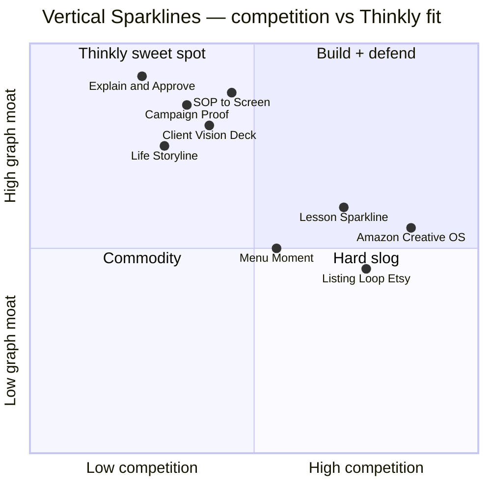
```mermaid
quadrantChart
  title Vertical Sparklines — competition vs Thinkly fit
  x-axis Low competition --> High competition
  y-axis Low graph moat --> High graph moat
  quadrant-1 Build + defend
  quadrant-2 Thinkly sweet spot
  quadrant-3 Commodity
  quadrant-4 Hard slog
  Explain and Approve: [0.25, 0.92]
  Campaign Proof: [0.35, 0.85]
  Client Vision Deck: [0.40, 0.80]
  SOP to Screen: [0.45, 0.88]
  Life Storyline: [0.30, 0.75]
  Amazon Creative OS: [0.85, 0.55]
  Lesson Sparkline: [0.70, 0.60]
  Menu Moment: [0.55, 0.50]
  Listing Loop Etsy: [0.75, 0.45]
```

**Sweet spot (quadrant 2):** Regulated or emotional truth + multi-asset pack + human gate — competitors ship speed; we ship **sendability + audit**.

**Build but defend (quadrant 1):** Amazon/Etsy listing video — revenue huge, Topview/Advivi crowded; win on **Brand Lock + batch blueprint**, not first MP4.

---

## 25. Meta-theses: Credential Economy, Catalog Factories, Moment OS

Beyond individual verticals, three **structural** theses explain why Thinkly’s workflow system is the right substrate.

### 25.1 The Credential Economy

Every meaningful interaction — apply for a job, list a house, launch a product, ask for donations, pitch investors — now expects a **visual credential**: proof you are serious, professional, and real.

| Stakeholder | Old credential | New credential |
|-------------|--------------|----------------|
| Job seeker | PDF resume | **Portfolio Sparkline** (60s + case stills) |
| Realtor | MLS photos | **Listing Cinema** pack |
| Founder | Deck PDF | **Pitch Cinema** + modular proof clips |
| Musician | Spotify link | **Release Visual** pack (Canvas + clips) |
| Nonprofit | Donation page | **Mission Pack** with emotional film |
| Researcher | Paper PDF | **Paper Cinema** lay summary |

**Thinkly is not “video AI.”** It is **credential infrastructure** — GCR governs how credentials are minted.

### 25.2 Catalog Factories

A growing class of users has **N assets, one taste**:

- Amazon seller with 200 SKUs
- Realtor with 40 listings/month
- Etsy shop with seasonal catalog refresh
- Franchise with 30 locations

One-shot tools force **N separate sessions**. A blueprint forces **one graph, N runs** with:

- Per-run credit hold and cap
- Brand Lock shared
- Batch status dashboard
- Failure isolation (SKU 17 doesn’t poison SKU 18)

This is the **Activepieces** mental model applied to **creative output** — and it is largely empty in the market.

### 25.3 Moment OS (calendar-triggered Sparklines)

Many verticals are **date-driven**:

| Moment | Sparkline |
|--------|-----------|
| Wedding week | Highlight Reel Factory |
| Listing goes live | Listing Cinema |
| Sunday sermon | Ministry Moment |
| Menu change / lunch rush | Menu Moment |
| Feature ship Friday | Ship Kit |
| Album release | Release Visual |
| Grant deadline | Grant Cinema |
| Giving Tuesday | Mission Pack |

**Product implication:** Blueprint templates + **scheduled triggers** (Trigger.dev already in stack) + optional MCP `start_run` from calendar — Thinkly becomes **creative cron for life and business**.

### 25.4 Translation Layer thesis

YC W26 rewards **boring B2B** that translates hard input → operator output ([Foundra W26 filter](https://www.foundra.ai/key-reads/yc-w26-consumer-ai-idea-filter-first-time-founders-2026)). Thinkly’s graph is literally a **translation layer**:

| Raw (expert) | Polished (client) |
|--------------|-------------------|
| BIM / SketchUp | Client Vision Deck |
| Clinical PDF | Explain & Approve |
| Paper PDF | Paper Cinema |
| Contract spec | Spec to Pitch |
| SOP document | SOP-to-Screen |
| RAW photo folder | Highlight Reel Factory |

The canvas is **honest** — clients see the translation steps, not a magic black box.

---

## 26. Audience projection: normal users, professionals, companies

Same blueprint, three **projection layers** (UX + pricing + governance).

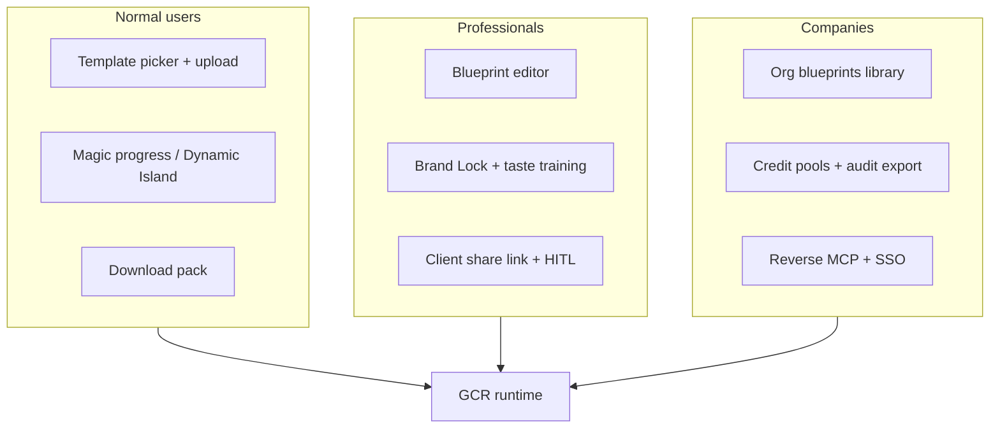
```mermaid
flowchart TB
  subgraph consumer [Normal users]
    UI1[Template picker + upload]
    UI2[Magic progress / Dynamic Island]
    UI3[Download pack]
  end
  subgraph pro [Professionals]
    UI4[Blueprint editor]
    UI5[Brand Lock + taste training]
    UI6[Client share link + HITL]
  end
  subgraph enterprise [Companies]
    UI7[Org blueprints library]
    UI8[Credit pools + audit export]
    UI9[Reverse MCP + SSO]
  end
  GCR[GCR runtime]
  consumer --> GCR
  pro --> GCR
  enterprise --> GCR
```

| Dimension | Normal user | Professional | Company |
|-----------|-------------|--------------|---------|
| **Entry** | “Wedding teaser”, “Tribute video” template | Custom blueprint + presets | Licensed vertical pack + admin |
| **Input** | Phone photos, voice memo | RAW, brand kit, client brief | DAM, PIM, MLS, EHR export |
| **Control** | Low — pick style, approve final | Medium — edit nodes, gates | High — lock nodes, compliance rules |
| **Output** | MP4 + IG sizes | Pack + client review link | Batch + API + provenance ZIP |
| **Pricing** | Credits per pack | Subscription + per-client runs | Seat + pooled credits + SLA |
| **Trust** | “Looks amazing” | “Client signed off” | “Audit passed procurement” |
| **Example Sparklines** | Life Storyline, Ministry Moment | Highlight Reel, Listing Cinema, Release Visual | Explain & Approve, SOP-to-Screen, Franchise Frame |

### 26.1 Messaging by audience

| Audience | One-liner | Avoid saying |
|----------|-----------|--------------|
| Normal user | “Turn your photos into a film you’re proud to share — tonight.” | Workflow, MCP, nodes |
| Professional | “One shoot → full client pack, your style locked.” | Zapier, automation |
| Company | “Governed creative pipelines with approval and audit built in.” | Another AI video tool |

### 26.2 PLG → sales motion

1. **PLG:** Pitch Cinema + Showcase Factory (§20) + one emotional template (Life Storyline or Campaign Proof).
2. **Pro upgrade:** Brand Lock + batch + client HITL links.
3. **Enterprise:** Explain & Approve or SOP-to-Screen with SSO + reverse MCP for internal agents.

---

## 27. Dark-horse wedge picks for YC (2026 filter)

YC W26 pattern: **64% B2B**, vertical, painkiller, moat outside model ([Foundra](https://www.foundra.ai/key-reads/yc-w26-consumer-ai-idea-filter-first-time-founders-2026), [Reforgers W26 AI](https://reforgers.com/y_combinator/winter-2026/artificial-intelligence)). Consumer AI chat is out; **credentials for regulated/emotional work** is in.

### 27.1 Top 5 dark horses (ranked)

| Rank | Wedge | Why dark horse | 90-day proof |
|------|-------|----------------|--------------|
| 1 | **Explain & Approve** | Crowded PDF→video, empty **governed approval** | 3 clinic LOIs + audit export demo |
| 2 | **Campaign Proof** | Crowdfunding video tools ignore **disclosure + truth graph** | 10 founders, modular Kickstarter packs |
| 3 | **Client Vision Deck** | Render AI crowded; **narrated deck film** empty | 5 interior studios, meeting iteration story |
| 4 | **SOP-to-Screen** | L&D spend huge; SMEs hate video tools | 1 corporate pilot, SME gate metric |
| 5 | **Life Storyline** | Emotional PLG; memorial tools one-shot | Viral template + dignified HITL story |

**Not dark horse but revenue:** Brief Closure (agencies), Listing Cinema (prop tech partnerships), Amazon Creative OS (volume).

### 27.2 Combined YC narrative (vertical + infrastructure)

> “Creative work is becoming credential work — every listing, launch, patient, and tribute needs a visual pack. One-shot AI video tools ship clips; **Thinkly ships governed packs** from a visible blueprint: brand-locked, human-approved, batch-ready. We’re building the **GCR** — governed creative runtime — under emotional Sparklines. PLG on Pitch Cinema; wedge on patient education and crowdfunding proof where trust is the product.”

### 27.3 YC Q&A (vertical thesis)

| Question | Answer |
|----------|--------|
| Why not vertical SaaS only? | Vertical proves pain; **GCR** is the compounding layer across 24 verticals. |
| Avoice does architecture docs | They do **contract review**; we do **spec→client visual credential**. |
| Knowlify does training video | They do **speed**; we do **SME approval + audit**. |
| Topview does Amazon video | They do **one ASIN clip**; we do **one blueprint → all ad formats + batch**. |
| Memorial apps exist | They do **auto tribute**; we do **dignified human gate + print pack**. |
| Is this Magica? | Magica is **node canvas for artists**; we’re **finish-line packs for credential moments**. |

---

## 28. Bibliography (§24–27)

### Wedding & photo/video

- Wedding industry post-production time studies (cull/edit bottleneck — industry blogs & Aftershoot/Imagen positioning)

### Real estate

- AutoReel, Bounti, JSON2Video + Make.com listing automation stacks

### Course / L&D

- Guidde, X-Pilot, Knowlify, Leadde — PDF/slides→video; corporate L&D $5k–15k/module benchmarks

### Nonprofits & churches

- [Krumzi / Sovran nonprofit video](https://zsky.ai/blog/ai-video-for-nonprofits), [ZSky churches](https://zsky.ai/blog/ai-video-for-churches), [Opus church workflow](https://www.opus.pro/agent/workflows/ai-video-generator-for-churches), [PromptedWork volunteer pack](https://promptedwork.com/articles/how-to-turn-a-volunteer-role-description-into-a-recruitment-post-and-outreach-pack-with-ai), [Ministry Match](https://ministrymatch.app/)

### Restaurants

- Feedo AI, Brandlix, CHILI GraFx — menu→social positioning

### Healthcare / trials

- Leadde, Intellegi, InformGen — patient education video + clinical review

### Etsy / Amazon

- Make.com Etsy video workflows; Topview, Advivi, Ima Studio — ASIN→video

### Memorial

- MemorialVideo.ai, MyHeritage Tribute, LifeTribute

### Academia

- PaperTalker, Preacher, VideoAgent — paper→video agents

### Music

- freebeat, WaveMusic, Neural Frames — release visuals

### Crowdfunding

- [Veo 3 crowdfunding guide — truth pack](https://www.veo3ai.io/blog/veo-3-crowdfunding-video-generator-2026), [Medeo](https://www.medeo.app/video-generator/crowdfunding), [Mootion Kickstarter](https://www.mootion.com/use-cases/en/kickstarter-video-maker), [Kling indie trailer ROI](https://videoai.me/blog/kling-ai-for-character-animation)

### HR / employer brand

- [StaffingTalk recruitment video 2026](https://staffingtalk.com/how-ai-video-creation-is-transforming-recruitment-marketing-in-2026/), [Mokzu HR](https://mokzu.com/pages/ai-video-for-hr-and-recruiting/), [DeepReel HR](https://deepreel.com/blog/ai-video-hr-recruitment), [iCIMS GEO recruitment](https://www.icims.com/blog/how-geo-is-revolutionizing-recruitment/)

### Interior / architecture

- [Spacely client presentation workflow](https://resources.spacely.ai/how-interior-designers-and-architects-use-ai-for-client-presentations-full-workflow/), [Visoid half-time presentation](https://visoid.com/blog/how-to-present-interior-design-concepts-to-clients), [MoldaSpace client presentations](https://www.moldaspace.com/use-cases/client-presentations), Avoice YC W26 (contract review — adjacent)

### SaaS launch

- [Demokaze launch pack](https://demokaze.com/launch-pack-generator), [Oakgen launch kit](https://oakgen.ai/blog/ai-product-launch-kit-oakgen), [Vidocu product marketing](https://vidocu.ai/use-cases/product-marketing), [ngram launch video](https://www.ngram.com/use-cases/product-launch-video-maker), [Elasticflow feature launch skill](https://elasticflow.app/hub/skills/feature-launch-playbook)

### YC W26 patterns

- [Foundra — W26 consumer AI filter](https://www.foundra.ai/key-reads/yc-w26-consumer-ai-idea-filter-first-time-founders-2026), [Reforgers W26 AI](https://reforgers.com/y_combinator/winter-2026/artificial-intelligence), [Foundevo Demo Day analysis](https://www.foundevo.com/yc-winter-2026-demo-day-top-startups/)

---

## 29. The one product (emulsified) — why verticals are templates, not the company

§18 and §24 listed many wedges. **That list is research, not the product.** If each wedge were a separate company, most would be easy for Canva or Adobe to ship as a menu item — and they would be right to **build**, not acquire.

**The actual company is one general use case:**

> **You have raw creative material and a vague goal. Thinkly helps you *finish* — a polished pack you’re proud to send — either by talking to Brain (simple) or by shaping the pipeline on the canvas (creative control).**

Everything else (MCP, orchestrator, canvas, credits ledger, vertical template names) is **how** that promise is delivered reliably — not what users buy.

### 29.1 What “useful for a lot of people” actually means

Not 24 industries. **One job everyone shares:**

| Person | What they have | What they need to send |
|--------|----------------|------------------------|
| Student | Slides + notes | Presentation video or deck that doesn’t look like homework |
| Job seeker | Portfolio scraps | One cohesive “here’s who I am” pack |
| Founder | Messy demo + bullet points | Pitch clip + social cuts for investors |
| Etsy seller | Product photos | Listing motion + 3 post sizes |
| Realtor | Phone photos of a house | Listing film + stills (template, not a separate product) |
| Manager | PDF policy | Training clip the team will actually watch |
| Parent | 200 wedding photos | Teaser for family (template) |
| Creator | Half-edited project folder | **Finally ship version 1** |

**Mass need:** finishing creative work is universal. **Mass behavior:** people already bounce across ChatGPT → image tool → video tool → Canva and still don’t ship (§16 stats).

**Vertical examples in §24 are shortcut labels** — “Listing Cinema” = a pre-built graph + copy in the template gallery, not a second product line.

### 29.2 Two modes, one runtime (simple ↔ creative)

This is the product shape you described — emulsified:

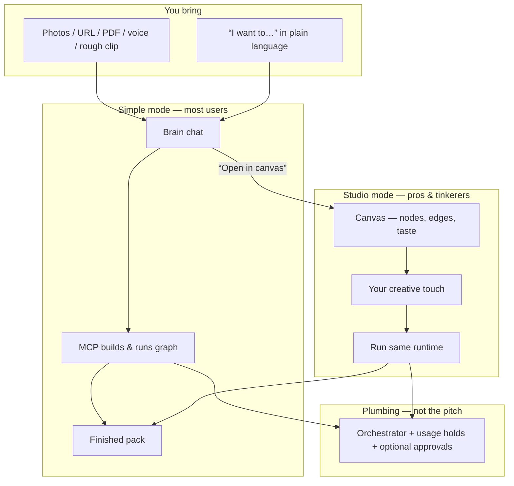
```mermaid
flowchart TB
  subgraph input [You bring]
    STUFF[Photos / URL / PDF / voice / rough clip]
    INTENT[“I want to…” in plain language]
  end

  subgraph simple [Simple mode — most users]
    CHAT[Brain chat]
    MCP[MCP builds & runs graph]
    PACK[Finished pack]
  end

  subgraph studio [Studio mode — pros & tinkerers]
    CANVAS[Canvas — nodes, edges, taste]
    TWEAK[Your creative touch]
    RUN[Run same runtime]
  end

  subgraph under [Plumbing — not the pitch]
    PLUMB[Orchestrator + usage holds + optional approvals]
  end

  STUFF --> CHAT
  INTENT --> CHAT
  CHAT --> MCP --> PACK
  CHAT -->|“Open in canvas”| CANVAS
  CANVAS --> TWEAK --> RUN --> PACK
  MCP --> PLUMB
  RUN --> PLUMB
```

| Mode | Who | What they do | What they never see |
|------|-----|--------------|---------------------|
| **Simple** | Normal users, busy pros | Upload + describe; Brain proposes pipeline; approve; download pack | Node types, MCP, credits math |
| **Studio** | Creatives, agencies, power users | Start from template or Brain draft; edit graph, brand, sequence; rerun subgraphs | — |
| **Org** | Companies | Same modes + brand lock, approval gates, pooled credits, audit export | Optional for SMB |

**Thinkly Chat** (planner) → **Blueprint** draft. **Brain** (agent) → creates workflow via MCP, runs it, streams progress in chat. **Canvas** → optional handoff for creative control (`learning/CHAT_SYSTEM_DESIGN.md`). One product, three depths — not three products.

### 29.3 The one sentence for users vs companies

| Audience | Say this | Do not say this |
|----------|----------|-----------------|
| Everyone | **“Finish your creative idea — talk or tinker, get a pack you’re proud to send.”** | 24 vertical Sparklines, GCR, governed runtime |
| Companies | **“The finish line for creative work — with approvals and spend control when you need them.”** | We’re Zapier for video |

### 29.4 “Big companies could just build this” — honest answer

**Yes, for any single template** (e.g. “photos → listing video”). That is why **we do not sell templates as the company.**

**Harder for them to replicate as a system:**

| Layer | Why it’s not a one-sprint feature |
|-------|-----------------------------------|
| **Chat → executable graph → run → pack** | Brain + MCP + orchestrator + realtime UI is a full stack; Canva’s Simtheory is closer to *marketing deploy*, not arbitrary multi-modal finish pipelines |
| **Same graph in chat and canvas** | Figma Weave and Adobe Graph have canvas; few tie *conversational build* + *pro edit* + *batch rerun* to one blueprint |
| **Finish-line UX** | Flora/Weave optimize *exploration*; our wedge is *commitment to ship* a pack (hero + variants + stills) |
| **Finish-line + chat↔canvas** | Few products tie conversational build, pro graph edit, and pack export in one loop |

**Acquisition logic (revised):**

- **Not:** “Adobe buys us for church video.”
- **Yes:** “Platform buys **finish-line workflow** (chat + canvas + pack) when creative agents are everywhere.” Comparable: Frame.io (finish/review), not a vertical SaaS. Ledger/audit is a **nice enterprise checkbox**, not the deal driver.

**Service logic:** Agencies use Thinkly to **finish client jobs** — Brain for speed, canvas for craft, one workspace per project.

### 29.5 What to build and pitch (priority order)

1. **Sparkline Core** (§18.1) — one general “finish my idea” flow; template gallery includes §24 names as starters.
2. **Brain + MCP** (Phase 0 in §12) — simple mode must work without opening canvas.
3. **Canvas handoff** — studio mode; differentiation vs “chat-only video apps.”
4. **One horizontal wedge for revenue** — e.g. product URL → ad pack OR pitch pack (pick one for 90 days).
5. **Org addons** — approvals, provenance export, pooled usage (ledger already supports holds); pitch as reliability, not “we invented credits.”

**Deprioritize:** positioning as “wedding AI” or “clinical AI” unless a template + 10 customers prove it — those are **GTM shortcuts**, not identity.

### 29.6 YC one-liner (emulsified)

> **Thinkly is where creative ideas actually finish. Describe what you want or open the canvas — Brain builds the pipeline, you get a polished pack.**

### 29.7 Platform plumbing (credits & ledger — mention, don’t lead)

Microcredit holds, per-node run records, and reconcile-on-cancel are **already in the codebase** (`thinkly-backend/lib/credits.ts`). They matter because:

- Multi-step graphs need **predictable cost** before a run starts (hold → capture/refund).
- Brain/MCP agents need a **single usage meter** across nodes, not silent overspend.
- Companies want **visibility** into what each step cost (support ticket defense).

They are **not** a moat in 2026 — any platform can add usage metering. Do **not** pitch Thinkly as “Stripe for creative AI” to users or as the primary investor story. Pitch **finish-line**; mention ledger as **how runs stay sane** under the hood.

| Audience | Credits message |
|----------|-----------------|
| Consumer / PLG | “You see the cost before you run” (simple) |
| Pro | “Per-run estimate in chat; rerun one step without redoing everything” (when we ship partial rerun) |
| Enterprise | “Team caps + step-level usage export” (addon, not headline) |

---

## 30. Default blueprint: “Finish My Idea” (product skeleton)

This is the **canonical system template** everything else extends — gallery templates (§24), pitch pack, listing pack are **variants** of this graph with pre-filled prompts and extra nodes.

**Template id (proposed):** `finish_my_idea`  
**Ship path:** add to `WORKFLOW_TEMPLATES` beside `empty` and `advertisement` in `thinkly-backend/lib/workflow-templates.ts`; Brain calls `create_workflow` with `template: "finish_my_idea"` after Thinkly Chat intake.

### 30.1 User journey (simple mode)

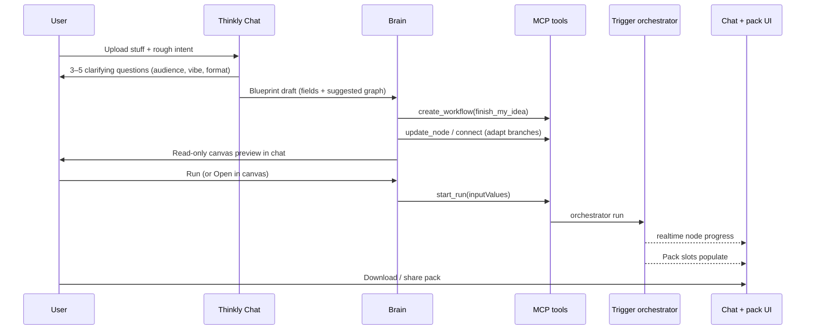
```mermaid
sequenceDiagram
  participant U as User
  participant TC as Thinkly Chat
  participant B as Brain
  participant MCP as MCP tools
  participant RT as Trigger orchestrator
  participant UI as Chat + pack UI

  U->>TC: Upload stuff + rough intent
  TC->>U: 3–5 clarifying questions (audience, vibe, format)
  TC->>B: Blueprint draft (fields + suggested graph)
  B->>MCP: create_workflow(finish_my_idea)
  B->>MCP: update_node / connect (adapt branches)
  B->>U: Read-only canvas preview in chat
  U->>B: Run (or Open in canvas)
  B->>MCP: start_run(inputValues)
  MCP->>RT: orchestrator run
  RT-->>UI: realtime node progress
  RT-->>UI: Pack slots populate
  U->>UI: Download / share pack
```

### 30.2 Request-Inputs fields (default)

| Field id | Type | Label (user-facing) | Brain fills from chat |
|----------|------|---------------------|------------------------|
| `field_intent` | `text_field` | What are you trying to finish? | Main goal + context |
| `field_audience` | `text_field` | Who will see this? | e.g. investors, customers, family |
| `field_style` | `text_field` | Vibe / style | e.g. cinematic, playful, minimal |
| `field_image_1` | `image_field` | Images (optional) | Uploads |
| `field_video_1` | `video_field` | Video clip (optional) | Uploads |
| `field_audio_1` | `audio_field` | Voice / music (optional) | Uploads |

**Rule:** Media fields stay `null` until user uploads (`upload_file` MCP); Brain never invents URLs.

### 30.3 Response slots (the “pack”)

| Slot id | Label | Typical content |
|---------|-------|-----------------|
| `slot_hero` | Hero piece | Primary video **or** hero still + short motion |
| `slot_copy` | Ready-to-send text | Caption, email blurb, or post body |
| `slot_social` | Social cuts | Short hooks / variant lines (text in v0; clips in v1) |
| `slot_summary` | Pack summary | One paragraph: what was made + how to use each piece |

Chat UI renders these as a **pack card** (not a single `result` blob). Playground already supports multiple response mappings via `lib/playground-output.ts` — extend for chat.

### 30.4 Default graph (v0 — ship first)

**Path:** images + intent → hero visual + copy pack (extends current `advertisement` pattern).

```mermaid
flowchart LR
  RI[requestInputs]
  PLAN[openRouter Plan]
  HERO[gptImage2 Hero]
  MOTION[klingV3 Motion]
  COPY[openRouter Pack copy]
  R[response slots]

  RI -->|field_intent + field_style| PLAN
  RI -->|field_image_1 → image_urls| HERO
  PLAN -->|out:response → prompt| HERO
  HERO -->|out:result| MOTION
  PLAN --> COPY
  HERO -->|image_urls| COPY
  MOTION -->|out:result → slot_hero| R
  COPY -->|out:response → slot_copy + slot_social| R
  PLAN -->|out:response → slot_summary| R
```

**Node detail:**

| Node id | Type | Role | Key wiring |
|---------|------|------|------------|
| `plan-1` | `openRouter` | Turn intent + audience + style into **plan JSON** (hero brief, 3 hook lines, motion hint) | `in:prompt` ← `field_intent` + `field_audience` + `field_style` |
| `hero-1` | `gptImage2` | Hero still aligned to plan | `in:prompt` ← plan `out:response`; `in:image_urls` ← `field_image_1` (fan-in if multiple images added later) |
| `motion-1` | `klingV3` | Short motion from hero | `in:prompt` ← plan motion hint; image from hero `out:result` |
| `copy-1` | `openRouter` | Final captions + email blurb | `in:prompt` ← plan; `in:image_urls` ← hero still |

**Edges (handle convention):** Request-Inputs sources use raw field ids; executable ports use `in:` / `out:` per MCP catalog.

### 30.5 Adaptive branches (Brain adds via MCP — v1)

Brain inspects which request fields are filled and **adds or skips** nodes — same template, not a new product.

| Input signal | Branch |
|--------------|--------|
| `field_video_1` present | `extractAudio` → optional `mergeAV` with generated VO; hero slot = merged clip |
| Text-only (no media) | Skip `gptImage2`/`klingV3`; `openRouter` → longer script + `gptImage2` only if user approves “generate visuals” |
| Multiple images | Parallel `cropImage` → fan-in to `copy-1` `in:image_urls` (only array fan-in port) |
| User asks “deck not video” | Replace motion branch with second `openRouter` + multiple `gptImage2` slides (studio mode) |

### 30.6 Thinkly Chat intake (planner — cheap model)

**Opening:** “What are you trying to finish? Upload anything you already have — photos, a clip, notes.”

**Clarifiers (pick 3–5, not all):**

1. Who is this for? (one person, a client, social followers, a class…)
2. What should they feel or do after seeing it?
3. Video, stills, or both? Any length preference?
4. Any reference vibe (film, brand, creator) — words or upload?
5. Hard deadline? (tonight vs polished week)

**Emit:** structured Blueprint draft → Brain — field values + note which branch (§30.5) to use.

### 30.7 Brain system prompt (summary — full prompt in implementation)

Brain must:

1. Call `list_node_types` / `get_model_schema` before unfamiliar nodes.
2. `create_workflow({ template: "finish_my_idea", ... })` then `update_node` to seed `field_*` values from chat.
3. Show read-only canvas in chat after graph is valid.
4. On “run”: `start_run` with `inputValues`; mint realtime token via internal token route (§12 / `CHAT_SYSTEM_DESIGN.md` §7.4).
5. Stream progress; map outputs to pack slots.
6. On “open in canvas”: handoff with Barba + Dynamic Island choreography.
7. Never `upload_file` without user media; never skip scaffold nodes.

**Tone:** finish coach, not tool explainer — “Your hero clip is rendering; next you’ll get three post lines to copy.”

### 30.8 Pack UI (chat surface)

| Element | Behavior |
|---------|----------|
| Progress | Dynamic Island + inline step list (node labels user-friendly: “Writing your hook”, “Rendering hero”, …) |
| Pack card | 4 slots with preview + copy/download |
| Actions | **Download all** · **Share link** (later) · **Open in canvas** · **Rerun from…** (studio, later) |
| Empty state | “Describe what you want to finish” + example packs (pitch, listing, tribute — gallery links) |

### 30.9 Implementation phases

| Phase | Scope | Outcome |
|-------|--------|---------|
| **P0** | `finish_my_idea` v0 graph + `advertisement`-level backend template | Run from playground with manual fields |
| **P1** | Brain + MCP + realtime in chat | Simple mode works end-to-end |
| **P2** | Multi-slot pack UI + Thinkly Chat intake | Product demo / PLG |
| **P3** | Canvas handoff + branch adaptation | Studio mode |
| **P4** | Gallery variants (rename graph, swap plan prompts) | §24 templates without new code paths |

### 30.10 Success metrics (first 90 days)

| Metric | Target |
|--------|--------|
| Time to first pack (new user) | < 15 min including upload |
| % runs that populate all 4 slots | > 70% |
| % users who only use chat (never canvas) | > 50% (validates simple mode) |
| % users who open canvas after first pack | > 20% (validates studio upsell) |
| Completion vs abandon mid-run | Track via orchestrator status |

### 30.11 Relation to existing code

| Asset | Location |
|-------|----------|
| Template pattern | `thinkly-backend/lib/workflow-templates.ts` (`advertisement` = reference) |
| MCP tools | `thinkly-backend/lib/mcp-tools.ts` |
| Node catalog | `thinkly-backend/lib/mcp/node-catalog.ts` |
| Credits holds | `thinkly-backend/lib/credits.ts` (plumbing — runs use holds automatically) |
| Chat architecture | `learning/CHAT_SYSTEM_DESIGN.md` |
| Canvas read-only embed | `components/workflow/Canvas.tsx` |

---

## 31. Document audit: what to lead vs plumbing

Earlier sections (especially §1–§14) were written for investor/M&A depth. **Many themes are real and worth building — but only a few are worth leading with.** This table mirrors the credits reframe (§29.7): mention in architecture docs; do not stack on the homepage.

| Theme in doc | Lead pitch? | Actual role | Risk if over-pitched |
|--------------|-------------|-------------|---------------------|
| **Sparkline / finish-line** | **Yes** | The product promise | — |
| **Brain + simple mode** | **Yes** | How most users finish | — |
| **Canvas / studio mode** | **Yes** | Creative control + differentiation vs chat-only apps | — |
| **Blueprint / saved graph** | **Yes (pro)** | “Your finish recipe” — reusable, improvable | — |
| **Template gallery** | **Yes (onboarding)** | Shortcuts into §30 graph | — |
| Microcredit ledger / holds | **No** | Run cost sanity; agent meter | “We’re billing infrastructure” |
| GCR / governed runtime | **No** | Internal name for orchestration + policy | Sounds like enterprise-only |
| MCP server (20 tools) | **No** | How Brain builds graphs; integration surface | “Another agent protocol” |
| Reverse MCP `run_blueprint_*` | **No** | Phase 2 distribution | Premature platform story |
| Observatory / replay | **No** | Pro debug + trust for studio users | Observatory is not the product (§3.5) |
| Provenance / C2PA export | **No** | Org-tier addon | Fear-based EU AI Act selling |
| EU AI Act / liability | **No** | Enterprise procurement checkbox | Not PLG |
| Barba / Dynamic Island shell | **No** | Craft UX; retention | Irrelevant to problem |
| Trigger.dev orchestrator | **No** | Execution engine | Dev-facing |
| “Stripe + Git for pipelines” (§2) | **Retire** | Old investor shorthand | Confuses users; over-indexes ledger |
| 24 vertical Sparklines (§24) | **No** | Research + template names | Looks like 24 startups |
| Competitive matrix density | **No** | Internal strategy | Analysis paralysis |

**Investor conversation (revised):** Lead with **finish-line + dual-mode UX**. Mention orchestration and usage metering as “we had to build this so multi-step creative actually works.” Enterprise governance as expansion — not the wedge.

---

## 32. Higher-level unique ideas (seven iterations)

Same engine (§30), **seven ways to tell the story** — pick one primary for YC/website; others as supporting angles or future positioning tests.

### Iteration A — **Sparkline** (default, §29)

> **Finish your creative idea — talk or tinker, get a pack you’re proud to send.**

| Strength | Weakness |
|----------|----------|
| Universal; matches product shape | Broad; needs one gallery hero to anchor |
| Emotional (“proud to send”) | Hard to measure in analytics at first |

**Best for:** PLG, consumers, general landing page.

---

### Iteration B — **The last mile** (judgment era)

Research: 2026 bottleneck is **not generation** — it’s judgment, approval, and shipping the *right* variant ([Segwise UA structure 2026](https://segwise.ai/blog/modern-creative-team-structure-app-ua-2026); [Adobe Apr 2026 survey](https://blog.adobe.com/en/publish/2026/04/17/creatives-say-ai-helping-them-meet-growing-demand-content-improving-their-work)).

> **AI made creative supply infinite. Thinkly is where you decide what’s worth sending — and ship that pack.**

| Strength | Weakness |
|----------|----------|
| Credible 2026 macro story | Sounds B2B/marketing-heavy |
| Differentiates from Flora/Weave (exploration) | Needs clear consumer examples |

**Best for:** Marketing teams, agencies, performance brands.

**Product implication:** Pack UI emphasizes **pick hero + regenerate variants**; canvas shows why this variant was chosen (visible graph = judgment, not black box).

---

### Iteration C — **One finish workspace** (anti–tool fatigue)

Research: power users carry **3–5 AI subscriptions** ($100–130/mo), lose context across tabs ([CareerValore audit 2026](https://careervalore.com/blog/is-ai-subscription-fatigue-real-how-to-audit-your-2026-ai-tool-stack/2803/29/2026/)); aggregators (Poe, MagAI) unify **chat models**, not **image→video→pack** pipelines ([GrayGrids aggregators](https://graygrids.com/blog/ai-aggregators-multiple-models-platform)).

> **Stop re-pasting between ChatGPT, Midjourney, and Runway. One project, one Brain, one finish pack.**

| Strength | Weakness |
|----------|----------|
| Huge addressable “everyone with 4 tabs open” | Competes narratively with aggregators |
| Matches actual user behavior (§16) | Must prove multi-modal, not just chat |

**Best for:** Creators, indie hackers, prosumer — **not** “we’re cheaper ChatGPT.”

**Differentiator vs MagAI/Poe:** They switch **models in one chat**. Thinkly runs **multi-step media pipelines** with saved blueprints.

---

### Iteration D — **Brief-to-live engine** (velocity KPI)

Research: **Brief-to-live** predicts creative performance more than any single ad result ([Focal creative strategist guide](https://focal.inc/archive-not-used/blog2/creative-strategist-guide-2026-role-metrics-and-tools)); top DTC teams target **5-day** cycles ([D2C Times briefing](https://d2c-times.com/how-to-build-a-creative-briefing-system-that-scales-dtc-ad-output/)); AI-first agencies ship first batch in **72 hours** vs 2–3 weeks ([Admiral Media 2026](https://admiral.media/best-ai-creative-agencies/)).

> **From brief to live pack in one sitting — not one sitting per tool.**

| Strength | Weakness |
|----------|----------|
| Measurable KPI for B2B | Less emotional for consumers |
| Clear ROI story | CharacterQuilt owns “deploy to HubSpot” |

**Best for:** DTC brands, growth teams, agencies selling speed.

**Boundary:** Thinkly owns **visual pack out**; partner with CharacterQuilt/Activepieces for **deploy into HubSpot** (§23, §33).

---

### Iteration E — **Ship fright killer** (psychological wedge)

Research: abandoned projects are **ego-threat avoidance**, not discipline ([Indie Hackers / DEV ship fright](https://www.indiehackers.com/post/i-abandoned-20-projects-before-i-realized-my-coding-was-just-a-psychological-defense-mechanism-18c98ec49e)); “done > perfect” only works with a **concrete done state** ([DEV perfectionism trap](https://dev.to/nader0913/the-perfectionism-trap-why-your-side-project-is-collecting-dust-and-how-i-finally-shipped-mine-3i27)).

> **Your project isn’t missing features. It’s missing a finish line. We give you a pack — then you’re done.**

| Strength | Weakness |
|----------|----------|
| Deeply human; viral among builders/creators | Harder for enterprise procurement |
| “Finish One” (§18) becomes the hero | Can sound therapy-adjacent |

**Best for:** Indie hackers, side-project creators, students — gallery template: **Ship v1**.

---

### Iteration F — **Visual layer for agentic marketing** (partnership thesis)

Research: CharacterQuilt (YC W26) — **80% of campaign time is ops**, deploys to HubSpot/Marketo in ~1 hour ([CharacterQuilt YC](https://www.ycombinator.com/companies/characterquilt)); strong on **on-brand deploy**, not cinematic craft or multi-format video packs.

> **CharacterQuilt ships the campaign. Thinkly ships the visual pack your brand is proud of.**

| Strength | Weakness |
|----------|----------|
| Clear complement, not collision | Depends on partner motion |
| Credible in YC ecosystem | Not standalone consumer story |

**Best for:** Investor narrative, B2B partnerships, “why not another CharacterQuilt.”

---

### Iteration G — **Approval-native generation** (enterprise ops wedge)

Research: **58% of marketers spend >40% of time on reviews**, not creating ([MTM / Adobe via MTM](https://mtm.video/blog/the-cost-of-tool-fatigue)); structured review links cut validation **~75%**; vague briefs drive **3+ revision rounds** ([Marq approval workflow 2026](https://www.marq.com/blog/marketing-approval-workflow/)).

> **Generate packs worth approving — brief locked, feedback on the asset, regenerate without starting over.**

| Strength | Weakness |
|----------|----------|
| Enterprise pain is documented and expensive | PageProof/Ziflow own review UI |
| HITL nodes map naturally to graph | Must not become “another proofing tool” |

**Best for:** Mid-market marketing orgs, agencies — **generation + graph rerun** as wedge, not replacing Ziflow.

---

### 32.1 Iteration picker

| If primary GTM is… | Lead iteration | Gallery hero template |
|--------------------|----------------|------------------------|
| Mass PLG | A or C | Finish My Idea |
| Creators / indie | C or E | Ship v1 |
| DTC / performance | B or D | Product ad pack |
| YC application | A + F (complement CQ) | Pitch pack |
| Enterprise marketing | G + D | Brief Closure |

---

## 33. Impact niches — researched & ranked

**Not 24 separate companies.** Ten **high-impact entry wedges** where research shows real money, real pain, and a gap between one-shot AI tools and what people actually need. Each maps to §30 blueprint + template prompt swap.

### 33.1 Ranking matrix

| Rank | Niche | Who feels it | Pain (source) | One-shot tools give | Thinkly pack gap | Template name |
|------|-------|--------------|---------------|---------------------|------------------|---------------|
| 1 | **DTC performance creative** | Growth lead, $50k+/mo Meta | Creative fatigue **14–21 day** half-life; need **6–8 new concepts**/month ([D2C Times](https://d2c-times.com/how-to-build-a-creative-briefing-system-that-scales-dtc-ad-output/)) | Single ad clip | Hook variants + hero + captions + **brief-to-live in days** | `dtc_ad_pack` |
| 2 | **Agency client delivery** | Creative agencies | Design **2 days**, approve **2 weeks**; invisible revision creep ([USTech Automations 2026](https://ustechautomations.com/resources/blog/reduce-client-approval-workflow-creative-review-with-automation-2026)) | Static mockups | Client pack + round tracking + rerun from feedback | `client_pack` |
| 3 | **Career credential** | Job seekers, freelancers | LinkedIn video **250% visibility** claim; crowded resume→one MP4 ([PortfolioVideo](https://portfoliovideo.com/personal-branding-video-maker)) | One video resume | **Pack**: intro clip + 3 post hooks + portfolio stills | `career_credential` |
| 4 | **Founder fundraise** | Pre-seed–Series A | Investors expect motion, not PDF decks | Medeo/Mootion one pitch video | Modular proof clips + social + disclosure manifest | `pitch_cinema` |
| 5 | **Creator ship v1** | Indie creators, side projects | **90% repo abandon**; ship fright ([DEV devprom](https://dev.to/devprom/i-built-a-local-ai-tool-to-analyze-why-i-abandon-90-of-my-github-repos-source-code-included-3dm2)) | Infinite exploration on Weave | **One finished pack** = psychological done state | `ship_v1` |
| 6 | **SMB local promo** | Restaurant, salon, gym owner | No marketing team; daily/weekly promo need | Canva static | Menu/event → Story + posts pack | `local_moment` |
| 7 | **E-commerce SKU velocity** | Shopify sellers, Amazon | Top advertisers **2,400+ variants/quarter** ([Segwise / AppsFlyer gaming ref](https://segwise.ai/blog/modern-creative-team-structure-app-ua-2026)) | Topview one ASIN video | One blueprint × N SKUs, brand-locked | `catalog_loop` |
| 8 | **Sales / recruiting visual** | HR, sales enablement | **80% higher engagement** with video job posts ([Mokzu](https://mokzu.com/pages/ai-video-for-hr-and-recruiting/)) | Single role video | Role video + culture reel + GEO snippets | `talent_pack` |
| 9 | **Student / academic present** | Students, researchers | Presentation shame; paper→talk gap | PaperTalker black box | Visible graph + slides + short film | `present_pack` |
| 10 | **Influencer repurposing** | Influencers, brand social teams | Long-form → **5 platforms** manually ([LinkedIn Sambou cycle case](https://www.linkedin.com/posts/smakalou_old-cycle-4-months-from-brief-to-live-new-activity-7461113454909825024-hJTD)) | Opus clip only | One asset → platform-sized pack with consistent brand | `repurpose_pack` |

### 33.2 Deep profiles — top 5 niches

#### 1. DTC performance creative (highest revenue density)

- **Macro:** Supply is cheap; **iteration speed** is the meta-metric ([Focal](https://focal.inc/archive-not-used/blog2/creative-strategist-guide-2026-role-metrics-and-tools)).
- **Workflow:** Monday performance review → Brain ingests winning hooks → generates **4–6 brief-backed packs** → upload Friday → kill losers in 72h ([D2C Times weekly rhythm](https://d2c-times.com/how-to-build-a-creative-briefing-system-that-scales-dtc-ad-output/)).
- **Why not Admiral Media alone:** They sell **managed service** at agency price; Thinkly sells **the finish workspace** for in-house teams who still want control + canvas.
- **Why not CharacterQuilt:** They **deploy emails in HubSpot**; they don’t own **UGC-style video packs** and cinematic craft ([CharacterQuilt how it works](https://www.characterquilt.com/how-it-works)).
- **90-day proof:** One DTC brand, measure **brief-to-live hours** and creative tests per sprint.

#### 2. Agency client delivery (services economy)

- **Pain:** Feedback in email/screenshots; **round 4 of scoped round 2** ([USTech Automations](https://ustechautomations.com/resources/blog/reduce-client-approval-workflow-creative-review-with-automation-2026)).
- **Thinkly wedge:** Generate **client-ready pack** first; share link; comments → **rerun subgraph** (new hook, new crop) without re-briefing entire agency stack.
- **Complement:** Ziflow/PageProof for legal PDF mark-up; Thinkly for **generative pack + iteration**.
- **90-day proof:** 3 agency clients, metric: **revision rounds to approval**.

#### 3. Career credential (mass PLG)

- **Market:** PortfolioVideo, Medeo, Pollo, Opus — all **one MP4** ([PortfolioVideo](https://portfoliovideo.com/personal-branding-video-maker), [Opus resume workflow](https://www.opus.pro/agent/workflows/resume-to-video-generator)).
- **Gap:** Job seekers need **intro + LinkedIn posts + portfolio stills** in one session — credential pack (§25.1).
- **PLG:** Free tier = watermarked pack; paid = clean + rerun for each job application.
- **Volume:** Every hiring cycle, millions of applicants — **template**, not separate product.

#### 4. Founder fundraise (YC-native)

- **Pain:** Kickstarters/founders need **truth-bound modular clips** + assembled pitch ([Veo3 crowdfunding guide](https://www.veo3ai.io/blog/veo-3-crowdfunding-video-generator-2026)); demo day = **motion + social** not just deck.
- **Gap:** Mootion optimizes **speed to one video**; investors want **pack + updatable modules** when product changes.
- **Gallery:** `pitch_cinema` variant of §30 with `slot_hero` = pitch clip, `slot_social` = 3 hooks.

#### 5. Creator ship v1 (emotional viral wedge)

- **Pain:** Perfect Project Syndrome — **47 abandoned repos** ([DEV guayoyo](https://dev.to/guayoyo_tech/the-perfect-project-syndrome-that-never-ships-4h69)).
- **Product:** “Friday or Die” integration — Brain asks for **one pack by Friday**; pack card = **ceremony of done**.
- **Marketing:** Builder/creator Twitter, Indie Hackers — iteration E (§32).
- **Not:** Another infinite canvas for exploration.

### 33.3 Niches to deprioritize (crowded or low moat)

| Niche | Why deprioritize |
|-------|------------------|
| Generic “AI video generator” | Runway, Pika, Canva — commodity |
| Programmatic video at scale only | Shotstack, Wireflow, Pirsonal own API-first batch ([Shotstack](https://shotstack.io/product/ai-video-creation-platform/), [Wireflow programmatic](https://www.wireflow.ai/programmatic-video-generation-platform)) |
| Chat model aggregator | Poe, MagAI — different problem |
| Pure approval SaaS | PageProof, Ziflow — no generation |
| Clinical/regulated first | Long sales cycle; use as enterprise template later |

### 33.4 Niche → §30 graph (how templates work)

```mermaid
flowchart TB
  CORE[finish_my_idea core graph]
  T1[dtc_ad_pack prompts]
  T2[career_credential prompts]
  T3[pitch_cinema prompts]
  CORE --> T1 & T2 & T3
  T1 --> RUN1[Same MCP + orchestrator]
  T2 --> RUN2[Same MCP + orchestrator]
  T3 --> RUN3[Same MCP + orchestrator]
```

Only **plan node system prompts** and **response slot labels** change per niche — not the company.

---

## 34. Master narrative synthesis

### 34.1 One company, three sentences

1. **Problem:** Everyone can *start* creating with AI; almost nobody reliably *finishes* something polished enough to send — across tabs, tools, and half-done folders.
2. **Product:** Thinkly is the **finish workspace** — describe your goal to Brain (simple) or open the canvas (studio) — same blueprint runs underneath, you get a **pack** (hero + copy + variants).
3. **Plumbing:** Multi-step runs need orchestration, usage visibility, and optional approvals — we built that because finish-line UX breaks without it; **not because ledger is the product.**

### 34.2 Recommended public positioning (June 2026)

| Layer | Message |
|-------|---------|
| **Tagline** | Finish what you started. |
| **Subhead** | Talk or tinker. Brain builds the pipeline. You get a pack you’re proud to send. |
| **For companies** | Brief-to-live creative packs — with approvals when your team needs them. |
| **Do not lead with** | GCR, MCP, ledger, Observatory, 24 verticals, EU AI Act |

### 34.3 Recommended YC story (single page)

- **Opening:** Adobe says creatives save **17 hrs/week** with AI but **demand doubled** and **84% worry about brand** ([Adobe Apr 2026](https://blog.adobe.com/en/publish/2026/04/17/creatives-say-ai-helping-them-meet-growing-demand-content-improving-their-work)).
- **Insight:** Bottleneck moved from **supply → judgment + finish** ([Segwise 2026](https://segwise.ai/blog/modern-creative-team-structure-app-ua-2026)).
- **Product:** Thinkly — Brain + optional canvas; §30 `finish_my_idea` ships first.
- **Wedge customers:** DTC growth lead OR agency OR career-credential PLG — pick **one** for application demo.
- **Why not CharacterQuilt:** They deploy campaigns to HubSpot; we **finish visual packs** — partner layer ([CharacterQuilt](https://www.characterquilt.com/why-characterquilt)).
- **Why not Weave/Flora:** Exploration canvases; we **commit to ship** a pack.
- **Business model:** Credits for runs (plumbing); Pro for canvas + templates; Team for approvals.
- **Ask:** Ship Brain + finish pack; 10 design partners in [chosen wedge].

### 34.4 What to build next (ordered)

1. `finish_my_idea` template in `workflow-templates.ts` (§30.4).
2. Brain + MCP + pack UI (simple mode).
3. **One gallery niche** from §33 rank 1, 3, or 5 — not all ten.
4. Canvas handoff (studio mode).
5. Org addons (approval node, export) when a paying team asks — not before.

### 34.5 Bibliography (§31–34)

- [Segwise — creative judgment bottleneck 2026](https://segwise.ai/blog/modern-creative-team-structure-app-ua-2026)
- [Adobe — creatives AI survey Apr 2026](https://blog.adobe.com/en/publish/2026/04/17/creatives-say-ai-helping-them-meet-growing-demand-content-improving-their-work)
- [Presenc — creator AI usage 2026](https://presenc.ai/research/how-creators-use-generative-ai-2026)
- [MTM — approval bottleneck / tool fatigue](https://mtm.video/blog/the-cost-of-tool-fatigue)
- [Marq — marketing approval workflow 2026](https://www.marq.com/blog/marketing-approval-workflow/)
- [USTech — agency creative review automation](https://ustechautomations.com/resources/blog/reduce-client-approval-workflow-creative-review-with-automation-2026)
- [Focal — brief-to-live meta-metric](https://focal.inc/archive-not-used/blog2/creative-strategist-guide-2026-role-metrics-and-tools)
- [D2C Times — briefing system / creative fatigue](https://d2c-times.com/how-to-build-a-creative-briefing-system-that-scales-dtc-ad-output/)
- [Admiral Media — 72h first batch / AI creative factory](https://admiral.media/best-ai-creative-agencies/)
- [CharacterQuilt — YC W26 / deploy vs recommend](https://www.characterquilt.com/why-characterquilt)
- [CareerValore — AI subscription stack audit](https://careervalore.com/blog/is-ai-subscription-fatigue-real-how-to-audit-your-2026-ai-tool-stack/2803/29/2026/)
- [GrayGrids — AI aggregators 2026](https://graygrids.com/blog/ai-aggregators-multiple-models-platform)
- [PortfolioVideo — LinkedIn personal brand](https://portfoliovideo.com/personal-branding-video-maker)
- [Indie Hackers — ship fright / defense mechanism](https://www.indiehackers.com/post/i-abandoned-20-projects-before-i-realized-my-coding-was-just-a-psychological-defense-mechanism-18c98ec49e)
- [DEV — perfectionism trap / ship mine](https://dev.to/nader0913/the-perfectionism-trap-why-your-side-project-is-collecting-dust-and-how-i-finally-shipped-mine-3i27)
- [Shotstack / Wireflow — programmatic video (adjacent, not core)](https://shotstack.io/product/ai-video-creation-platform/)

---

## 35. Blunt truth: escaping the W26 workflow pile

This section is intentionally harsh. §29–§34 are directionally right but still **sound like half the W26 batch** if you pitch them naively. YC W26 has **~190 companies**, **~56 “AI-native services”** (agent does the job), **~34 dev/agent-infra tools**, and a dense cluster of **workflow automation** (Jinba, Cofia, Ressl, FullSeam, Pollinate, Bubble Lab, EigenPal, ramAIn, o11, etc.) ([Extruct W26](https://www.extruct.ai/research/ycw26/), [Sameer Nanda W26 analysis](https://sameernanda.com/yc-w26-batch-analysis/)). Lobster Capital notes the winning W26 pattern is **vertical agents that own a full ops workflow** ([Lobster W26 recap](https://lobstercap.substack.com/p/ycs-record-breaking-w26-demo-day)).

**If Thinkly’s headline is “AI workflow for creative” or “finish your creative idea,” you are filing into a category YC is already saturated on — and you are not the best-funded team in that pile.**

### 35.1 What we built is good — what we should NOT claim is unique

| We have (real, shippable) | Blunt truth about “uniqueness” |
|---------------------------|--------------------------------|
| Node graph + orchestrator | Wireflow, Comfy App Mode, Jinba, NiftyFlow — same shape |
| Brain + MCP builds graph | Cofia “automations that write themselves,” o11 “agent in every app” |
| Multi-model video pipeline | Runway, Canva, MergeMate, Shotstack, Plys |
| Credit holds | Plumbing; every usage-metered API will have this |
| “Finish pack” output | Demokaze, Vidocu, ngram, PortfolioVideo |
| Template gallery | Every marketing AI tool |
| Canvas for pros | Figma Weave, Flora, Magnific |

**None of that alone is a company in June 2026.** It is a **feature bundle**. The bundle is worth building because you already have most of it — but the **category name** must not be “workflow automation.”

### 35.2 Why §29 “one product” still feels generic

“Finish your creative idea” is emotionally right but **market-wise invisible**:

- Every AI video landing page says *ship faster / polish / professional in minutes*.
- W26 vertical agents say *we finish the whole job* (prior auth, dental front desk, Salesforce config).
- Creators say they already save **17 hrs/week** with AI ([Adobe Apr 2026](https://blog.adobe.com/en/publish/2026/04/17/creatives-say-ai-helping-them-meet-growing-demand-content-improving-their-work)) — so “save time” is not a wedge.

**The missing sharper question:** not “can you finish?” but **“can you send this without losing respect?”**

### 35.3 The 2026 fear nobody in W26 workflow land owns

While YC funds **autonomous agents**, the workforce is developing **AI slop PTSD**:

| Stat | Source |
|------|--------|
| **42%** see colleagues who send low-quality AI work as **less trustworthy** | [Stanford Social Media Lab / BetterUp “workslop” study](https://finance.yahoo.com/news/prevent-ai-slop-costing-business-133000647.html), [Presenter Notes](https://presenternotes.substack.com/p/ai-workslop-makes-colleagues-trust) |
| **53%** annoyed; **22%** offended receiving workslop | Same |
| **44%** of millennials blocked/muted brands for AI slop content | [Sprout / Yahoo thought leaderslop](https://uk.news.yahoo.com/why-ai-generated-thought-leaderslop-223811126.html) |
| Outsourcing voice to AI signals **no conviction** to investors/customers | Same |
| CIOs: “content generation is cheap; **credibility isn’t**” | [TechTarget AI slop enterprise risk](https://www.techtarget.com/searchcio/feature/AI-Slop-The-hidden-enterprise-risk-CIOs-cant-ignore) |

**W26 workflow startups optimize throughput.** Almost nobody optimizes **“I’m about to attach my name to this.”**

That gap is emotionally huge, commercially real, and **not the same problem as automating Salesforce config.**

### 35.4 Proposed category (primary): **Sendable**

**Not a workflow company. A send-gate for creative work that stakes your reputation.**

> **Thinkly makes creative work *sendable* — plan before pixels, see the steps, approve before export, archive what you actually sent.**

| W26 default | Thinkly (Sendable) |
|-------------|-------------------|
| Agent runs autonomously | **Human stakes reputation** on output |
| Black-box task completion | **Visible plan + pipeline** before expensive render |
| Continuous automation | **Episodic episodes** — one send moment, one pack, archived |
| Replace the ops job | **Protect the person** from looking like workslop |
| Optimize enterprise throughput | Optimize **pre-send confidence** |

**One-line (YC-safe):** *“The studio for creative work you’re about to stake your name on.”*

**Tagline (PLG):** *“Make it sendable.”*

This uses everything you built (Brain, graph, canvas, pack) but **names a different job-to-be-done** than Jinba/Cofia/Ressl.

### 35.5 Product mechanics that prove you’re not “another workflow startup”

These are **category features**, not nice-to-haves:

| Mechanic | What it does | Why it’s not workflow automation |
|----------|--------------|----------------------------------|
| **Judge interview** (Thinkly Chat) | “Who will see this? What would make them think it’s cheap?” | Targets reputation, not task list |
| **Plan-before-pixels gate** | Mandatory plan node approval before `gptImage2`/`klingV3` run | Plys does this for faceless channels only ([Plys](https://www.plys.ai/)); you generalize |
| **Visible pipeline** | User sees graph in chat (read-only) | Anti black-box agent (W26 autonomous agents hide steps) |
| **Send Gate** | Export/download only after explicit **“I’d send this”** tap | Ceremony of accountability |
| **Sent Archive** | Library of packs you actually sent (not drafts graveyard) | Credibility timeline — what you shipped, not what you generated |
| **Studio escape** | Open canvas to change taste, not to “build automation” | Creative control without Zapier brain |

```mermaid
flowchart LR
  subgraph w26 [W26 workflow pattern]
    A1[Trigger] --> A2[Agent runs]
    A2 --> A3[Done in HubSpot/Salesforce]
  end

  subgraph sendable [Thinkly Sendable pattern]
    B1[Who judges you?] --> B2[Plan — approve]
    B2 --> B3[Render pipeline]
    B3 --> B4[Send Gate]
    B4 --> B5[Sent Archive]
  end
```

### 35.6 Where Sendable hits hardest (specific niches — not 24 products)

**Rule:** only moments where **being wrong is socially expensive**. Template swaps on §30 graph.

| Moment | Who judges you | Why Sendable wins vs one-shot video |
|--------|----------------|-------------------------------------|
| **Job hunt** | Recruiter, hiring manager | 42% trust hit if workslop; need pack not one MP4 ([PortfolioVideo crowd](https://portfoliovideo.com/personal-branding-video-maker)) |
| **Fundraise / demo day** | Investors | “No conviction” if obviously AI ([Yahoo leaderslop](https://uk.news.yahoo.com/why-ai-generated-thought-leaderslop-223811126.html)) |
| **Client deliverable** | Paying client | Agency: 2 days design, 2 weeks approve — **send-gate + rerun** beats another generator |
| **First launch** (solo founder) | Customers + Twitter | Ship v1 without looking like slop |
| **Memorial / tribute** | Family | Dignity gate — not fast ugly automation |
| **Executive outward post** | Board, press, LinkedIn | CIO credibility risk ([TechTarget](https://www.techtarget.com/searchcio/feature/AI-Slop-The-hidden-enterprise-risk-CIOs-cant-ignore)) |

**Deprioritize for uniqueness:** generic DTC ad volume (CharacterQuilt + Admiral + Meta tooling), ERP config (Ressl), document OCR (EigenPal) — **you will lose the “we’re workflow” comparison every time.**

### 35.7 Alternative unique iterations (if Sendable feels too soft)

Pick **one** primary; others as backup narrative.

#### Iteration 1 — **Sendable** (recommended)

*Make it sendable before you attach your name.*

- **Wedge:** Career credential pack OR founder pitch pack.
- **Kill test:** Users say “I’d actually send this to [recruiter/investor]” — not “cool video.”

#### Iteration 2 — **Anti-workslop studio**

*AI that helps you not look like workslop.*

- **Wedge:** Teams / managers afraid of brand damage from AI output.
- **Risk:** Negative framing; sounds like compliance tool.
- **Kill test:** HR/marketing buys for **reputation**, not “productivity.”

#### Iteration 3 — **Episodic closure** (anti-automation positioning)

*We don’t automate your week. We close one creative episode.*

- **Wedge:** Indie hackers / creators (ship fright §32-E).
- **Risk:** Sounds philosophical; hard to demo.
- **Kill test:** Users finish **one episode/week** with Sent Archive growth.

#### Iteration 4 — **Judgment layer** (B2B performance)

*Generate less. Commit more.*

- **Wedge:** DTC brand tired of 2,400 variants and no taste ([Segwise 2026](https://segwise.ai/blog/modern-creative-team-structure-app-ua-2026)).
- **Risk:** Still adjacent to performance marketing crowd.
- **Kill test:** Metric = **variants killed** per sprint, not variants produced.

#### Iteration 5 — **Visual layer for CharacterQuilt** (partnership, not identity)

*CQ deploys the campaign; Thinkly makes the visual pack credibly yours.*

- **Use:** YC “why not another marketing agent” answer only — **do not** make this the company name.

### 35.8 What to say vs hide in a YC application

| Say | Hide / footnote |
|-----|-----------------|
| “Studio for work you stake your name on” | “Governed creative runtime” |
| “Plan before render; nothing exports until you approve” | MCP, 20 tools, reverse MCP |
| “Visible pipeline — not a black-box agent” | Observatory, Trigger.dev |
| “Pack for [recruiter / investor / client] moment” | 24 vertical Sparklines |
| “Complement CharacterQuilt on visual craft” | Compete with Jinba/Cofia |

**Do not write:** “workflow automation,” “orchestration platform,” “agentic DAG,” “Stripe for creative AI.”

**Investor question prep:** “Isn’t this Plys?” → Plys = recurring faceless YouTube host. We = **any identity moment, any pack, optional canvas.** “Isn’t this Canva?” → Canva optimizes **volume**; we optimize **send confidence.**

### 35.9 Honest viability check

| Question | Blunt answer |
|----------|--------------|
| Is Sendable a billion-dollar word? | **Maybe** — if “sent archive” becomes professional credibility layer (LinkedIn evolution). Early: niche wedge. |
| Can Adobe ship “send gate”? | Yes, in 18 months. Defense = **episode archive + taste graph + dual chat/canvas** habit, not ledger. |
| Is this still AI video? | **Under the hood, yes.** Category is **reputation-safe finishing**, not video. |
| Will YC like “anti-slop”? | **Better than workflow.** Tied to documented trust collapse; contrarian vs autonomous-agent wave. |
| What if we ignore this and pitch Sparkline? | You’ll get classified with **NiftyFlow + MergeMate + Jinba** — probably dead in partner meeting. |

### 35.10 Recommended master positioning (June 2026)

**Category:** Sendable — pre-send confidence for creative work.  
**Product:** Thinkly — talk (Brain) or tinker (canvas); same graph; **plan → pipeline → send gate → archive.**  
**90-day wedge:** One identity-risk template — **`career_credential`** or **`pitch_cinema`** — not generic `finish_my_idea` on homepage.  
**Enterprise later:** Team send gates + approval when marketing fears workslop — not GCR-led sales.

**YC opening line (blunt version):**

> “Half of YC W26 is workflow agents. We’re building the opposite: the last step before a human attaches their name — plan-first creative packs that don’t export until you’d actually send them. AI slop is destroying trust; we’re the send gate.”

### 35.11 Bibliography (§35)

- [Extruct — YC W26 batch breakdown](https://www.extruct.ai/research/ycw26/)
- [Sameer Nanda — W26 190 companies analyzed](https://sameernanda.com/yc-w26-batch-analysis/)
- [Lobster Capital — W26 Demo Day recap / vertical agents](https://lobstercap.substack.com/p/ycs-record-breaking-w26-demo-day)
- [Happycapy — W26 strongest batch / autonomous agents](https://happycapyguide.com/blog/yc-w26-demo-day-strongest-batch-ai-startups-2026)
- [Stanford/BetterUp workslop — Yahoo Finance summary](https://finance.yahoo.com/news/prevent-ai-slop-costing-business-133000647.html)
- [Presenter Notes — workslop trust damage](https://presenternotes.substack.com/p/ai-workslop-makes-colleagues-trust)
- [TechTarget — AI slop enterprise / credibility](https://www.techtarget.com/searchcio/feature/AI-Slop-The-hidden-enterprise-risk-CIOs-cant-ignore)
- [Yahoo — thought leaderslop / Gen Z block rates](https://uk.news.yahoo.com/why-ai-generated-thought-leaderslop-223811126.html)
- [Plys — plan before render (adjacent)](https://www.plys.ai/)
- [CharacterQuilt — deploy campaigns (complement, not compete)](https://www.characterquilt.com/why-characterquilt)
- [Segwise — judgment bottleneck 2026](https://segwise.ai/blog/modern-creative-team-structure-app-ua-2026)
- [majr — creativity graph / process data (adjacent thesis)](https://majr.app/)

---

## 36. Sendable refined: discreet, private, honestly moated

§35 pushed **Sendable** + visible pipeline + Sent Archive. That direction is right, but two objections expose where it was **too loud** and **not actually unique**:

1. **“If companies already have build logic, how hard is sendable for them?”**
2. **“Why would a creator broadcast the exact steps they took?”** (Inside a company, coworkers might need audit — but creators want mystique, not a making-of documentary.)

This section corrects the model: **Sendable is not transparency theater.** It is a **private confidence ritual** before a public artifact. Steps are for *you* (and optional org policy), not for your audience.

### 36.1 Blunt answer: can enterprises DIY “sendable”?

**Partially yes — and we should not pretend otherwise.**

| What they already have | What “add sendable” would mean for them |
|------------------------|----------------------------------------|
| Brand templates (Canva, Marq) | Lock fonts/colors — **they have this** |
| Review (Frame.io, PageProof, Ziflow) | Comment on finished asset — **they have this** |
| Build logic (CQ, internal playbooks) | Brief → deploy in HubSpot — **emerging** |
| Generation (Runway, Firefly, agencies) | One-shot clips — **they have this** |

**What they usually do NOT have in one place:**

| Missing layer | Why it’s annoying to bolt on |
|---------------|------------------------------|
| **Plan lock before spend** | Runway doesn’t show you a beat sheet then wait; you burn credits discovering failure |
| **Multi-modal pack as one episode** | Hero video + 3 social lines + stills = 4 tools + 4 exports |
| **Rerun one beat without redoing all** | Frame.io reviews output; doesn’t regenerate hook line 2 |
| **Private rehearsal → public send** | No product owns the *psychological* gate between “generated” and “I stake my name” |

So: a mature company can **assemble** sendable in 6–12 months with Frame.io + CQ + Runway + custom glue. **Difficulty: medium** — not because any single piece is hard, but because **no incumbent owns the pre-send episode** as a product category.

**Our honest enterprise pitch is not “you can’t build this.”** It is:

> “You haven’t wired plan → pack → sign-off in one episode; your team still ships slop between tools. We sell the **last mile before the name goes on it** — optional audit export for legal, not the default creator experience.”

**When we lose enterprise:** Fortune 500 with Adobe CC + Frame.io + dedicated ops — we target **high identity-risk outbound** (investor materials, executive comms, regulated patient ed) or **teams without ops** (Series A marketing lead, agencies).

### 36.2 Why creators won’t share their steps (and shouldn’t have to)

Creators optimize for **perceived authenticity**, not **process transparency**:

| If we push “show your pipeline” | Creator reaction |
|--------------------------------|------------------|
| Audience sees AI graph | “They used a machine” → slop stigma |
| Followers see prompts | Craft mystique dies; copycats clone |
| Client sees messy middle | Undermines “I’m the talent” pricing |
| Public audit trail | Feels like homework, not art |

**majr/Studiograph** thesis: process data is valuable **to train your future self** or **internal team memory** — not to publish to fans ([majr](https://majr.app/), [Studiograph](https://studiograph.com/)). Creators monetize **the dish**, not the recipe.

**Revised product rule:**

| Surface | Default | Who sees it |
|---------|---------|-------------|
| Plan-before-render | **Private** | User only |
| Pipeline in chat | **Private** | User only (collapsed to friendly steps: “Writing hook”, not node IDs) |
| Canvas | **Private** | User + optional client share link |
| **Pack export** | **Public** | What the world gets |
| Step log / provenance | **Opt-in** | Org tier, legal, Kickstarter disclosure — never default for creators |

**Sent Archive** is reframed: not “here’s how I made it,” but **“here’s what I actually sent”** — a private grid of outcomes (like a sent-mail folder for creative identity). Portfolio of **artifacts**, not **workflows**.

### 36.3 The discreet version of Sendable: **Green Room**

Public category name options (less “compliance,” more human):

| Name | Feeling | Risk |
|------|---------|------|
| **Sendable** | Clear, slightly corporate | Sounds like email QA |
| **Green Room** | Private prep before spotlight | Needs one-line explanation |
| **Dress Rehearsal** | Emotional, creator-friendly | Long |
| **Sign-off Studio** | Pro, discreet | B2B leaning |

**Recommended outward story:**

> **Green room for work you’re about to put your name on.** Prepare in private. Send only the finished pack.

**What Sendable / Green Room actually means (three layers):**

```mermaid
flowchart TB
  subgraph private [Private — default]
    INTENT[Who will judge this?]
    PLAN[Plan you approve before render]
    REHEARSE[Pipeline runs — you watch]
    SIGN[Personal sign-off]
  end

  subgraph public [Public — only this leaves]
    PACK[Finished pack]
  end

  subgraph optional [Optional — company only]
    AUDIT[Audit export for legal/compliance]
    TEAM[Team reviewer on share link]
  end

  INTENT --> PLAN --> REHEARSE --> SIGN --> PACK
  SIGN -.-> AUDIT
  SIGN -.-> TEAM
```

1. **Self-trust (creator)** — “I’ve seen the plan, I’ve watched it render, I tapped send.” No one sees the middle.
2. **Team-trust (company)** — optional reviewer on **pack link** or **plan gate**; still not public pipeline broadcast.
3. **Compliance-trust (regulated)** — exportable step log **on demand**; same engine, different checkbox.

### 36.4 What is actually unique (if steps stay private)

Strip away “visible graph for coworkers” and the moat narrows to what’s **hard to copy as a bundle**:

| Unique bundle | Why DIY is annoying | Why one-shot apps don’t have it |
|---------------|---------------------|----------------------------------|
| **Plan gate before burn** | Plys has it for one vertical; enterprises don’t in general | Runway/Canva = render first, regret later |
| **Chat builds, canvas refines, same blueprint** | Needs MCP + editor + orchestrator | Chat apps don’t edit graphs; canvases don’t interview |
| **Private taste compounding** | Each signed-off pack improves *your* next plan (future) | Generic templates reset every session |
| **Episode not automation** | Jinba/Cofia = continuous ops; this = **one send moment, closed** | Workflow startups never “end” |
| **Pack semantics** | One social object (hero + variants + copy), not one MP4 | PortfolioVideo, Medeo = single file |

**The discreet uniqueness is not “we show steps.”** It is:

> **The only studio where messy AI prep stays private, the audience only sees the pack, and you physically cannot export until you’ve crossed your own sign-off.**

That is **opposite** of W26 autonomous agents (they act without you) and **opposite** of “building in public” process influencers.

### 36.5 Creator vs company — same engine, different privacy contract

| Dimension | Creator (default) | Company (opt-in) |
|-----------|-------------------|------------------|
| **Job** | Don’t embarrass myself publicly | Don’t embarrass the brand / violate policy |
| **Judge** | Recruiter, audience, client | Legal, brand, boss |
| **Sees pipeline?** | No — friendly progress only | Optional: compliance sees audit export |
| **Sees plan?** | Yes, private | Yes + optional second approver |
| **Archive** | Private sent grid | Team library + audit |
| **Share link** | Client reviews **pack**, not graph | Same — Frame.io-like on output |
| **Why they pay** | Confidence + speed without looking like slop | Fewer revision rounds + slop risk down |

**Creator headline:** *“Prep in private. Send something you’re proud of.”*  
**Company headline:** *“Sign-off studio for outbound creative — audit when you need it.”*

### 36.6 Revised mechanics (discreet product spec)

| §35 mechanic | §36 revision |
|--------------|--------------|
| Visible pipeline in chat | **Progress theater** — “Hook written”, “Hero rendering” — graph collapsed by default; “Show steps” for studio users |
| Sent Archive | **Sent grid** — thumbnails of packs you shipped; **no** public process |
| Send Gate | **Sign-off button** — “Ready to send” — private ritual |
| Judge interview | **Stays** — core to identity-risk |
| Plan-before-pixels | **Stays** — private plan card, approve before credits burn |
| Provenance export | **Hidden** until org tier or Kickstarter template |

**New mechanic — Taste echo (future moat):**

After sign-off, Brain stores **outcome + your tweaks** (not public) to bias next plan: “You usually shorten hooks.” Discreet compounding — Studiograph/majr adjacent but **execution-side**, not shared memory for teams.

### 36.7 Honest moat timeline (discreet Sendable)

| Timeframe | Moat strength | Why |
|-----------|---------------|-----|
| **0–12 months** | Weak on features alone | Plan gate + pack = copyable |
| **12–24 months** | Medium if **Sent grid + taste echo** ship | Habit + private compounding |
| **Enterprise** | Medium on **regulated outbound** wedge | Audit export + approval node — checkbox sales |
| **Never** | “We exposed the pipeline” | Creators won’t adopt; enterprises DIY |

**Defense against Adobe:** not ledger, not public provenance — **private sign-off habit** + **episode archive** + **chat↔canvas** on same blueprint.

### 36.8 What to kill from §35 messaging

| Kill | Replace with |
|------|--------------|
| “Visible pipeline — not black box” (public pitch) | “Private rehearsal — you see everything; they see only the pack” |
| “Archive of how you made it” | “Archive of what you actually sent” |
| “Transparency for trust” | “Sign-off for self-trust; audit optional for legal” |
| “Workflow for creative” | “Green room before the send” |

### 36.9 Updated YC line (discreet)

> “AI made it easy to generate and easy to embarrass yourself. Thinkly is the private green room before you attach your name — plan first, prep in private, export only the pack. Not workflow automation: one send episode, then done.”

**Answer “companies can build this”:**

> “They can glue Frame.io + Runway + HubSpot in a year. We ship the episode in fifteen minutes for teams that don’t have ops — and creators who will never publish their recipe, only the dish.”

### 36.10 One wedge, discreet execution

**Homepage:** Green room for **[job application / pitch]** — not “workflow platform.”

**Demo flow:**

1. “Who’s going to see this?” (private)
2. Plan card — approve (private)
3. Progress — no graph unless “studio mode” (private)
4. Pack preview (what world would see)
5. **“I’d send this”** → download/share
6. Sent grid adds thumbnail — **output only**

No step export in demo. No “share your pipeline.” Mystique preserved; slop risk reduced.

---

## 37. Platform moats beyond Sendable (defendable)

§35–§36 established **Sendable / Green Room** — private prep, plan gate, sign-off, sent grid (outputs only), optional audit for companies. **That is a strong product layer.** It is **not** a full platform differentiator: Adobe can add a sign-off button; Plys already has plan-before-render for one niche; Frame.io already owns review.

This section answers: **what is Thinkly the *platform* — Brain + Thinkly Chat + canvas + orchestrator — if Sendable is only a layer?**

It also **consolidates the full strategy arc** (§29–§36) so the doc stands alone.

### 37.0 Strategy arc summary (§29 → §36)

| Stage | What we concluded | Status |
|-------|---------------------|--------|
| §29 **One product** | Sparkline / finish-line — talk or tinker → pack; verticals = templates | **Core UX** — keep |
| §30 **Blueprint** | `finish_my_idea` graph, pack slots, Brain MCP path | **Ship spec** — keep |
| §31 **Audit** | Ledger, MCP, GCR = plumbing; finish-line = pitch | **Positioning rule** — keep |
| §32–§33 **Iterations + niches** | Identity-risk moments (job, pitch, client) | **GTM wedges** — pick one |
| §34 **Synthesis** | Tagline “finish what you started” | **Marketing** — refine below |
| §35 **W26 blunt** | Don’t pitch workflow automation; AI slop / trust collapse | **Investor framing** — keep |
| §36 **Discreet Sendable** | Green room; steps private; sent grid = outputs; enterprises can DIY glue | **Feature layer** — keep as option |

**User push (correct):** Sendable sounds like a **feature**, not YC-scale platform moat. **Agreed.** Sendable sits on top of platform moats below — like “checkout” on Shopify, not Shopify itself.

### 37.1 What YC W26 is saturated on (don’t be this)

| Crowded lane | W26 examples | Why we lose if we pitch this |
|--------------|--------------|------------------------------|
| Workflow automation | Jinba, Cofia, Ressl, Pollinate, Bubble Lab | “Smaller problem” vertical agents win |
| Autonomous agents | ~56 AI-native services | We require human sign-off — opposite thesis |
| Agent infra | Salus, Sentrial, Tensol, Terminal Use | We’re application layer |
| Multi-model canvas | Weave, Flora, Wireflow, Glue | Table stakes |
| AI video one-shot | Runway, Canva, Plys, PortfolioVideo | Commodity generation |
| Marketing deploy | CharacterQuilt | They own HubSpot deploy |

**Empty-ish quadrant for YC:** *Human-stakes creative episodes* — bounded runs that **must close**, with **executable intent** that survives chat→render, and **private compounding** from what you actually approved (not team wiki, not public process).

### 37.2 Platform stack — three layers

```mermaid
flowchart TB
  subgraph moats [Platform moats — the company]
    M1[Executable Intent]
    M2[Episodic Runtime]
    M3[Commitment Memory]
  end

  subgraph product [Product experience]
    CHAT[Thinkly Chat + Brain]
    CANVAS[Canvas studio]
    RUN[Orchestrator]
  end

  subgraph features [Feature layers — optional depth]
    GR[Green Room / Sendable]
    AUDIT[Org audit export]
    GALLERY[Template gallery]
  end

  CHAT --> M1
  CANVAS --> M1
  RUN --> M2
  M2 --> M3
  GR --> M2
  AUDIT --> features
  GALLERY --> product
```

| Layer | Analogy | Pitch? |
|-------|---------|--------|
| **Moats (§37.3–37.5)** | Why Thinkly exists | **Yes — YC / platform** |
| **Product** | Brain, canvas, episodes | **Yes — demo** |
| **Features** | Green Room, audit, templates | **Yes — wedge UX** |
| **Plumbing** | Credits, MCP, Trigger | **No** |

---

### 37.3 Moat 1 — **Executable Intent** (the blueprint is the conversation)

**Problem (blunt):** Creative people don’t fail because they lack models. They fail because **intent dissolves between tools** — ChatGPT for words, Midjourney for look, Runway for motion, Canva for polish. Each hop re-interprets the idea. Aggregators (Poe, MagAI) fix **model switching**, not **intent continuity**. Sim/n8n fix **ops automation**, not **“I’m making one thing for one send.”**

**Thesis:** The **blueprint graph is the persistent creative intent** — not a workflow you “built for automation,” but the **executable version of what you meant**, shared across:

| Surface | Same artifact |
|---------|---------------|
| Thinkly Chat | Plans and refines intent → blueprint draft |
| Brain | Mutates blueprint via MCP, runs it |
| Canvas | Human edits taste/sequence on **identical** graph |
| Orchestrator | Runs **that** graph, not a re-prompted guess |

**What YC hasn’t seen packaged for humans:** Glue (W26) designs **agent UIs**; CharacterQuilt **deploys campaigns**; nobody owns **consumer-grade executable intent** for multi-modal **send episodes** where chat and canvas are the same file.

**Why discreet:** Users never pitch “my node graph.” They say “my project” — the blueprint is backend truth, not creator flex.

**Defense (blunt):**

| Attacker | They say | Our answer |
|----------|----------|------------|
| ChatGPT + plugins | “We orchestrate too” | No persistent executable graph; amnesia between sessions |
| Sim / n8n | “We have DAGs” | Ops DAGs, not creative pack semantics + finish UX |
| Figma Weave | “We have graphs” | Exploration, not chat-built intent → closed episode |
| DIY enterprise | “We’ll glue tools” | Glue loses intent every handoff — that’s why slop multiplies |

**Weak if:** We ship chat without blueprint persistence, or canvas as separate app without shared ID. **Moat dies.**

**12-month proof:** % of users who **return to same blueprint** (chat edit or canvas) vs new chat every time. Habit of **one intent artifact** = moat signal.

---

### 37.4 Moat 2 — **Episodic Creative Runtime** (anti-automation)

**Problem (blunt):** W26 bets on **agents that never stop** — dental desk, Salesforce config, infinite ops. Creative humans suffer from **never stopping** too: infinite tabs, infinite variants, infinite “one more tweak,” 47 abandoned repos ([§32-E](https://dev.to/guayoyo_tech/the-perfect-project-syndrome-that-never-ships-4h69)). **Workflow products amplify this** — Zapier/Jinba model is perpetual automation.

**Thesis:** Thinkly is an **episodic runtime** — creative work is **bounded episodes**, not continuous workflows:

| Zapier / W26 agent | Thinkly episode |
|--------------------|-----------------|
| Runs forever on triggers | **Opens → rehearses → signs off → closes** |
| Success = task done in CRM | Success = **pack sent + episode archived** |
| No psychological “done” | **Done is a first-class state** |
| Automation identity | **Closure identity** |

**Episode lifecycle:**

1. **Open** — new episode or fork from template (`career_credential`, `pitch_cinema`, …)
2. **Intent** — Thinkly Chat + blueprint
3. **Rehearse** — plan gate + partial run (optional Green Room)
4. **Sign off** — Sendable feature — private
5. **Close** — episode locked; output in **sent grid**; blueprint frozen as “what worked”
6. **Next** — new episode; optional **taste echo** from Moat 3

**Why YC hasn’t seen it:** Everyone funds **more automation**; almost nobody funds **forced creative closure** with a runtime that **refuses to be an infinite agent**.

**Why discreet:** Episodes are **private chapters** — not “my automation stack” posted to coworkers. Companies get **team episode library** opt-in, not public feeds.

**Defense (blunt):**

| Attacker | Weakness for them |
|----------|-------------------|
| CharacterQuilt | Episodes deploy to HubSpot — continuous marketing ops, not personal send closure |
| Canva | Infinite templates, no **closed episode** semantics |
| Plys | Channel operator — daily loops, not identity-risk one-offs |
| Jinba/Cofia | Explicitly anti-episode — always-on |

**Weak if:** We feel like “run again” without **close** — becomes generic workflow builder. **Ship episode close + sent grid as core nav**, not sidebar.

**12-month proof:** Episodes closed per user per month; **close rate** (opened episodes that reach sign-off) vs abandon mid-run.

---

### 37.5 Moat 3 — **Commitment Memory** (private taste from what you approved)

**Problem (blunt):** **majr** wants process exhaust ([majr](https://majr.app/)); **Studiograph** wants team shared context ([Studiograph](https://studiograph.com/)). Creators **won’t publish process** (§36). What they *will* accumulate privately: **proof of what they actually stood behind** — plans they approved, hooks they rejected, packs they signed.

**Thesis:** Thinkly compounds **commitment memory** — not prompts, not team wiki:

| Data source | Private signal |
|-------------|----------------|
| Plan rejections | “Too long”, “too salesy”, “wrong vibe” |
| Canvas edits before run | Taste deltas (crop, reorder, swap node) |
| Sign-off | **This pack met my threshold** |
| Episode close | **I sent this** — outcome URL in sent grid |

**Not training a public model on users.** **Biasing the next episode’s plan** toward your historical approvals: shorter hooks, calmer motion, specific pack shapes. **Discreet** — followers never see it; competitors can’t scrape it.

**Why defendable:**

- Switching to Runway/Canva = **lose your commitment fingerprint** (cold start every time).
- Generic templates = **everyone converges** (Segwise “photocopy market” warning).
- Team DAM = assets, not **your approval psychology**.

**Why not “memory product”:** Mem0/Letta chat memory ≠ **creative commitment graph** tied to executable blueprints.

**Defense (blunt):**

| Attacker | Gap |
|----------|-----|
| Adobe | Brand presets, not **your** sign-off history across episodes |
| CharacterQuilt | Brand guidelines, not individual creator commitment |
| ChatGPT memory | Text memory, not multi-modal pack + blueprint lineage |

**Weak if:** We never ship taste echo / commitment bias — Moat 3 is **future**, must be on roadmap with clear v1 (store sign-off metadata on episode close).

**12-month proof:** Repeat users’ **plan acceptance rate** improves (fewer plan iterations before approve); time-to-sign-off drops.

---

### 37.6 How the three moats compose (platform story)

**One sentence:**

> **Thinkly is the episodic creative runtime where intent stays executable (blueprint), episodes must close (anti-infinite-agent), and your sign-offs compound privately (commitment memory) — Green Room when you need confidence before the send.**

| Moat | User feels | Company feels |
|------|------------|---------------|
| Executable Intent | “My project doesn’t break when I switch talk ↔ tinker” | “One artifact from brief to render” |
| Episodic Runtime | “I actually *finished* an episode” | “Campaigns as closed units, not endless drafts” |
| Commitment Memory | “It gets closer to my taste without me teaching followers” | “Brand + approver patterns compound” |
| **Green Room (feature)** | “I won’t export until I’m ready” | “Optional audit + second approver” |

**Sendable is Moat 2’s rehearsal/sign-off UX** — necessary, not sufficient.

### 37.7 Blunt viability — can each moat survive?

| Moat | Copyable in 12mo? | What makes it stick anyway |
|------|-------------------|----------------------------|
| Executable Intent | **Yes** — Weave + chat glue | **Habit** of one project file; Brain+MCP+canvas depth |
| Episodic Runtime | **Partially** — “project” metaphor is common | **Close semantics** + sent grid + anti-automation positioning |
| Commitment Memory | **Harder** — needs episode history | **Private data** users don’t want to rebuild |
| Green Room alone | **Easy** | Don’t bet company on it |

**Honest platform company:** Moat 2 + 3 over time, Moat 1 as **onboarding wedge** (“your intent doesn’t evaporate”).

### 37.8 What to pitch YC (platform, not feature)

**Don’t open with:** Sendable, anti-slop, workflow builder, MCP.

**Open with:**

> “YC is funding infinite agents. We’re building the **episodic creative runtime** — every creative send is a **closed episode**: executable blueprint from chat, optional canvas, private rehearsal, sign-off, archived outcome. Intent doesn’t die between tools; your approvals compound privately. W26 automates ops; we **close** creative episodes humans stake their names on.”

**Demo:** One episode — job or pitch template — show **same blueprint** in chat preview and canvas tab; **close episode** → sent grid thumbnail. Mention Green Room only as “we don’t export until you sign off.”

**Complement CharacterQuilt:** “They deploy lifecycle campaigns; we **close high-stakes visual episodes** — pitch film, exec comms, portfolio — before anything goes public.”

### 37.9 What we are NOT claiming (stay blunt)

| Claim | Verdict |
|-------|---------|
| “We’re the only multi-model canvas” | **False** |
| “Ledger is our moat” | **False** |
| “Creators will share pipelines” | **False** — §36 |
| “Enterprises can’t DIY sendable” | **False** — they can, slowly |
| “We replace Frame.io” | **False** — we generate + close episodes; they review |
| “We’re not AI video under the hood” | **False** — category is higher |
| **Episodic runtime + executable intent + commitment memory** | **Defensible if shipped** — **not yet proven** |

### 37.10 Build order (platform-first)

| Priority | Ship | Moat served |
|----------|------|-------------|
| 1 | Blueprint persists across Brain session + canvas open | Executable Intent |
| 2 | Episode object (open/close) + sent grid | Episodic Runtime |
| 3 | Plan gate + sign-off (Green Room) | Feature on Episodic |
| 4 | `finish_my_idea` + one wedge template | GTM |
| 5 | Commitment metadata on close → plan bias v2 | Commitment Memory |
| 6 | Org audit export | Feature / checkbox |

### 37.11 Updated public positioning (June 2026)

| | Text |
|---|------|
| **Platform** | Episodic creative runtime |
| **Tagline** | Close the episode. |
| **Subhead** | Talk or tinker on one blueprint. Sign off in private. Send the pack. |
| **Feature (optional marketing)** | Green Room — prep before you attach your name |
| **Retired as lead** | Sparkline, Sendable-only, GCR, workflow automation |

### 37.12 Bibliography (§37)

- [Glue — YC W26 agent interface canvas](https://www.ycombinator.com/companies) (batch reference via Extruct W26)
- [Extruct W26 breakdown](https://www.extruct.ai/research/ycw26/)
- [majr — process data thesis](https://majr.app/)
- [Studiograph — shared creative memory](https://studiograph.com/)
- [Segwise — judgment bottleneck](https://segwise.ai/blog/modern-creative-team-structure-app-ua-2026)
- [CharacterQuilt — deploy vs episode](https://www.characterquilt.com/why-characterquilt)
- §35–§36 bibliography (workslop, Plys, enterprise DIY)

---

## 38. Pressure test: will this actually work?

§37 claimed three platform moats + Green Room as feature layer. **This section stress-tests every claim** — competitors, YC skepticism, adoption physics, pre-mortems, and a blunt **go / no-go** verdict. Not cheerleading.

**Method:** For each moat — (1) closest live competitor, (2) pre-mortem failure story, (3) what must be true in 90 days, (4) score 1–10 on defensibility *if shipped*, (5) score 1–10 on *likelihood we ship it right*. Then: combined platform verdict, YC partner simulation, and kill criteria.

### 38.1 Executive verdict (read this first)

| Question | Blunt answer |
|----------|--------------|
| **Will the full §37 platform work as stated today?** | **Not yet** — moats are **design hypotheses**, not proven. ~40–55% chance of meaningful PMF in 18 months **if** episode close + blueprint continuity ship in v1. |
| **Is Sendable/Green Room enough alone?** | **No.** Feature; copyable in months. |
| **Is “episodic creative runtime” YC-unique?** | **Partially** — AlbumOS and Layerline rhyme; **execution + multi-modal pack + chat↔canvas** is the narrow wedge. |
| **Should we still build Thinkly?** | **Yes**, if scope is **one wedge episode** (job/pitch pack) and **episode close is non-negotiable in v1** — not “workflow builder first.” |
| **Biggest risk** | We ship **another canvas with chat** and never enforce **close** semantics — then we are Mosaic/Storyflow with worse distribution. |
| **Second biggest risk** | YC hears “creative runtime” and maps to **Martini/Mosaic/Flick** — crowded professional video lane ([Martini W26](https://www.ycombinator.com/companies/martini), [Mosaic](https://mosaic.so/)). |

**Recommendation:** Pursue **Moat 2 (Episodic)** as **primary narrative**, **Moat 1 (Executable Intent)** as **demo proof**, **Moat 3 (Commitment Memory)** as **v2 only**. Green Room as **default UX on close path**, not brand name.

---

### 38.2 Pressure test — Moat 1: Executable Intent

**Claim:** Blueprint is persistent creative intent across Thinkly Chat → Brain → canvas → orchestrator.

#### Closest competitors (already exist)

| Competitor | Overlap | Why they’re not identical |
|------------|---------|---------------------------|
| [Storyflow](https://storyflow.so/) | Canvas + AI sees **full project context** | Planning/revision rounds; **no multi-modal run graph** or MCP execution |
| [AlbumOS](https://albumos.com/) | Brief → structured deliverable | Slides/tasks; **not** image/video pipeline execution |
| [Flick](https://www.trueventures.com/blog/why-we-invested-in-ai-filmmaking-platform-flick) | Node canvas for film; Figma+Cursor for directors | **Film vertical**; festival-quality storytellers |
| [Martini W26](https://www.ycombinator.com/companies/martini) | Integrated models + timeline + collaboration | **Pro film**; Brevoir: moat “product-shaped, not structural” ([Brevoir Martini](https://brevoir.com/analysis/martini)) |
| [Mosaic](https://mosaic.so/) | Agentic video workflow canvas | **Editing automation** volume; YC W25 video agents |
| [Glue W26](https://www.ycombinator.com/companies/glue) | Canvas for **agents** building UI | **Dev interfaces**, not consumer send packs |
| [Layerline](https://layerline.co/) | Creative OS, approve→lock→export | **Studio/VFX** pixels; MCP + API |

**Pressure-test conclusion:** **Intent continuity is not novel.** Storyflow and AlbumOS market the same pain (“context doesn’t die between tools”). **Novel only if:** intent is **executable** (runs image→video→copy) and **identical** in chat and canvas — not a planning board.

#### Pre-mortem (Moat 1 dies)

> We shipped Brain chat that **creates workflows** but users treat each message as a new run. Canvas opens a **duplicate** workflow. Intent still fractures. We become “chat that calls MCP” — CharacterQuilt without deploy, Mosaic without volume. Retention flat. YC says “why not Cursor + Runway?”

#### Must be true in 90 days

| Signal | Pass | Fail |
|--------|------|------|
| Same `workflowId` from Brain through canvas handoff | ≥80% of sessions | New workflow per chat turn |
| User edits canvas → rerun **without** re-briefing Brain | Works in demo | Must re-paste context |
| Qual interview: “my project stayed one thing” | ≥3/5 users | “felt like separate tools” |

#### Scores (Moat 1)

| Dimension | Score | Note |
|-----------|-------|------|
| Defensibility **if perfectly shipped** | **5/10** | Storyflow/Flick/Martini adjacent; execution bundle helps |
| Likelihood we ship it right in 90d | **6/10** | Codebase close; chat not built yet |
| YC “never seen” factor | **4/10** | Glue + Flick + Mosaic reduce novelty |

**Moat 1 alone:** **Insufficient for YC.** Use as **demo mechanic**, not company definition.

---

### 38.3 Pressure test — Moat 2: Episodic Creative Runtime

**Claim:** Creative work is **closed episodes** (open → rehearse → sign-off → archive), opposite of infinite W26 agents.

#### Closest competitors

| Competitor | Overlap | Gap vs Thinkly |
|------------|---------|----------------|
| [AlbumOS](https://albumos.com/) | **“Starts from finish line”**; album complete = done | No generative multi-modal **pack execution** |
| [Layerline](https://layerline.co/) | Approve → lock → export per asset | Studio pipeline, not identity-risk **send episodes** |
| [Storyflow](https://storyflow.so/blog/best-creative-project-management-tools-2026) | Rounds/revision on canvas | **No hard “close”** state or sent grid |
| W26 agents (Jinba, Cofia) | **Anti-thesis** — always on | Validates positioning **by contrast** |
| Plys | Daily directed loops | **Channel operator**, not one-off identity sends |

**AlbumOS is the direct ideological competitor** to “episode that must close.” Their copy is stronger for **deck/task** episodes; ours must be **generative pack episodes** or we lose the positioning fight on marketing words alone.

#### Pre-mortem (Moat 2 dies)

> We built workflows users **re-run forever**. No `episode.close()`, no sent grid. “Close the episode” is marketing. Product feels like n8n with thumbnails. Creators still have 47 tabs. **Episode metaphor never shipped** — we’re Mosaic with chat.

#### Must be true in 90 days

| Signal | Pass | Fail |
|--------|------|------|
| **Episode object** in DB (open/closed, linked workflow + outputs) | Shipped | Only loose workflow list |
| **Close rate** (opened episodes that reach sign-off) | ≥35% | <15% → metaphor doesn’t match behavior |
| **Sent grid** is primary home nav item | Yes | Buried in playground |
| Users describe product as “I **finished** something” unprompted | ≥2/5 interviews | “it generated a video” |

#### Scores (Moat 2)

| Dimension | Score | Note |
|-----------|-------|------|
| Defensibility **if perfectly shipped** | **6/10** | AlbumOS/Layerline partial; **close semantics + pack** narrow the wedge |
| Likelihood we ship it right in 90d | **4/10** | Episode model **not in Prisma yet** — requires product decision |
| YC “never seen” factor | **6/10** | Anti-automation contrarian vs W26; AlbumOS weakens “never” |

**Moat 2 is the strongest platform story** — but **only if `close` is real code**, not copy.

---

### 38.4 Pressure test — Moat 3: Commitment Memory

**Claim:** Private compounding from **what you signed off** — plans rejected, packs sent — not public process.

#### Closest competitors (severe pressure)

| Competitor | Attack |
|------------|--------|
| [tasteID](https://tasteid.xyz/) | Portable taste fingerprint across AI tools (23 dimensions) |
| [BuildWithTaste](https://buildwithtaste.com/) | MCP taste profile for Cursor/Claude Code |
| [TasteProfile](https://tasteprofile.io/) | Hosted DESIGN.md + tokens for AI tools |
| [majr](https://majr.app/) | Process exhaust trains creative intelligence |
| [Studiograph](https://studiograph.com/) | Team creative memory graph |
| [Meport](https://github.com/zmrlk/meport) | Personality profile across 13 AI platforms |

**Brutal truth:** **Aesthetic taste portability is already a 2026 micro-category.** Quiz + SKILL.md + MCP is **crowded**. Our differentiation **must** be:

- Memory from **commitments** (sign-off, plan reject), not quiz or screenshot library
- Tied to **executable blueprints + pack outcomes**, not codegen UI taste
- **Private episode history**, not portable public fingerprint (creators may not want tasteID-style sharing)

If Moat 3 ships as “we learn your style” without sign-off data → **we lose to Taste/BuildWithTaste with better UX.**

#### Pre-mortem (Moat 3 dies)

> We announced “AI learns your taste.” Shipped generic style presets. No sign-off telemetry. Users compare us to tasteID and we lose. Or: we store prompts and users fear **training on their data**. Trust collapse.

#### Must be true (v2 — not 90 day gate)

| Signal | Pass |
|--------|------|
| Metadata on `episode.close`: plan iterations, rejected beats, canvas diff summary | Stored |
| Next episode plan **measurably** shorter for repeat users | Time-to-plan-approve ↓ 25%+ |
| User control: delete commitment history | Required |
| **No** “export taste profile” as default PLG | Discreet |

#### Scores (Moat 3)

| Dimension | Score | Note |
|-----------|-------|------|
| Defensibility **if perfectly shipped** | **7/10** | Sign-off-derived memory is **less copied** than quiz taste |
| Likelihood we ship it right in 12mo | **3/10** | Not started; easy to fake with presets |
| YC “never seen” factor | **5/10** | Commitment vs preference is subtle in pitch |

**Do not pitch Moat 3 at YC.** Pitch as roadmap after episode + close data exists.

---

### 38.5 Pressure test — Green Room / Sendable (feature layer)

| Attack | Result |
|--------|--------|
| Plys plan-before-render | **Partial copy** for video beats |
| Frame.io review | Different layer (review finished asset) |
| Enterprise DIY | **Can glue** in 6–12mo (§36) |
| Adobe adds “approve before export” | **Likely** |

| Dimension | Score |
|-----------|-------|
| As standalone company | **2/10** |
| As episode UX (Moat 2) | **7/10** — plan gate + sign-off drives close rate |
| User need (workslop fear) | **8/10** — documented ([Presenter Notes workslop](https://presenternotes.substack.com/p/ai-workslop-makes-colleagues-trust)) |

**Verdict:** **Keep building Green Room** — it increases close rate and reduces regretful sends. **Do not fund-raise on it.**

---

### 38.6 YC partner simulation (hostile questions)

| They ask | Weak answer (fail) | Strong answer (pass) |
|----------|-------------------|---------------------|
| “Another AI video workflow?” | “We have nodes and MCP” | “We **close episodes** — AlbumOS for decks, we’re for **generative send packs**. W26 automates forever; we **end**.” |
| “Storyflow / AlbumOS?” | “We’re broader” | “They plan. We **execute** the blueprint and **lock the episode** with a pack output.” |
| “Martini / Mosaic?” | “We do video too” | “They’re **pro volume editing**. We’re **identity-risk one-offs** — job app, pitch — private sign-off.” |
| “tasteID?” | “We learn taste” | “They quiz aesthetics. We learn from **what you actually sent** — private, not portable SKILL.md.” |
| “Glue?” | “We have canvas” | “Glue is **agents building UI**. We’re **humans closing creative sends** — different surface.” |
| “Can Adobe copy?” | “Our ledger” | “They can copy sign-off button. Harder to copy **episode habit + sent grid** if we’re default home.” |
| “Show traction” | “Architecture built” | “X episodes closed, Y% close rate, Z min to sign-off on [pitch template]” |

**YC pass probability (subjective):**

| Pitch lead | Est. partner interest |
|------------|----------------------|
| Workflow + MCP | **Low** — W26 fatigue |
| Sendable / anti-slop only | **Medium-low** — feature |
| **Episodic runtime + one wedge demo** | **Medium** — needs live close |
| Episodic + $ traction on wedge | **Medium-high** |

---

### 38.7 Platform composition test

Do the three moats **compose** into something competitors don’t bundle?

```mermaid
quadrantChart
  title Competitor map — execution vs episode close
  x-axis Planning only --> Executes multi-modal pack
  y-axis Open-ended work --> Hard episode close
  quadrant-1 Thinkly target
  quadrant-2 AlbumOS Storyflow
  quadrant-3 Notion Asana
  quadrant-4 Mosaic Martini Plys
  Thinkly target: [0.82, 0.78]
  AlbumOS: [0.35, 0.72]
  Storyflow: [0.40, 0.45]
  Mosaic: [0.75, 0.25]
  Martini: [0.70, 0.30]
  Plys: [0.65, 0.35]
  CharacterQuilt: [0.55, 0.55]
  tasteID: [0.20, 0.15]
```

**Unique quadrant (high execution + high close):** Only **Thinkly target** if shipped. **Today:** we have execution graph in code, **not** episode close — we are **quadrant 4** (Mosaic-like) until we ship close.

**Honest current position:** **Mosaic/Martini adjacency risk** until episode semantics ship.

---

### 38.8 What must be true for §37 to “work” (master checklist)

| # | Condition | Status now | If false |
|---|-----------|------------|----------|
| 1 | Episode is a **first-class object** (not just Workflow rows) | ❌ Not built | Moat 2 is fiction |
| 2 | Close episode **locks** blueprint + stores pack URLs | ❌ | No sent grid meaning |
| 3 | Brain + canvas share **one workflowId** | ⚠️ Designed in chat RFC | Moat 1 fiction |
| 4 | Plan gate before expensive nodes | ⚠️ Template-level | Green Room weak |
| 5 | **One wedge template** (pitch or career) polished | ❌ | YC demo hollow |
| 6 | Close rate measured and ≥35% in pilot | ❌ | No PMF signal |
| 7 | Commitment memory **not** promised in v1 | ✅ | Avoid tasteID fight |
| 8 | Pitch **not** “workflow automation” | ⚠️ Doc only | W26 bucket |

**4 of 8 false today.** Strategy **works only if 1–5 ship before fundraising demo.**

---

### 38.9 90-day experiment design (falsification)

Run these to **kill the thesis early** instead of rationalizing:

| Experiment | n | Success | **Kill thesis if** |
|------------|---|---------|---------------------|
| **Pitch episode** with 15 job-seekers / founders | 15 | ≥5 close episode + send pack to real recipient | <3 close OR users won’t send to real recipient |
| **Close vs generate** survey after use | 15 | ≥60% say “finished an episode” not “got a video” | ≥60% say “just another generator” |
| **Canvas handoff** optional | 10 | ≥2 open canvas without support | 0 — studio mode irrelevant |
| **Repeat within 14 days** | 15 | ≥30% start **second episode** | 0% — no episodic habit |
| **vs AlbumOS/Storyflow mention** | 5 investor chats | Clear differentiation in 1 sentence | Confused with project mgmt |

**If pitch wedge fails:** pivot episode template (career ↔ pitch) once; if still fail, **episodic thesis wrong for PLG** — retreat to **agency B2B** (client pack + close) or **kill consumer**.

---

### 38.10 Pre-mortem — whole company (18 months)

> Thinkly raised on “episodic runtime” but shipped **playground + MCP** for hackers. No episode close. Creators tried once, got a mediocre pack, never returned. Enterprises piloted but **glued Frame.io + Runway** anyway. tasteID won “personal AI taste.” AlbumOS won “finish line” for decks. YC batch had 12 more video canvases. **We became a feature inside someone else’s OS** or shut down.

**Survivors path:**

1. **Narrow wedge wins** — “close your pitch episode in one sitting” with ≥40% close rate.
2. **Sent grid becomes habit** — second episode within a week.
3. **Moat 3 quietly compounds** — repeat users faster sign-off.
4. **Partnership** — CharacterQuilt / agency channel for **visual episode** layer.

---

### 38.11 Revised scores — full platform

| Layer | Defensibility (if shipped) | PMF likelihood (18mo) | YC novelty |
|-------|--------------------------|-------------------------|------------|
| Moat 1 Executable Intent | 5/10 | 6/10 | 4/10 |
| Moat 2 Episodic Runtime | 6/10 | 5/10 | 6/10 |
| Moat 3 Commitment Memory | 7/10 | 4/10 (v2) | 5/10 |
| Green Room feature | 3/10 | 7/10 (as UX) | 3/10 |
| **Composed platform** | **6/10** | **5/10** | **6/10** |

**Interpretation:** **Not a slam dunk.** **Worth building** if team accepts:

- **Wedge first** (one template, episode close in code)
- **Moat 3 later**
- **Honest positioning** vs AlbumOS/Storyflow/Mosaic
- **Metrics:** close rate, not generation count

**Will it work?** → **Conditionally yes:**

| Scenario | Probability (subjective) |
|----------|---------------------------|
| Meaningful PMF on one wedge (repeat episodes, real sends) | **35–45%** |
| YC acceptance with strong demo + close metrics | **25–35%** (batch quality high) |
| Venture-scale outcome ($100M+ path) | **10–15%** — Martini/Brevoir warning on video workflow moats |
| Acqui-hire / small exit as creative episode layer | **20–30%** |
| Flat / shutdown after 2 years | **25–35%** |

---

### 38.12 What to change in §37 based on pressure test

| §37 claim | Adjustment |
|-----------|------------|
| “YC hasn’t seen episodic runtime” | **Softened:** AlbumOS exists — say **“generative pack episodes”** |
| Moat 1 as equal pillar | **Demote** to demo enabler |
| Moat 3 in platform pitch | **Remove** from YC until data |
| “Close the episode” tagline | **Keep** — still best differentiator |
| Green Room as optional marketing | **Keep** — drives close rate |
| Build order | **Episode object BEFORE** more node types |

### 38.13 Final blunt recommendation

**Build Thinkly if** you commit to shipping **Episode + Close + Sent grid** in the same release as Brain chat — not “workflow builder v2.”

**Pitch Thinkly as:** episodic generative packs for **high-stakes sends** (pitch, job, client), with private Green Room — **not** creative workflow automation, **not** taste quiz, **not** ledger.

**Kill or pivot if** 90-day falsification fails close rate and users call it “another AI video tool.”

**The strategy is defensible enough to proceed** — but **not** defensible enough to be confident without **90-day metrics.** §37 was directionally right; §38 is the **honest odds.**

### 38.14 Bibliography (§38)

- [Storyflow — creative PM / canvas context](https://storyflow.so/blog/best-creative-project-management-tools-2026)
- [AlbumOS — finish line from day one](https://albumos.com/)
- [Layerline — approve lock export creative OS](https://layerline.co/)
- [Glue W26 — agent interface canvas](https://www.ycombinator.com/companies/glue)
- [Martini W26 — professional AI video](https://www.ycombinator.com/companies/martini)
- [Brevoir — Martini moat skepticism](https://brevoir.com/analysis/martini)
- [Mosaic — agentic video workflows](https://mosaic.so/)
- [Flick — AI filmmaking canvas](https://www.trueventures.com/blog/why-we-invested-in-ai-filmmaking-platform-flick)
- [tasteID](https://tasteid.xyz/), [BuildWithTaste](https://buildwithtaste.com/), [TasteProfile](https://tasteprofile.io/)
- [Lobster / Happycapy — W26 batch context](https://lobstercap.substack.com/p/ycs-record-breaking-w26-demo-day)
- §35–§37 internal references

---

## 39. Strategic recommendation: what to do now

Synthesis of §29–§38 for founders — **one decision stack**, not another strategy menu.

### 39.1 What Thinkly should be (final narrowing)

**Company:** Episodic **generative send packs** for moments where attaching your name is risky.

**Not:** workflow automation, infinite agent, taste quiz, ledger company, 24 verticals, general canvas for pros.

**One sentence:** *Close a high-stakes creative episode — private prep, one blueprint, one pack, archived.*

| Say | Stop saying |
|-----|-------------|
| Close the episode | Workflow builder |
| Generative send pack (pitch / job / client) | Sparkline, GCR, MCP platform |
| Private green room before send | Visible pipeline for trust |
| AlbumOS for **motion + copy packs**, not slides | Finish line (generic — AlbumOS owns decks) |
| Opposite of W26 infinite agents | Another AI video tool |

**Wedge (pick one for 90 days):** `pitch_cinema` **or** `career_credential` — not both on homepage.

### 39.2 How to improve the idea (concept fixes from pressure test)

| Weakness found | Improvement |
|----------------|-------------|
| “Finish line” too generic | **Generative pack episode** — hero + copy + variants, executed not planned |
| Moat 1 overclaimed | **Demo mechanic:** one `workflowId` chat↔canvas↔run — not a pitch pillar |
| Moat 2 not in code | **Episode entity + `closedAt` + sent grid** — non-negotiable v1 |
| Moat 3 fights tasteID | **v2 only:** memory from sign-offs, never quiz/SKILL.md export |
| Sendable as company | **Green Room** = default path on close (plan gate + “I’d send this”) |
| Mosaic/Martini confusion | **Identity-risk one-offs** — job, pitch, client pack — not pro editing volume |
| Creators won’t share steps | **Sent grid = outputs only**; graph collapsed in chat |
| Enterprise DIY | **Sell speed to close one episode**, not replace Frame.io |

**Idea upgrade in one line:** Thinkly is not “where you build workflows” — it is **where a scary send becomes a closed episode with a pack you actually shipped.**

### 39.3 What to build (strict order — do not reorder)

| Phase | Ship | Why first |
|-------|------|-----------|
| **0** | `Episode` model: `open` → linked `workflowId` → outputs → `closedAt` | Without this, Moat 2 is fiction (§38) |
| **1** | Wedge template (`pitch_cinema` or `career_credential`) in `workflow-templates.ts` | Demo substance |
| **2** | **Sent grid** as chat/home primary view | Habit + episodic identity |
| **3** | Brain + MCP + realtime run in chat | Simple mode |
| **4** | Same `workflowId` canvas handoff | Moat 1 proof |
| **5** | Plan gate + Green Room sign-off before export | Close rate ↑ |
| **6** | `finish_my_idea` general template + gallery | Expand after wedge works |
| **7** | Commitment metadata on close → plan bias | Moat 3 |
| **8** | Org audit export | Checkbox revenue |

**Explicitly defer:** more node types, Observatory marketing, reverse MCP, 22 templates, enterprise SSO.

### 39.4 What to measure (only these for 90 days)

| Metric | Target | Kill signal |
|--------|--------|-------------|
| **Close rate** (opened episodes → sign-off) | ≥35% | <15% |
| **Real send** (user reports sent to recruiter/investor/client) | ≥5/15 pilot | <3 |
| **Second episode within 14 days** | ≥30% of closers | 0% |
| Unprompted “I **finished** an episode” | ≥3/5 interviews | “got a video” |
| Time to sign-off (wedge template) | Trending down | Stuck at “too many steps” |

**Do not optimize:** generations per day, GitHub stars, node count, MCP tool calls.

### 39.5 GTM and fundraising

| Audience | Message | Channel |
|----------|---------|---------|
| **PLG wedge** | “Close your pitch episode tonight” or “Job app pack you’ll actually send” | Twitter, Indie Hackers, YC app |
| **YC** | Episodic generative packs vs W26 infinite agents; live **close** in demo | One wedge, sent grid visible |
| **Agency backup** | Client pack + close per job (if PLG fails falsification) | 3 agency design partners |
| **Partnership** | Visual episode layer for CharacterQuilt (not compete) | After wedge demo works |

**Raise / apply when:** Episode + close shipped **and** ≥10 closed episodes with ≥3 real external sends documented — not when “architecture complete.”

### 39.6 What to stop doing immediately

1. Positioning as workflow automation or MCP platform.  
2. Leading with GCR, ledger, Observatory, 24 vertical Sparklines.  
3. Building canvas features before Episode exists.  
4. Promising “AI learns your taste” before sign-off data exists.  
5. Homepage “general AI creative tool” — wedge only.  
6. Competing with Mosaic/Martini on **pro video editing** narrative.

### 39.7 Decision tree after 90 days

```mermaid
flowchart TD
  A[90-day pilot n=15] --> B{Close rate ≥35%?}
  B -->|No| C{Users want pack but won't close?}
  C -->|Yes| D[Fix Green Room UX — plan gate, quality]
  C -->|No| E{Called another video tool?}
  E -->|Yes| F[Pivot wedge template OR agency B2B client pack]
  E -->|No| G[Interview harder — wrong wedge audience]
  B -->|Yes| H{Repeat episode ≥30%?}
  H -->|Yes| I[Scale wedge + second template + YC/fundraise]
  H -->|No| J[One-off use — add hooks for episode 2 same week]
```

### 39.8 Improved platform vision (12 months, if wedge works)

1. **Home = Sent grid** of closed episodes (private credibility timeline).  
2. **Start episode** → template picker (pitch, career, client, …).  
3. **Brain or canvas** on same blueprint until sign-off.  
4. **Green Room** default; studio mode expands graph.  
5. **Commitment memory** shortens plan loops for repeat users.  
6. **Team tier:** reviewer on pack link + optional audit — not lead pitch.

Moats at maturity: **Episodic (primary)** + **Commitment memory (compounding)** + **Executable intent (table stakes)**.

### 39.9 Founder checklist (this week)

- [ ] Choose wedge: `pitch_cinema` vs `career_credential` (founder gut + 5 user calls).  
- [ ] Spec `Episode` in Prisma (link `Workflow`, `orchestratorRunId`, pack URLs, `status`, `closedAt`).  
- [ ] Rename internal narrative: **Close the episode** (not Sparkline/GCR).  
- [ ] Cut landing page copy to wedge + green room + sent grid story.  
- [ ] Schedule 15-person falsification cohort before YC application.  
- [ ] Read CHAT_SYSTEM_DESIGN + implement Brain with **fixed workflowId** discipline.

---

## 40. Production system blueprint (whole picture)

This section is the **end-state architecture** for Thinkly as a **production platform** — not a demo script. It synthesizes §29–§39 into buildable artifacts: data model, integrations, surfaces, phases, and privacy rules. **Sendable / Green Room** is a **product layer** inside episodes; **episodic generative packs** are the platform.

**Companion implementation spec:** `learning/CHAT_SYSTEM_DESIGN.md` (chat/Brain/MCP). **This section** is the product + platform contract.

### 40.1 What the system is (one picture)

Thinkly is a **closed-loop creative episode platform**:

1. User starts an **Episode** (from a template or scratch).
2. **Thinkly Chat** interviews → **Blueprint** (inert plan).
3. **Brain** activates Blueprint → real **Workflow** via MCP → optional **Canvas** edits.
4. **Orchestrator** runs the graph → **Pack assets** populate.
5. **Green Room** (plan gate + private sign-off) → user closes episode.
6. **Sent grid** archives **outputs only** — discreet, personal credibility timeline.
7. Optional: **share pack link** for client/reviewer (output surface, not graph).

```mermaid
flowchart TB
  subgraph user [User surfaces — discreet]
    HOME[Sent grid — home]
    START[Start episode]
    PLAN[Thinkly Chat — private]
    BRAIN[Brain chat — private]
    CANVAS[Canvas studio — private]
    SIGN[Sign-off — Green Room]
    PACK[Pack download / share link]
  end

  subgraph platform [Thinkly platform]
    EP[Episode service]
    WF[Workflow + Blueprint]
    ORCH[Trigger orchestrator]
    PACK_SVC[Pack assembler]
    CHAT_SVC[Chat + AI SDK]
  end

  subgraph integrations [Production integrations]
    CLERK[Clerk auth]
    NEON[Neon Postgres]
    TRIGGER[Trigger.dev]
    UNKEY[Unkey API keys]
    OPENROUTER[OpenRouter]
    R2[S3/R2 media storage]
    SVIX[Webhook delivery]
  end

  HOME --> START --> PLAN --> BRAIN
  BRAIN --> WF --> ORCH --> PACK_SVC
  BRAIN --> CANVAS --> WF
  PACK_SVC --> SIGN --> PACK --> EP
  EP --> HOME

  platform --> integrations
```

### 40.2 User-facing surfaces (discreet by design)

| Surface | Route (planned) | User sees | Never sees by default |
|---------|-----------------|-----------|------------------------|
| **Sent grid** | `/` or `/episodes` | Thumbnails of **closed packs** | Node graph, prompts, MCP |
| **Episode workspace** | `/episode/[id]` | Brain chat + pack progress + sign-off | Raw provider logs |
| **Canvas studio** | `/workflow/[id]/canvas` | Graph editor | — (opt-in power mode) |
| **Template gallery** | `/start` | “Pitch episode”, “Career episode” | “Workflow templates” |
| **Helper** | `/chat/helper` | Node catalog Q&A | — |
| **Settings** | `/settings` | Credits, keys, privacy delete | Ledger internals |
| **Pack share** (v2) | `/p/[token]` | Pack preview for reviewer | Full blueprint |

**Language rule (product copy):** episode, pack, sign-off, sent — **not** workflow, node, MCP, orchestrator.

### 40.3 Production data model (extensions to Prisma)

Current schema: `User`, `Workflow`, `WorkflowRun`, `NodeRun`, `CreditBalance`, `CreditLedger`, `ApiKey` (`thinkly-backend/prisma/schema.prisma`).

**New core entity — Episode** (Moat 2 anchor):

```prisma
enum EpisodeStatus {
  drafting      // Thinkly Chat / blueprint only
  preparing     // Brain building or editing workflow
  rehearsing    // plan approved, run in progress or review
  ready         // pack complete, awaiting sign-off
  closed        // user signed off — appears in sent grid
  abandoned     // explicit discard
}

enum EpisodeTemplate {
  pitch_cinema
  career_credential
  client_pack
  finish_my_idea
  custom
}

model Episode {
  id              String         @id @default(cuid())
  userId          String
  user            User           @relation(fields: [userId], references: [id])
  title           String
  template        EpisodeTemplate @default(custom)
  status          EpisodeStatus  @default(drafting)
  // Stakes context (discreet — for plan bias, not public)
  judgeContext    String?        // "investor", "recruiter", etc.
  workflowId      String?        @unique
  workflow        Workflow?      @relation(fields: [workflowId], references: [id])
  thinklyChatId   String?
  brainChatId     String?        @unique
  // Closure
  signedOffAt     DateTime?
  closedAt        DateTime?
  signOffNote     String?        // private user note
  // Commitment memory (Moat 3 — v2)
  planIterations  Int            @default(0)
  commitmentMeta  Json?          // private: rejected beats, edit summary
  packAssets      PackAsset[]
  createdAt       DateTime       @default(now())
  updatedAt       DateTime       @updatedAt
  @@index([userId, status])
  @@index([userId, closedAt])
}

model PackAsset {
  id          String   @id @default(cuid())
  episodeId   String
  episode     Episode  @relation(fields: [episodeId], references: [id], onDelete: Cascade)
  slotId      String   // slot_hero | slot_copy | slot_social | slot_summary
  label       String
  mediaType   String   // video | image | text | bundle
  url         String?  // R2/CDN URL when binary
  textContent String?  // for copy slots
  workflowRunId String?
  nodeId      String?  // provenance — private unless audit export
  createdAt   DateTime @default(now())
  @@index([episodeId])
}
```

**Chat layer** (from `CHAT_SYSTEM_DESIGN.md` §6.1):

```prisma
enum ChatKind { helper thinkly brain }

model Chat {
  id          String     @id @default(cuid())
  userId      String
  kind        ChatKind
  title       String?
  episodeId   String?    // link planner/brain to episode
  workflowId  String?    @unique
  blueprint   Json?
  modelId     String?
  messages    Message[]
  createdAt   DateTime   @default(now())
  updatedAt   DateTime   @updatedAt
  @@index([userId, kind])
}

model Message {
  id                String   @id @default(cuid())
  chatId            String
  role              String
  parts             Json
  orchestratorRunId String?
  workflowRunId     String?
  createdAt         DateTime @default(now())
  @@index([chatId, createdAt])
}
```

**Workflow extensions:**

| Field | Purpose |
|-------|---------|
| `episodeId` | Back-link (optional duplicate of Episode.workflowId) |
| `templateId` | `pitch_cinema`, etc. |
| `graphSnapshot` on `WorkflowRun` | Frozen graph at run time (audit / replay) |
| `planApprovedAt` on `WorkflowRun` | Green Room plan gate timestamp |

**Organization tier (Phase 4 — not v1):**

```prisma
model Organization {
  id        String   @id @default(cuid())
  name      String
  members   OrgMember[]
  episodes  Episode[]  // shared sent library opt-in
}

model OrgMember {
  id     String @id @default(cuid())
  orgId  String
  userId String
  role   String // admin | creator | reviewer
}
```

```mermaid
erDiagram
    User ||--o{ Episode : owns
    User ||--o{ Chat : has
    User ||--o{ Workflow : owns
    Episode ||--o| Workflow : binds
    Episode ||--o{ PackAsset : outputs
    Episode o|--o| Chat : thinkly
    Episode o|--o| Chat : brain
    Chat ||--o{ Message : contains
    Workflow ||--o{ WorkflowRun : runs
    WorkflowRun ||--o{ NodeRun : contains
    User ||--o| CreditBalance : has
```

### 40.4 Episode lifecycle (production behavior)

```mermaid
stateDiagram-v2
  [*] --> drafting: Start from template
  drafting --> preparing: Activate blueprint / Brain builds
  preparing --> rehearsing: Plan approved (Green Room)
  rehearsing --> ready: Pack slots filled
  ready --> closed: User signs off
  drafting --> abandoned: Discard
  preparing --> abandoned: Discard
  rehearsing --> preparing: Re-open canvas / major edit
  closed --> [*]: Sent grid only
```

| Status | System behavior |
|--------|-----------------|
| `drafting` | Thinkly Chat only; no credit hold |
| `preparing` | Workflow mutable; Brain/MCP/canvas |
| `rehearsing` | Plan locked; runs allowed; progress theater in chat |
| `ready` | All required pack slots populated; sign-off CTA |
| `closed` | Workflow read-only; pack assets immutable; grid visible |
| `abandoned` | Hidden from grid; soft delete after 30d |

**Hard rule:** No export to “public” without `status === closed` (or explicit share link generation from closed episode).

### 40.5 Integration map (production-grade)

| Integration | Role | Production requirements |
|-------------|------|-------------------------|
| **Clerk** | UI auth, `userId` | SSO (Google) v2; org SSO Phase 4 |
| **Neon Postgres** | System of record | PITR backups, connection pooling, Prisma 7 adapter |
| **Trigger.dev v4** | Orchestrator + node tasks | Deploy per env; `publicAccessToken` scoped to run |
| **OpenRouter** | LLM + vision for chat + nodes | Model routing by plan; fallbacks; spend caps |
| **Unkey** | `gx_` API keys + MCP auth | Ephemeral chat session keys (§CHAT §6.4); rate limits |
| **MCP `/api/mcp`** | Brain tool surface | Streamable HTTP; 20 tools; same as public API |
| **Transloadit** | Upload assemblies + FFmpeg in Trigger tasks | **Live today** — `TRANSLOADIT_*`; MCP `upload_file`, merge/crop/extract nodes |
| **R2 / S3** | Pack archive after close; presigned browser upload (P2) | CDN URLs; TTL on abandoned episodes; user delete; complements Transloadit (see §40.16) |
| **Svix / native** | Outbound webhooks | `Workflow.webhookUrl` + HMAC — episode.closed event Phase 3 |
| **Vercel** | Frontend + backend deploy | `BACKEND_URL` rewrite; edge where safe |
| **Sharp** | Upload validation | Already in upload route |
| **Barba** | Shell transitions | Chat ↔ canvas ↔ episodes without state loss |
| **Trigger realtime** | `useRealtimeRun` | Chat + canvas + Dynamic Island |

**External integrations (Phase 3–4, not wedge):**

| Integration | Use |
|-------------|-----|
| CharacterQuilt / HubSpot | Partner: visual pack handoff after CQ deploy |
| Frame.io / Ziflow | **Not replace** — optional “send pack link” alongside |
| Stripe | Credits top-up + Team plan |
| C2PA manifest export | Org tier audit checkbox only |

### 40.6 Runtime architecture

```mermaid
sequenceDiagram
  participant U as User
  participant FE as thinkly-frontend
  participant CH as Chat API
  participant MCP as /api/mcp
  participant BE as thinkly-backend
  participant TR as Trigger.dev
  participant DB as Postgres

  U->>FE: Start pitch episode
  FE->>BE: POST /api/episodes
  U->>CH: Thinkly Chat stream
  CH->>DB: Blueprint draft
  U->>CH: Activate Brain
  CH->>MCP: create_workflow / graph ops
  MCP->>BE: /api/v1/*
  U->>FE: Open canvas (optional)
  FE->>BE: PATCH workflow
  U->>CH: Approve plan + Run
  CH->>MCP: start_run
  MCP->>BE: POST /api/v1/runs
  BE->>TR: orchestrator
  TR->>DB: NodeRun rows
  TR-->>FE: realtime metadata
  BE->>BE: Assemble PackAssets
  U->>FE: Sign off
  FE->>BE: POST /api/episodes/:id/close
  BE->>DB: Episode closed + PackAsset locked
```

**Pack assembler (new service module):** After orchestrator success, map `response` node slots + node outputs → `PackAsset` rows; store media to R2 if not already URL-stable.

### 40.7 API catalog (production)

**Episode API (new — Clerk auth):**

| Method | Path | Purpose |
|--------|------|---------|
| `POST` | `/api/episodes` | Create episode from `template` |
| `GET` | `/api/episodes` | Sent grid + open episodes |
| `GET` | `/api/episodes/:id` | Episode detail (status, pack, chat ids) |
| `POST` | `/api/episodes/:id/approve-plan` | Green Room plan gate |
| `POST` | `/api/episodes/:id/sign-off` | User sign-off → `ready` → `closed` |
| `POST` | `/api/episodes/:id/abandon` | Discard |
| `GET` | `/api/episodes/:id/pack` | Download bundle / manifest |

**Existing (retain):** `/api/workflows/*`, `/api/v1/*`, `/api/mcp`, `/api/credits/*`, `/api/upload`.

**Chat API:** per `CHAT_SYSTEM_DESIGN.md` §6.2 + `POST /api/chat/run-token`.

**Public API (integrations):** `gx_` keys run workflows by id — Phase 3: `run_episode_template` MCP tool.

### 40.8 Security, privacy, discretion

| Principle | Implementation |
|-----------|----------------|
| **Outputs over process** | Sent grid = `PackAsset` only; graph hidden in default UI |
| **Private by default** | Pack share links opt-in; expire; no index |
| **No training on user data** | Contract + config; commitment meta stays in tenant |
| **Ephemeral MCP keys** | Server-minted for Brain; never in browser localStorage |
| **Delete episode** | Cascade pack + chats; R2 objects removed |
| **Audit export** | Org-only; explicit download; includes node provenance |
| **Rate limits** | Unkey per key + per-user chat throttles |
| **Input validation** | Shared Zod + `validate-input-limits` + sharp |

**What we do not market:** public provenance, “show your pipeline”, portable taste export (avoids tasteID fight).

### 40.9 Template & gallery system

Templates are **parameterized episode starters** — not separate products.

| Template id | Episode title (user-facing) | Pack slots |
|-------------|----------------------------|------------|
| `pitch_cinema` | Pitch episode | hero clip, investor hooks, summary |
| `career_credential` | Career episode | intro video, LinkedIn copy, portfolio stills |
| `client_pack` | Client episode | hero, captions, social cuts |
| `finish_my_idea` | General episode | §30 four slots |

Implementation: `workflow-templates.ts` graph + `EpisodeTemplate` enum + Thinkly Chat system prompt pack per template.

### 40.10 Production roadmap (phases)

| Phase | Timeline | Ship | Production bar |
|-------|----------|------|----------------|
| **P0 — Episode core** | Weeks 1–4 | Prisma Episode + PackAsset; sent grid UI; one wedge template; execute from playground/canvas | Migrations, indexes, error states |
| **P1 — Chat loop** | Weeks 5–8 | Thinkly Chat + Brain + MCP; same `workflowId`; realtime in chat; plan gate | Session keys, persistence, token mint fix |
| **P2 — Close loop** | Weeks 9–12 | Sign-off; closed immutability; pack download; 90-day metrics | R2 CDN, abandon cleanup |
| **P3 — Platform** | Months 4–6 | Gallery; `finish_my_idea`; pack share links; webhooks `episode.closed`; graph snapshot on run | Monitoring, alerts, SLOs |
| **P4 — Team** | Months 7–12 | Org, reviewer link, audit export, pooled credits, SSO | Compliance sales kit |

**Not in year-1 critical path:** reverse MCP, Observatory as homepage, 24 vertical GTM, ledger-led enterprise.

### 40.11 Observability & SLOs (production)

| Metric | Target |
|--------|--------|
| Orchestrator success rate | >95% per template |
| P95 episode time-to-ready (wedge) | <20 min user-active |
| Chat API p95 latency (first token) | <2s |
| Credit hold accuracy | 100% reconcile on cancel |
| Episode close rate | ≥35% (product health) |

**Logging:** Trigger run ids ↔ Episode ↔ WorkflowRun correlation id in all services. **Ops stack detail:** PostHog (close funnel), Axiom/Sentry (SLOs), Langfuse (Brain traces) — see §40.16.

### 40.12 Artifact checklist (documents + code to produce)

| Artifact | Owner | Status |
|----------|-------|--------|
| `FUTURE_GROWTH.md` (this doc) | Strategy | ✅ |
| `learning/CHAT_SYSTEM_DESIGN.md` | Chat RFC | ✅ |
| `docs/EPISODE_API.md` | Backend | 🔲 |
| `docs/PACK_ASSET_SPEC.md` | Backend | 🔲 |
| Prisma migration Episode + Chat | Backend | 🔲 |
| `lib/workflow-templates.ts` wedge templates | Backend | 🔲 |
| `app/api/episodes/*` routes | Backend | 🔲 |
| Sent grid + episode workspace UI | Frontend | 🔲 |
| Pack assembler module | Backend | 🔲 |
| Brain route + MCP session key | Frontend/BE | 🔲 |
| E2E: open → close episode test | CI | 🔲 |

### 40.13 Platform moats in the production architecture

| Moat | Where it lives in code |
|------|------------------------|
| **Episodic** | `Episode.status`, `closedAt`, sent grid nav |
| **Executable intent** | `Episode.workflowId` + Chat `workflowId` uniqueness |
| **Commitment memory** | `Episode.commitmentMeta` on close → plan prompt bias |
| **Green Room** | `approve-plan`, `sign-off`, export guards |
| **Discreet** | `PackAsset` public surface; graph behind studio toggle |

### 40.14 Final blunt analysis — will this work as a big system?

**What “big system” means here:** Not a larger demo — a **coherent platform** where episodes, chat, canvas, orchestrator, packs, credits, and API are **one product** with production ops. That is **doable** with the two-repo stack you already have; the gap is **product entities** (Episode, PackAsset, Chat) not exotic infra.

| Question | Blunt answer |
|----------|--------------|
| Is this more than a feature? | **Yes, if Episode + close semantics ship** — otherwise it’s Mosaic with chat. |
| Is it production-grade path real? | **Yes** — Clerk, Neon, Trigger, Unkey, OpenRouter, R2 are standard; no novel infra. |
| Biggest build risk | **Scope creep** — shipping canvas polish before Episode exists. |
| Biggest market risk | **Wedge fails** — users want one MP4, not episode ritual (~35–45% PMF odds §38). |
| Biggest competitive risk | **AlbumOS** on “finish line” words; **Mosaic** on graph+video; win on **generative pack + close**. |
| Is discreet positioning viable? | **Yes** — sent grid + private green room matches creator psychology (§36). |
| Enterprise path | **Phase 4** reviewer + audit — not year-1 identity. |
| Acqui-hire path | **Credible** as episodic creative layer for CQ/Canva if close metrics strong. |
| Shutdown path | **Likely** if P1 ships without Episode close — becomes undifferentiated tooling. |

**Verdict:** Build the **platform** as documented in §40 — Episode-centric navigation, production integrations unchanged, chat/canvas as **inputs to close**, not the product headline. **Sendable stays inside sign-off.** **Do not** document or pitch another demo; **ship P0–P2 as production** (migrations, R2, monitoring, delete, rate limits).

**Single north-star metric for the system:** **Closed episodes per active user per month** with **≥1 pack asset sent externally** (user attestation or share link open).

### 40.15 Bibliography (§40)

- Internal: `thinkly-backend/prisma/schema.prisma`, `docs/DATABASE.md`, `docs/SYSTEM_DEEP_DIVE.md` (both repos)
- `learning/CHAT_SYSTEM_DESIGN.md`
- §35–§39 strategy and pressure tests in this document

### 40.16 Production technology complement audit (what §40 missed)

§40.5 lists the **core spine** correctly (Clerk, Neon, Trigger, OpenRouter, Unkey, R2, webhooks). A second pass against the **actual codebase** and **2025–2026 production tooling** shows gaps: some services are **already in prod but under-documented**, others are **missing from the ops layer**, and several **mature products complement the episode-close loop** without turning Thinkly into “another integration zoo.”

**Rule for this section:** adopt tools that **shorten time-to-close**, **raise close-rate observability**, or **reduce run/pack failure** — not tools that add homepage integrations.

#### 40.16.1 Gap audit — §40 vs reality

| Area | §40 says | Code / env today | Gap |
|------|----------|------------------|-----|
| **Media storage** | R2/S3 for packs | **Transloadit** for `/api/upload`, FFmpeg tasks, v1 uploads (`TRANSLOADIT_*` in `docs/ENVIRONMENT.md`) | R2 is **planned**; Transloadit is **live**. Need explicit **dual-role** architecture, not silent replacement. |
| **Webhooks** | Svix / native | **Svix-style HMAC** in `emitWebhookTask` + Mintlify verify docs | Native signing is fine at low volume; **no delivery dashboard, retries, or consumer portal**. |
| **Observability** | “Logging: correlation id” | Trigger dashboard only | No **LLM trace** product, no **episode funnel** analytics, no **error APM** named in §40. |
| **Human gates** | Postgres `approve-plan` / `sign-off` | Trigger v4 **Waitpoints** available but unused | Episode gates are app-level only; orchestrator cannot pause for plan approval without custom status hacks. |
| **Memory** | `commitmentMeta` Json (v2) | CHAT RFC: Mem0 later | Structured Postgres first is right; no plan for **semantic retrieval** at plan time. |
| **Preview / CI DB** | Neon PITR | Neon in prod | No **branch-per-PR** workflow documented for Episode E2E. |
| **Rate limits** | Unkey per key + chat throttle | Unkey on `/api/v1` | Chat routes (Clerk) need **separate** limiter — Unkey does not cover UI session abuse. |
| **Pack playback** | CDN URL on `PackAsset` | Raw file URLs from providers / Transloadit | No **signed playback** or adaptive delivery for share links (Phase 3). |

#### 40.16.2 Complement map (production-grade, episode-aligned)

```mermaid
flowchart TB
  subgraph core [Core spine — keep]
    CLERK[Clerk]
    NEON[Neon Postgres]
    TRIGGER[Trigger.dev v4]
    OR[OpenRouter]
    UNKEY[Unkey API keys]
    TRANS[Transloadit FFmpeg + upload]
  end

  subgraph adopt [Adopt — production productivity]
    POSTHOG[PostHog funnels]
    LANGFUSE[Langfuse / OR Broadcast]
    AXIOM[Axiom via Trigger OTLP]
    UPSTASH[Upstash Redis ratelimit]
    NEON_BR[Neon branch per preview]
    R2[Cloudflare R2 packs]
  end

  subgraph phase [Phase 3–4 — when scale demands]
    SVIX[Svix webhook SaaS]
    MUX[Mux or CF Stream playback]
    C2PA[@contentauth/c2pa-node]
    CLERK_ORG[Clerk Organizations]
    STRIPE[Stripe Billing meters]
    RESEND[Resend notifications]
  end

  subgraph skip [Do not add as core]
    TEMPORAL[Temporal / Inngest duplicate orchestrator]
    FULL_DAM[Cloudinary as system of record]
  end

  core --> adopt
  adopt --> phase
```

#### 40.16.3 Layer-by-layer recommendations

##### A. Orchestration — Trigger.dev v4 (extend, don’t replace)

Already correct choice for DAG + realtime. §40 underuses **v4 production primitives**:

| Capability | How it complements episodes | When |
|------------|------------------------------|------|
| **Waitpoint tokens** (`wait.createToken` / `wait.forToken`) | Pause orchestrator until **plan approved** or optional **per-node human OK**; cloud billing pauses while waiting ([Trigger waitpoints](https://trigger.dev/changelog/waitpoints)) | P1 — pairs with Green Room without fake “run completed” states |
| **OTLP exporters** to Axiom/Honeycomb | Correlate `Episode.id` ↔ `WorkflowRun` ↔ `NodeRun` in one trace ([Trigger telemetry](https://trigger.dev/changelog/telemetry-exporters)) | P0 ops — wire `episodeId` into task metadata |
| **Run prioritization + queues** | Wedge template runs start faster under load | P2 when concurrent episodes matter |
| **Warm starts** | Cuts cold-start latency on short kling/gptImage2 chains | Already on cloud — monitor P95 |

**Do not** add Temporal or Inngest for the main DAG — you already have coordinator-waitpoint orchestration; a second orchestrator is ops debt.

##### B. Media — Transloadit + R2 (complement, not either/or)

| Service | Role in Thinkly | Production pattern |
|---------|-----------------|-------------------|
| **Transloadit** (live) | User uploads, MCP `upload_file`, **FFmpeg** (crop, merge, extract) in Trigger tasks | Keep — serverless-friendly, already env-configured |
| **Cloudflare R2** (add) | **Pack archive** after close: immutable `PackAsset` blobs, **presigned PUT** for browser uploads ([R2 presigned URLs](https://developers.cloudflare.com/r2/api/s3/presigned-urls/)) | P2 — copy finalized outputs from Transloadit/provider URLs → R2; custom domain + Tiered Cache for sent grid |
| **Mux** or **Cloudflare Stream** (optional) | **Pack share link** playback: signed JWT URLs, instant clip trim for social cuts ([Mux instant clipping](https://www.mux.com/docs/guides/create-instant-clips)) | P3 — only if reviewers need reliable HLS, not raw MP4 hotlink |
| **Cloudinary** (partner) | On-the-fly **thumbnail** transforms for sent grid | P3 — optional; Sharp + R2 may suffice for wedge |

**Architecture:**

```text
Upload path:  Browser → presigned R2 PUT (new) OR Transloadit assembly (current)
Run path:     Trigger node → provider URL → Transloadit FFmpeg when needed
Close path:   Pack assembler → copy to R2 `packs/{episodeId}/{slotId}` → CDN URL on PackAsset
Share path:   Signed GET (R2) or Mux playback id (Phase 3)
```

##### C. Chat / Brain — AI SDK + observability

| Tool | Complement | Integration |
|------|------------|-------------|
| **Vercel AI SDK v5** + `@ai-sdk/mcp` | Streamable HTTP to `/api/mcp`; dynamic tools for Brain ([AI SDK MCP](https://ai-sdk.dev/docs/ai-sdk-core/mcp-tools)) | P1 per CHAT RFC |
| **OpenRouter** | Single key for chat + nodes; **Broadcast → Langfuse** for zero-code LLM traces ([OpenRouter Langfuse](https://openrouter.ai/docs/guides/features/broadcast/langfuse)) | P1 — tag traces with `episode_id`, `chat_kind` |
| **Langfuse** (hosted or cloud) | Episode-scoped traces, cost per close, debug “Brain chose wrong node” | P1 — prefer Broadcast first; SDK `@observe` for nested tool calls |
| **Mem0** | Semantic layer on **sign-off summaries** only — `user_id` + `run_id=episodeId` ([Mem0 entity scoping](https://docs.mem0.ai/platform/features/entity-scoped-memory)) | P2 Moat 3 — **after** `commitmentMeta` in Postgres; not a taste quiz export |

**OpenRouter AI Gateway / Vercel AI Gateway:** optional routing fallback and spend caps — add only if OpenRouter direct becomes a reliability bottleneck.

##### D. Data — Neon (beyond PITR)

| Feature | Complement | When |
|---------|------------|------|
| **Branch per preview** | Each Vercel preview gets isolated Postgres; Episode E2E runs without touching prod ([Neon branching](https://neon.com/docs/introduction/branching)) | P0 CI — enable Vercel integration + TTL branches |
| **Schema-only branches** | Test migrations without PII | P1 |
| **Connection pooling** | Already implied — document `?pgbouncer=true` in deploy | P0 |

##### E. API security & abuse — Unkey + Upstash

| Layer | Tool | Why both |
|-------|------|----------|
| Public API + MCP | **Unkey** `gx_` keys, per-key quotas | Already shipped |
| Clerk chat routes | **Upstash Ratelimit** (`@upstash/ratelimit`) | UI sessions are not Unkey keys — limit messages/min per `userId` ([Upstash serverless ratelimit](https://upstash.com/blog/upstash-ratelimit)) |
| Upload abuse | Presigned URL **size/type** validation + per-user daily cap in Redis | P2 |

Unkey and Upstash are **complementary** (keys vs session abuse), not redundant.

##### F. Webhooks — native HMAC → Svix

Today: Svix-compatible signing in outbound webhooks. At **Phase 3** (`episode.closed` for partners):

| Stay native | Upgrade to Svix SaaS |
|-------------|----------------------|
| &lt;20 integration customers | Partner SLAs, retry dashboards, embeddable consumer portal |
| You own retry logic | Standard Webhooks spec, SOC2 for enterprise checkbox ([Svix](https://www.svix.com/build-vs-buy/)) |

Mintlify docs already teach Svix verification — migration is consumer-side compatible.

##### G. Product analytics — PostHog (north-star instrument)

§40.11 lists **close rate** as health metric but not **how to measure**. PostHog funnels fit episodic semantics ([PostHog funnels](https://posthog.com/docs/product-analytics/funnels)):

| Event | Properties | Funnel step |
|-------|------------|-------------|
| `episode_started` | `template`, `judge_context` | 1 |
| `blueprint_activated` | `episode_id` | 2 |
| `plan_approved` | `episode_id`, `plan_iterations` | 3 |
| `pack_ready` | `episode_id`, `slot_count` | 4 |
| `episode_closed` | `episode_id`, `has_share` | 5 |
| `pack_sent_external` | `episode_id`, `channel` (attestation) | 6 |

Free tier (~1M events/mo) covers 90-day falsification cohort. Pair with **session replay** on sign-off drop-offs only (privacy: exclude pack media URLs from replay config).

##### H. Errors & SLOs — Axiom + Sentry

| Tool | Scope | When |
|------|-------|------|
| **Axiom** (or Honeycomb) | Trigger OTLP logs/traces + Vercel log drain | P0 — orchestrator success rate SLO |
| **Sentry** | Next.js API + frontend unhandled errors | P0 — episode API error budget |

§40.11 correlation id → pass `episodeId` as Sentry tag and OTEL attribute on every route.

##### I. Auth & team — Clerk Organizations

§40.3 sketches custom `Organization` / `OrgMember`. **Clerk Organizations** (B2B) may reduce Phase 4 build: roles, invite flows, SSO — map `orgId` on `Episode` for shared sent library. Evaluate before writing custom org tables.

##### J. Billing — Stripe (metered credits)

Ledger in Postgres stays source of truth. **Stripe Billing** usage records map microcredit burns → invoices for Team tier ([§29 enterprise path]). Unkey metered keys for API-only customers can coexist.

##### K. Notifications — Resend (optional)

Not in §40. Email is **not** on the critical path for close (users stay in app). Useful for:

- “Pack ready for sign-off” (async wedge runs)
- Reviewer invite on pack share link (Phase 3)

Skip Knock/Novu until multi-channel notification product exists.

##### L. Provenance — C2PA (org tier only)

For audit export checkbox (§40.5 Phase 4):

| Path | Fit |
|------|-----|
| **`@contentauth/c2pa-node`** | Sign MP4 packs after close; ingredient chain from `NodeRun` provenance ([c2pa-node](https://www.npmjs.com/package/@contentauth/c2pa-node)) |
| **AWS MediaConvert C2PA** | If you move heavy transcode to AWS later |

Keep **off default UX** — enterprise export only, per §36 discretion rules.

#### 40.16.4 Revised integration table (§40.5 + complements)

| Integration | Role | Phase | Status |
|-------------|------|-------|--------|
| Clerk | Auth | P0 | Live |
| Neon Postgres | SoR + branches | P0 | Live |
| Trigger.dev v4 | Orchestrator + realtime + waitpoints | P0 | Live |
| OpenRouter | LLM chat + nodes | P0 | Live |
| Unkey | `gx_` API + MCP | P0 | Live |
| Transloadit | Upload + FFmpeg | P0 | **Live (add to §40.5 explicitly)** |
| Vercel AI SDK v5 | Brain streaming | P1 | Planned |
| Upstash Redis | Chat/upload ratelimit | P1 | New |
| Langfuse / OR Broadcast | LLM traces per episode | P1 | New |
| Axiom + Sentry | Ops SLOs | P0 | New |
| PostHog | Close funnel | P0 | New |
| Cloudflare R2 | Pack storage + presigned upload | P2 | Planned |
| Svix SaaS | Partner webhooks | P3 | Upgrade path |
| Mux / CF Stream | Share-link playback | P3 | Optional |
| Mem0 | Semantic commitment hints | P2 | v2 Moat 3 |
| Stripe Billing | Team invoices | P4 | Planned |
| Clerk Orgs | Team sent library | P4 | Evaluate vs custom |
| C2PA | Audit export | P4 | Optional |

#### 40.16.5 What NOT to adopt (blunt)

| Tool | Why skip as core |
|------|------------------|
| **Second orchestrator** (Temporal, Inngest) | Trigger already runs DAG + waitpoints + realtime |
| **Cloudinary / full DAM** | You orchestrate; they store — partner later, not SoR |
| **Letta** | Token-heavy; Mem0 + Postgres enough for wedge |
| **tasteID-style quiz export** | §38 kill criterion — fights positioning |
| **20 more MCP servers** | Brain uses **your** MCP; external MCPs are distraction pre-PMF |
| **Replace Transloadit on day 1** | FFmpeg in Trigger already works; migrate uploads incrementally |

#### 40.16.6 Updated production diagram (with complements)

```mermaid
flowchart LR
  subgraph client [Browser]
    UI[Episode UI + Sent grid]
  end

  subgraph vercel [Vercel]
    API[Next API]
    CHAT[Chat routes AI SDK]
  end

  subgraph data [Data]
    NEON[(Neon)]
    R2[(R2 packs)]
    REDIS[(Upstash)]
  end

  subgraph run [Execution]
    TR[Trigger.dev]
    TRANS[Transloadit]
    OR[OpenRouter]
  end

  subgraph observe [Observability]
    PH[PostHog]
    LF[Langfuse]
    AX[Axiom]
    SE[Sentry]
  end

  UI --> API --> NEON
  UI --> CHAT --> OR
  CHAT --> API
  API --> TR --> TRANS
  TR --> NEON
  API --> R2
  API --> REDIS
  CHAT --> LF
  TR --> AX
  API --> SE
  UI --> PH
```

#### 40.16.7 Action items (append to §40.12 checklist)

| Artifact | Phase | Notes |
|----------|-------|-------|
| Add `episodeId` to Trigger metadata + OTEL | P0 | Axiom dashboard |
| PostHog events + close funnel dashboard | P0 | 90-day falsification |
| OpenRouter → Langfuse Broadcast | P1 | `trace.episode_id` in metadata |
| Upstash ratelimit on `/api/chat/*` | P1 | Per `userId` |
| Neon preview branches in CI | P0 | E2E close episode |
| R2 bucket + presigned upload route | P2 | Parallel to Transloadit |
| Pack assembler → R2 copy on close | P2 | Immutable CDN URLs |
| Trigger waitpoint on plan gate (optional) | P1 | Evaluate vs Postgres-only gate |
| Svix SaaS for `episode.closed` | P3 | Partner tier |
| Update `docs/ENVIRONMENT.md` with new vars | Each phase | `UPSTASH_*`, `R2_*`, `POSTHOG_*`, etc. |

#### 40.16.8 Blunt analysis — does this make the system more production-ready?

| Question | Answer |
|----------|--------|
| Was §40 missing real production tools? | **Yes** — ops/analytics layer was thin; Transloadit was omitted; R2 was listed without upload architecture. |
| Will more tools help PMF? | **Only if they measure or shorten close** — PostHog + Langfuse + waitpoints directly support §39 metrics; Mux/C2PA do not help wedge. |
| Risk of integration creep? | **High** if you adopt Mux + Svix + Mem0 + Clerk Orgs before Episode ships — stick to **P0 column** first. |
| Best ROI additions | **PostHog funnel**, **Trigger OTLP → Axiom**, **Neon preview branches**, **Upstash chat limits**, **explicit Transloadit+R2 split**. |
| Verdict | §40 spine stays valid; this section **fills the production envelope** around it without changing the product thesis. |

### 40.17 Bibliography (§40.16)

- [Trigger.dev v4 GA — waitpoints, OTLP](https://trigger.dev/changelog/trigger-v4-ga)
- [Trigger waitpoints](https://trigger.dev/changelog/waitpoints)
- [Trigger telemetry exporters](https://trigger.dev/changelog/telemetry-exporters)
- [Cloudflare R2 presigned URLs](https://developers.cloudflare.com/r2/api/s3/presigned-urls/)
- [Cloudflare media streaming use cases](https://developers.cloudflare.com/use-cases/media-streaming/)
- [Mux instant clipping](https://www.mux.com/docs/guides/create-instant-clips)
- [Vercel AI SDK — MCP](https://ai-sdk.dev/docs/ai-sdk-core/mcp-tools)
- [OpenRouter → Langfuse Broadcast](https://openrouter.ai/docs/guides/features/broadcast/langfuse)
- [Langfuse](https://langfuse.com/)
- [Mem0 entity-scoped memory](https://docs.mem0.ai/platform/features/entity-scoped-memory)
- [Neon branching](https://neon.com/docs/introduction/branching)
- [Upstash Ratelimit](https://upstash.com/blog/upstash-ratelimit)
- [Svix build vs buy](https://www.svix.com/build-vs-buy/)
- [PostHog funnels](https://posthog.com/docs/product-analytics/funnels)
- [@contentauth/c2pa-node](https://www.npmjs.com/package/@contentauth/c2pa-node)
- Internal: `thinkly-backend/docs/ENVIRONMENT.md`, `app/api/upload/route.ts`

---

*This document is the strategic source of truth for Thinkly’s product, fundraising, and roadmap. Update after wedge customer interviews and Phase 0 ship.*

---

## 41. Sharpened product idea -- what Thinkly actually is (refined)

This is not another recap of strategy. This section makes the idea **crisp enough to pitch in 60 seconds**, identifies **why it is actually hard to copy**, and is blunt about what is still weak.

### 41.1 The one honest sentence

> **Thinkly is where you close a high-stakes creative send -- talk through it, build the pack privately, and ship with your name on it.**

Not: "AI workflow builder." Not: "creative agent." Not: "taste layer."

The word **close** is load-bearing. It implies a start, a private middle, and a moment of commitment. No other product in 2026 has episodic closure as a first-class primitive -- not Mosaic, not Martini, not AlbumOS, not any W26 agent. They run workflows. Thinkly archives episodes.

### 41.2 What the user actually experiences (concrete, one session)

1. **Opens episode.** Picks template: *Pitch pack for a seed round.* Types one sentence about the company.
2. **Thinkly Chat interviews them.** 4-6 questions. Tight. No filler. Produces a **Blueprint** -- structured plan with node choices, copy angle, visual direction.
3. **Activates Blueprint.** Brain builds the Workflow in the background via MCP. Progress theater in chat: *Writing investor hook... Building hero sequence...*
4. **Outputs arrive.** A 15-second hero clip. Three investor hook variants. A LinkedIn summary. All in the episode workspace.
5. **Green Room.** User reads the plan, reviews outputs, writes a private note: *Cut the second hook -- too soft.* Iterates once.
6. **Sign-off.** Single button. Episode status -> **closed**. Pack locked. Appears in sent grid.
7. **They send it.** Attach the hero clip to their Docsend. Email the hook variants to a partner. The pack lives in their sent grid -- private credibility timeline.

None of this is a "workflow." From the user's perspective it is a creative session that reached a conclusion.

### 41.3 Why this is hard to copy (moat anatomy -- honest version)

#### Moat A -- Episode primitive (infrastructure moat)

The `Episode` table is not a feature. It is a **new semantic layer** on top of a Workflow. It carries lifecycle state gating export and cost, `closedAt` immutability (pack assets frozen at sign-off), private `judgeContext` feeding plan bias, and structured `commitmentMeta` written at sign-off.

To copy this, a competitor must rebuild their entire product concept around episode semantics -- not just add a "save state" button. This changes navigation, UX language, billing (credit hold per episode not per run), analytics, and API surface simultaneously.

**Timeline to copy for a well-funded team:** 4-6 months minimum.

#### Moat B -- Private commitment memory (data moat, v2)

After 50+ closed episodes, Thinkly knows: which plan structures this user always rejects, which node combinations they sign off on, what `judgeContext` they write most often. This is **structured behavioral data** -- `commitmentMeta` JSON per episode, semantic layer via Mem0 at P2.

The insight: Thinkly is the only product that knows not just what you created, but **what you signed off on and what you rejected before sending.** No other product has this signal because no other product has the sign-off primitive. You cannot buy this data. A new entrant copying the architecture starts from zero on signal.

#### Moat C -- Sent grid as identity artifact (habit moat)

The sent grid is a **private credibility timeline** -- your closed episodes in reverse chronological order. Think GitHub contribution graph, except every square is a creative episode you had the courage to close. The psychological value compounds: after 10 closed episodes, your sent grid is proof that you finish things.

Habit moats are sticky because switching destroys the archive. A user with 30 closed episodes will not start over in a competitor.

#### Moat D -- Executable blueprint (demo moat, table stakes)

One `workflowId` connects Chat -> Brain -> Canvas -> Orchestrator -> Pack. No context switching. This is powerful to demo but **not** a long-term moat -- replicate in 6 weeks with resources.

Call it out in YC demos. Do not pitch it as a moat.

#### Moat E -- MCP server is your own first-party consumer

Your 20-tool MCP server (`/api/mcp`) is the same surface the Brain uses AND the same surface external agents use. Every Brain improvement benefits the public API. Most competitors have no public API at all. Mosaic: no public API. Martini: no public API. You have one.

### 41.4 What is still weak (blunt)

| Weakness | Why it matters | Fix |
|----------|----------------|-----|
| **Ritual friction** | Start an episode is a commitment users may avoid | Offer a **quick pack** entry (no interview, just template + prompt + run) that can optionally become an episode on sign-off |
| **10-minute time-to-pack** | If orchestrator takes 8+ min, users leave the tab | Wedge template must target **<5 min active time** -- pre-warm Trigger queues, cut node chain |
| **Solo use only** | No collaboration until Phase 4 -- kills agency deals | Acceptable for wedge; founders pitch solo |
| **Episode = commitment** | Users want to explore without committing | Make episode creation **lightweight** -- one click, auto-titled, no naming required |
| **Just use ChatGPT + Canva** | That is users' baseline | Time-to-closed-episode <15 min must beat 45 min of manual assembly |
| **Copy moat is invisible** | Commitment memory is v2; no visible differentiation without Episode + sent grid live | Ship Episode + sent grid before marketing |

### 41.5 What Thinkly is NOT competing with

| Not competing with | Why |
|-------------------|-----|
| **Mosaic** | Pro video pipeline for studios -- volume-first |
| **Canva / Adobe** | General creation for everything |
| **Frame.io / Ziflow** | Enterprise review workflow -- Thinkly is pre-send |
| **ChatGPT** | Open-ended chat -- no pack, no sign-off, no archive |
| **AlbumOS** | Music-only -- potential partner |
| **Figma Weave** | Component pipelines -- canvas-first |

Thinkly owns **the moment of send** -- the specific anxiety of attaching your name and clicking send. Nobody else owns that moment.

### 41.6 Refined YC positioning

**One-liner:** *Thinkly closes the episode -- from 'I have an idea' to 'I would put my name on this' in under 15 minutes.*

**30-second version:** Every high-stakes creative send -- a pitch, a job application, a client proposal -- starts the same way: a messy idea and a blank screen. Thinkly gives you a private episode room. Talk through the idea or tinker on a canvas. Brain builds the pack. You sign off. The sent grid is your personal record of things you actually shipped. No one sees your process. Only your outcomes.

**Why W26 missed it:** 40+ infinite agents and workflow builders shipped. None closed episodes. Perfect coverage of 'start.' Zero coverage of 'done.'

### 41.7 Refined wedge choice (final call)

**Ship `pitch_cinema` first.**

- Founders are the YC demo audience -- they will try it immediately
- A pitch pack (hero clip + 3 investor hook variants + summary) is concrete enough to close in one session
- "I used Thinkly to prep my YC pitch" is a viral story that writes itself
- Failure mode is clear: if founders will not close a pitch episode, nobody will close anything

`career_credential` is a fine second template. Do not build it until `pitch_cinema` has 10 closed episodes from real founders.

### 41.8 Blunt PMF verdict (updated)

- **Close rate target:** >=40% of started episodes
- **Send confirmation:** >=4/10 closers attach pack to real investor/client outreach
- **Repeat:** >=25% start second episode within 7 days of closing first
- **Kill signal:** Users say 'I would rather just use ChatGPT and screen-record' -- episode ritual is too heavy

If `pitch_cinema` hits above in 10 pilots, apply to YC. If not, iterate on ritual weight (quick pack entry from 41.4).

---

## 42. Full production system blueprint v2 -- real stack, real difficulty to copy

This is the **definitive technical architecture** for Thinkly as a production platform. Supersedes and consolidates sections 40 and 40.16 with the actual schema as starting point, every integration named and phased, difficulty-to-copy analysis per layer, and diagrams reflecting what will actually be built.

### 42.1 System identity in one diagram

```mermaid
flowchart TB
  subgraph episode [Episode lifecycle]
    E1[drafting] -->|Blueprint activated| E2[preparing]
    E2 -->|Plan approved| E3[rehearsing]
    E3 -->|Pack slots filled| E4[ready]
    E4 -->|User signs off| E5[closed]
    E2 -->|Discard| E6[abandoned]
    E3 -->|Major edit| E2
  end

  subgraph surfaces [User surfaces -- discreet]
    SG[Sent grid -- home]
    EW[Episode workspace]
    TC[Thinkly Chat]
    BR[Brain chat]
    CS[Canvas studio]
    GR[Green Room sign-off]
    PK[Pack share link v2]
  end

  subgraph platform [Platform -- hidden from users]
    EA[Episode API]
    BL[Blueprint engine]
    WF[Workflow DAG]
    ORCH[Trigger orchestrator]
    PA[Pack assembler]
    CM[Commitment memory]
  end

  SG --> EW --> TC --> BR --> BL --> WF
  WF --> ORCH --> PA --> GR --> E5 --> SG
  CS --> WF
  E5 -->|optional| PK
```

Users see: episodes, packs, sign-off, sent grid.
Users never see by default: workflows, nodes, MCP, LLM provider, orchestrator, cost per node, prompts.

### 42.2 Current schema + Episode extensions

**What exists today** (`thinkly-backend/prisma/schema.prisma` -- June 2026):
`User`, `Workflow`, `WorkflowRun`, `NodeRun` (with `providerUsed`, `providerAttempts`, `creditCost`), `CreditBalance`, `CreditLedger`, `ApiKey`

**New models for P0-P1:**

```prisma
enum EpisodeStatus {
  drafting      // Chat only -- no credits, no workflow yet
  preparing     // Brain building workflow via MCP
  rehearsing    // Plan locked; run in progress
  ready         // All required slots filled; sign-off CTA shown
  closed        // Immutable -- appears in sent grid
  abandoned     // Soft deleted after 30d
}

enum EpisodeTemplate {
  pitch_cinema
  career_credential
  client_pack
  finish_my_idea
  custom
}

model Episode {
  id              String          @id @default(cuid())
  userId          String
  user            User            @relation(fields: [userId], references: [id])
  title           String
  template        EpisodeTemplate @default(custom)
  status          EpisodeStatus   @default(drafting)

  // Private context -- never exposed in API response by default
  judgeContext    String?
  audienceNotes   String?
  signOffNote     String?

  // Workflow binding -- 1:1
  workflowId      String?         @unique
  workflow        Workflow?       @relation(fields: [workflowId], references: [id])

  // Chat bindings
  thinklyChatId   String?
  brainChatId     String?         @unique

  // Lifecycle timestamps
  blueprintAt     DateTime?
  planApprovedAt  DateTime?
  signedOffAt     DateTime?
  closedAt        DateTime?

  // Commitment memory
  planIterations  Int             @default(0)
  commitmentMeta  Json?
  packHash        String?         // SHA-256 of pack assets at close

  packAssets      PackAsset[]
  createdAt       DateTime        @default(now())
  updatedAt       DateTime        @updatedAt

  @@index([userId, status])
  @@index([userId, closedAt])
  @@index([userId, template])
}

model PackAsset {
  id              String   @id @default(cuid())
  episodeId       String
  episode         Episode  @relation(fields: [episodeId], references: [id], onDelete: Cascade)
  slotId          String
  label           String
  mediaType       String   // video | image | text | bundle
  url             String?  // R2 CDN URL -- immutable on close
  textContent     String?
  mimeType        String?
  fileSizeBytes   Int?
  durationMs      Int?
  workflowRunId   String?
  nodeId          String?
  nodeRunId       String?
  c2paManifestUrl String?  // Phase 4 only
  createdAt       DateTime @default(now())
  @@index([episodeId, slotId])
}

enum ChatKind { helper thinkly brain }

model Chat {
  id          String    @id @default(cuid())
  userId      String
  user        User      @relation(fields: [userId], references: [id])
  kind        ChatKind
  title       String?
  episodeId   String?
  workflowId  String?   @unique
  blueprint   Json?
  modelId     String?
  messages    Message[]
  createdAt   DateTime  @default(now())
  updatedAt   DateTime  @updatedAt
  @@index([userId, kind])
  @@index([episodeId])
}

model Message {
  id                String   @id @default(cuid())
  chatId            String
  chat              Chat     @relation(fields: [chatId], references: [id], onDelete: Cascade)
  role              String
  parts             Json
  orchestratorRunId String?
  workflowRunId     String?
  createdAt         DateTime @default(now())
  @@index([chatId, createdAt])
}
```

**Workflow additions (add to existing `Workflow` model):**

```prisma
episodeId         String?
templateId        String?
blueprintSource   Json?
isEpisodeLocked   Boolean  @default(false)
```

**WorkflowRun additions:**

```prisma
planApprovedAt    DateTime?
graphSnapshot     Json?
episodeId         String?
```

**ER diagram:**

```mermaid
erDiagram
    User ||--o{ Episode : owns
    User ||--o{ Workflow : owns
    User ||--o{ Chat : has
    User ||--o| CreditBalance : has
    User ||--o{ CreditLedger : has
    User ||--o{ ApiKey : has
    Episode ||--o| Workflow : binds
    Episode ||--o{ PackAsset : outputs
    Episode o|--o| Chat : thinkly_chat
    Episode o|--o| Chat : brain_chat
    Chat ||--o{ Message : contains
    Workflow ||--o{ WorkflowRun : runs
    WorkflowRun ||--o{ NodeRun : contains
    WorkflowRun ||--o{ CreditLedger : records
```

### 42.3 Full production stack -- every service named and justified

```mermaid
flowchart TB
  subgraph fe [thinkly-frontend on Vercel]
    NextFE[Next.js 16 App Router]
    AIChat[AI SDK v5 useChat]
    RF[React Flow canvas]
    BARBA[Barba shell plus Dynamic Island]
    PH_JS[PostHog JS SDK]
    SENTRY_FE[Sentry browser]
  end

  subgraph be [thinkly-backend on Vercel]
    NextBE[Next.js 16 API]
    PRISMA[Prisma 7 plus Neon adapter]
    CLERK_MW[Clerk middleware]
    UNKEY_MW[Unkey middleware]
    UPSTASH_RL[Upstash Ratelimit]
    SENTRY_BE[Sentry server]
  end

  subgraph exec [Execution layer]
    TR[Trigger.dev v4]
    OTLP[OTLP to Axiom]
    TRANS[Transloadit FFmpeg]
    WAITPT[Waitpoint tokens]
  end

  subgraph llm [LLM layer]
    OR[OpenRouter]
    LF[Langfuse via OR Broadcast]
    AISDK[AI SDK v5 plus MCP client]
  end

  subgraph data [Data layer]
    NEON[(Neon Postgres)]
    R2[(Cloudflare R2)]
    UPSTASH_KV[(Upstash Redis)]
  end

  subgraph auth [Auth and keys]
    CLERK[Clerk]
    UNKEY[Unkey gx_ keys]
  end

  subgraph ops [Observability]
    AXIOM[Axiom traces]
    SENTRY[Sentry errors]
    POSTHOG[PostHog funnels]
    LANGFUSE[Langfuse LLM traces]
  end

  subgraph later [Phase 3 and 4]
    SVIX[Svix webhooks]
    MUX[Mux playback]
    MEM0[Mem0 memory]
    C2PA[C2PA signing]
    STRIPE[Stripe Billing]
    RESEND[Resend email]
    CLERK_ORGS[Clerk Organizations]
  end

  fe --> be --> exec
  be --> llm
  be --> data
  be --> auth
  exec --> data
  exec --> llm
  exec --> ops
  be --> ops
  fe --> ops
```

### 42.4 Integration matrix -- production honest

| Integration | What it does in Thinkly | Phase | Difficulty to replace |
|-------------|------------------------|-------|----------------------|
| **Clerk** | Auth UI + internal APIs; `userId` on every entity | P0 live | Medium |
| **Neon Postgres + Prisma 7** | All relational state: Episode, PackAsset, Chat, credits | P0 live | High |
| **Trigger.dev v4** | DAG + coordinator-waitpoint + realtime + OTLP; warm starts; waitpoints for Green Room | P0 live | Very high |
| **OpenRouter** | LLM gateway for Chat, Brain, node tasks | P0 live | Low operationally |
| **Unkey** | `gx_` keys for `/api/v1` + `/api/mcp`; episode-scoped ephemeral Brain keys | P0 live | Medium |
| **Transloadit** | Upload assemblies + FFmpeg (crop, merge, extract, mergeAV) in Trigger tasks | P0 live | Medium |
| **Vercel AI SDK v5** | `useChat` streaming + `@ai-sdk/mcp` Streamable HTTP to Brain | P1 | Low |
| **Upstash Redis** | Per-`userId` chat ratelimit; upload abuse cap; optional hot episode cache | P1 | Low |
| **Langfuse via OR Broadcast** | LLM traces tagged `episode_id`, `chat_kind`; cost-per-close | P1 | Zero-code setup |
| **Axiom via Trigger OTLP** | Distributed traces `episodeId` through WorkflowRun through NodeRun | P1 | Low |
| **Sentry** | Frontend + API unhandled errors; `episodeId` as tag on all routes | P1 | Low |
| **PostHog** | Episode close funnel; north-star dashboard; session replay on sign-off | P0 instrument | Low; 1M events free |
| **Cloudflare R2** | Pack archive post-close; presigned PUT for browser uploads; CDN zero egress | P2 | Low -- S3-compatible |
| **Trigger Waitpoints** | Pause orchestrator at plan gate; billing pauses while waiting; Green Room unblocks | P1 | Already in Trigger v4 |
| **Mem0** | Semantic memory on `commitmentMeta` per user; `run_id = episodeId` | P2 | Low |
| **Svix SaaS** | Reliable `episode.closed` webhooks; retry dashboard; SOC2 | P3 | Upgrade from current HMAC |
| **Mux** | Signed HLS playback for share links; instant clip trim | P3 | Optional |
| **Clerk Organizations** | Team sent library; reviewer roles; SSO | P4 | Evaluate vs custom tables |
| **Stripe Billing** | Usage records to invoices for Team tier | P4 | Medium |
| **Resend** | Pack ready for sign-off email; reviewer invite | P3 | Low |
| **C2PA @contentauth/c2pa-node** | Sign MP4 packs at close; ingredient chain from NodeRun provenance | P4 | Low; org-tier only |

### 42.5 What makes this hard to copy -- technical specifics

**1. Episode-workflow binding changes mutation rules everywhere**

`Episode.workflowId` unique constraint means one workflow per episode. `Workflow.isEpisodeLocked = true` on close: canvas read-only, orchestrator rejects new runs, pack assembler stops writing. Copying this requires redesigning the workflow model -- changes every existing workflow endpoint's mutation logic.

**2. Credit hold is episode-scoped, not run-scoped**

Hold placed at `Episode.status = rehearsing`, released on `abandoned`. A competitor's credit model is run-scoped. Episode-scoped credits require co-design with the episode lifecycle -- not an additive migration.

**3. Brain session keys are ephemeral and episode-scoped**

Server-minted `gx_` key scoped to the episode's `workflowId` via Unkey key metadata -- never in browser, never user-visible, expired on close. Brain can only mutate the workflow belonging to the current episode. Competitors sharing the user's master API key across all chat sessions cannot offer this isolation without rebuilding key issuance.

**4. Commitment memory is structured, not logged**

`commitmentMeta` is typed JSON written at sign-off by Brain: rejected plan beats, approved tone words, preferred node combos, estimated audience skepticism. Thinkly Chat system prompt is seeded with prior commitments. Replicating requires the episode lifecycle AND structured extraction. Neither signal exists in a run-only model.

**5. `packHash` forms an immutable attestation anchor**

SHA-256 of all pack asset URLs + timestamps written on close by `packAssemblerTask`. Never updated. Foundation for C2PA signing (P4). 'I shipped this on June 10, 2026' is cryptographically anchored. A competitor cannot retroactively add this to existing runs.

**6. MCP server is first-party Brain and public API simultaneously**

Every tool built for Brain is automatically available to external agents via `/api/mcp`. Brain improvements benefit the public API and vice versa. Most competitors maintain separate internal and external API surfaces. Mosaic: no public API. Martini: no public API.

### 42.6 Episode API (production contract)

| Method | Path | Behavior |
|--------|------|----------|
| `POST` | `/api/episodes` | Create; returns `{ id, status: drafting, thinklyChatId }` |
| `GET` | `/api/episodes` | Sent grid + open episodes; sorted `closedAt desc` |
| `GET` | `/api/episodes/:id` | Full detail; `judgeContext` and `commitmentMeta` redacted by default |
| `PATCH` | `/api/episodes/:id` | Update title, judgeContext while drafting or preparing |
| `POST` | `/api/episodes/:id/activate-blueprint` | Promote Blueprint to Brain; create Workflow; status -> preparing |
| `POST` | `/api/episodes/:id/approve-plan` | Green Room gate; `planApprovedAt`; completes Trigger waitpoint |
| `POST` | `/api/episodes/:id/sign-off` | Body `{ note }`; `signedOffAt`; triggers pack assemble + close |
| `POST` | `/api/episodes/:id/abandon` | Soft delete; release credit hold |
| `GET` | `/api/episodes/:id/pack` | Download bundle or manifest; only on `status = closed` |
| `POST` | `/api/episodes/:id/share` | Generate signed token; only on `status = closed`; 30d TTL |

**Existing (unchanged):** `/api/workflows/*`, `/api/v1/*`, `/api/mcp`, `/api/credits/*`, `/api/upload`, `/api/keys`

### 42.7 Runtime flow with Trigger Waitpoints

```mermaid
sequenceDiagram
  participant U as User
  participant API as Episode API
  participant TR as Trigger.dev
  participant MCP as api/mcp
  participant OR as OpenRouter
  participant TRANS as Transloadit
  participant R2 as Cloudflare R2
  participant DB as Neon

  U->>API: POST /episodes/:id/activate-blueprint
  API->>TR: trigger(brainAgentTask, episodeId + blueprint)
  TR->>MCP: create_workflow, add_nodes, connect_nodes
  MCP->>DB: Workflow + nodes persisted
  API-->>U: workflowId, status: preparing

  Note over TR: wait.createToken(planGateToken)
  TR-->>API: planGateToken stored on Episode

  U->>API: POST /episodes/:id/approve-plan
  API->>TR: wait.completeToken(planGateToken)
  Note over TR: Orchestrator resumes -- billing paused during wait

  TR->>OR: LLM nodes
  TR->>TRANS: FFmpeg nodes
  TR->>DB: NodeRun rows + metadata.nodeStates
  TR-->>U: useRealtimeRun updates

  TR->>TR: packAssemblerTask
  TR->>R2: copy outputs to packs/episodeId/slotId
  TR->>DB: PackAsset rows with R2 CDN URLs
  TR->>API: episode status -> ready

  U->>API: POST /episodes/:id/sign-off
  API->>DB: closedAt + packHash + isEpisodeLocked = true
  API-->>U: pack download URL + sent grid update
```

**New Trigger tasks to build:**

| Task | Purpose |
|------|---------|
| `brainAgentTask` | AI SDK v5 agent loop; MCP tools via `@ai-sdk/mcp`; writes Blueprint to Workflow |
| `packAssemblerTask` | After orchestrator success; copies outputs to R2; writes PackAsset rows; computes `packHash` |
| `episodeAbandonCleanup` | On abandoned; releases credit hold; schedules R2 object deletion after 30d |
| `commitmentMemoryTask` | On closed; extracts structured `commitmentMeta`; writes to Mem0 at P2 |

### 42.8 Observability -- three parallel channels

```mermaid
flowchart LR
  EP[Episode event]
  EP -->|PostHog Node| FUNNEL[Close funnel: episode_started to closed to sent_external]
  EP -->|Trigger OTLP| AXIOM[Distributed trace: episodeId through WorkflowRun through NodeRun]
  EP -->|OR Broadcast| LANGFUSE[LLM trace: chat_kind, model, token cost, tool calls]
  EP -->|Sentry tag| ERRORS[Error budget: API routes tagged episodeId]
```

**PostHog funnel events (server-side capture):**

| Event | Key properties |
|-------|---------------|
| `episode_started` | `template`, `judge_context` |
| `blueprint_activated` | `episode_id`, `plan_iterations` |
| `plan_approved` | `episode_id`, `plan_iterations` |
| `pack_ready` | `episode_id`, `slot_count`, `duration_ms` |
| `episode_closed` | `episode_id`, `has_share_link`, `sign_off_note_length` |
| `pack_sent_external` | `episode_id`, `channel` (user-reported attestation) |

**SLO targets:**

| Metric | Target | Kill signal |
|--------|--------|-------------|
| `pitch_cinema` time-to-ready | P95 under 8 min | Over 15 min |
| Orchestrator success rate | Over 95% | Under 85% |
| Chat first-token latency | P95 under 1.5s | Over 4s |
| Episode close rate | 40% or above | Under 20% |
| Credit hold accuracy | 100% reconcile | Any unreconciled hold |

### 42.9 Security contracts (production)

| Contract | Implementation |
|----------|----------------|
| Pack private until closed | API `status` check before any pack URL response |
| Share links opt-in only | `/share` endpoint on closed episodes only; signed token 30d TTL |
| Brain key scoped to episode workflowId | Unkey key with `{ episodeId, workflowId }` metadata; deleted on close or abandon |
| No training on private fields | `judgeContext`, `signOffNote`, `commitmentMeta` excluded from all OpenRouter requests |
| Delete = hard cascade | Episode -> PackAsset, Chat, Message, Workflow; R2 objects scheduled for deletion; credit hold released |
| `packHash` immutable | Written once by `packAssemblerTask`; never updated |
| Rate limits | Unkey on `/api/v1` + `/api/mcp` per `gx_` key; Upstash on `/api/chat/*` 20 msg/min per userId; uploads 10/hour per userId |

### 42.10 Wedge template spec -- `pitch_cinema`

| Slot | Label | Node chain | Output |
|------|-------|-----------|--------|
| `slot_hero` | Hero clip | `gptImage2` keyframe + `klingV3` motion + optional `mergeAV` | 15-30s MP4 |
| `slot_hook_1` | Investor hook A | `openRouter` copy, aggressive angle | 140-char text |
| `slot_hook_2` | Investor hook B | `openRouter` copy, problem-first angle | 140-char text |
| `slot_hook_3` | Investor hook C | `openRouter` copy, traction angle | 140-char text |
| `slot_summary` | One-paragraph summary | `openRouter` structured VC-voice | 200-word text |
| `slot_deck_thumb` | Deck thumbnail | `gptImage2` clean branded | 1200x628 PNG |

Required slots: `slot_hero`, `slot_hook_1`, `slot_summary`
Optional slots: `slot_hook_2`, `slot_hook_3`, `slot_deck_thumb`
Estimated cost: ~4.2 credits
Estimated active time: under 6 minutes target

### 42.11 Build order (strict -- P0 through P2 only)

| Week | Ship | Why this order |
|------|------|----------------|
| 1 | Episode + PackAsset + Chat + Message Prisma migration | Schema first; nothing else works |
| 1 | `/api/episodes` CRUD + sign-off + abandon routes | API contract before UI |
| 2 | Sent grid UI + Episode workspace shell | Home = sent grid from day one |
| 2 | `pitch_cinema` template in `workflow-templates.ts` | Demo substance |
| 3 | Thinkly Chat (AI SDK v5, OpenRouter, Blueprint output) | Planner |
| 3 | Brain (AI SDK v5, `@ai-sdk/mcp`, episode-scoped Unkey key) | Executor |
| 4 | `packAssemblerTask` in Trigger + R2 bucket setup | Pack slots fill + immutable archive |
| 4 | Green Room sign-off + close flow + `packHash` computation | Moat A proof |
| 5 | PostHog funnel events + Axiom OTLP on Trigger | Cannot measure without this |
| 5 | Upstash ratelimit on `/api/chat/*` | Not optional for production |
| 6 | Neon preview branches in CI + E2E close-episode test | Regression safety |
| 7 | Trigger Waitpoints on plan gate | Green Room orchestrator integration |
| 7-8 | `commitmentMeta` extraction task on close | Seeds Moat B |
| 8 | 90-day falsification cohort launch | Kill or scale decision |

Do not ship before P0 completes: canvas polish, second template, gallery, share links, org features, C2PA.

### 42.12 YC demo script (3 minutes)

1. **Show sent grid** (empty or 2 pre-seeded). *This is your personal record of things you actually shipped.*
2. **Start pitch episode.** Type one sentence about the company.
3. **Thinkly Chat** asks 3 questions. Blueprint appears. *Here is the plan.*
4. **Activate Brain.** Graph builds in background. Progress theater in chat. *Users never see the node graph unless they want to.*
5. **Pack arrives.** Hero clip plays. Three hooks shown. Summary displayed.
6. **Green Room.** Write: *Hooks are too safe.* Re-run copy node. New hooks appear.
7. **Sign off.** Click. Sent grid shows first thumbnail.
8. **Partner asks: What stops Mosaic from copying this?** Answer: *Their entire product is graph-first. Episode semantics touch the data model, credit system, API surface, and UX language simultaneously. Four to six months for a funded team. By then we have 50 users with commitment memory no one can purchase.*

### 42.13 Complete environment variable additions (all phases)

**P0 -- instrument now:**

| Var | Service | Scope |
|-----|---------|-------|
| `POSTHOG_API_KEY` | PostHog | Backend + Trigger |
| `NEXT_PUBLIC_POSTHOG_KEY` | PostHog | Frontend |
| `SENTRY_DSN` | Sentry | Both |
| `NEXT_PUBLIC_SENTRY_DSN` | Sentry | Frontend |
| `AXIOM_TOKEN` + `AXIOM_DATASET` | Axiom via Trigger OTLP | `trigger.config.ts` |

**P1 -- Brain + Chat:**

| Var | Service | Scope |
|-----|---------|-------|
| `UPSTASH_REDIS_REST_URL` | Upstash | Backend |
| `UPSTASH_REDIS_REST_TOKEN` | Upstash | Backend |
| `LANGFUSE_SECRET_KEY` + `LANGFUSE_PUBLIC_KEY` | Langfuse via OR Broadcast | OpenRouter settings (no code changes) |

**P2 -- Pack archive:**

| Var | Service | Scope |
|-----|---------|-------|
| `R2_ACCOUNT_ID` | Cloudflare R2 | Backend + Trigger |
| `R2_ACCESS_KEY_ID` | Cloudflare R2 | Backend + Trigger |
| `R2_SECRET_ACCESS_KEY` | Cloudflare R2 | Backend + Trigger |
| `R2_BUCKET_NAME` | Cloudflare R2 | Backend + Trigger |
| `R2_PUBLIC_BASE_URL` | Cloudflare R2 CDN | Backend |

**P3:**

| Var | Service |
|-----|---------|
| `SVIX_AUTH_TOKEN` | Svix webhooks |
| `MUX_TOKEN_ID` + `MUX_TOKEN_SECRET` | Mux playback (optional) |
| `RESEND_API_KEY` | Resend email |

**P4:**

| Var | Service |
|-----|---------|
| `STRIPE_SECRET_KEY` + `STRIPE_WEBHOOK_SECRET` | Stripe Billing |
| `MEM0_API_KEY` | Mem0 commitment memory |

### 42.14 Blunt final assessment

| Question | Honest answer |
|----------|---------------|
| Is this genuinely new? | Yes -- episode-first with sign-off primitive is not built anywhere in 2026 |
| Is the tech stack YC-credible? | Yes -- every service is used by YC companies in production; no invented infrastructure |
| What is the actual build risk? | AI SDK v5 + MCP streaming + tool calls + realtime in one chat is the hardest P1 task |
| Does commitment memory work? | Unknown until 20+ users; data model is right; whether users write meaningful sign-off notes is a product design question |
| Is the wedge narrow enough? | Yes -- `pitch_cinema` for founders cannot creep without breaking the ritual |
| Biggest single risk | Ritual abandonment: users start episodes but treat sign-off as optional, making sent grid a draft graveyard. Fix: make sign-off feel rewarding with animation, timestamp, private note visible in grid. |
| Venture-scale path | If `pitch_cinema` proves close rate 40%+ across founders, expand to `client_pack` (agencies) and `career_credential` (tech workers). Org tier + API is enterprise. |
| Acquirable? | Credible as episodic creative layer for Canva, CharacterQuilt, or a recruiting platform if close metrics are strong |

### 42.15 Bibliography (sections 41 and 42)

- Internal: `thinkly-backend/prisma/schema.prisma` (actual schema June 2026)
- Internal: `learning/CHAT_SYSTEM_DESIGN.md` (Brain + MCP RFC)
- Internal: `thinkly-backend/lib/workflow-templates.ts`, `lib/mcp-tools.ts`
- Sections 40 and 40.16 (this document)
- [Trigger.dev v4 waitpoints](https://trigger.dev/changelog/waitpoints)
- [Vercel AI SDK v5](https://vercel.com/blog/ai-sdk-5)
- [Neon branching](https://neon.com/docs/introduction/branching)
- [Cloudflare R2 presigned URLs](https://developers.cloudflare.com/r2/api/s3/presigned-urls/)
- [PostHog funnels](https://posthog.com/docs/product-analytics/funnels)
- [Langfuse + OpenRouter Broadcast](https://openrouter.ai/docs/guides/features/broadcast/langfuse)
- [Upstash Ratelimit](https://upstash.com/blog/upstash-ratelimit)
- [Mem0 entity-scoped memory](https://docs.mem0.ai/platform/features/entity-scoped-memory)
- [Svix build vs buy](https://www.svix.com/build-vs-buy/)

*This document is the strategic source of truth for Thinkly’s product, fundraising, and roadmap. Update after wedge customer interviews and Phase 0 ship.*

---

## §43 — The B2B case: software businesses run on

> *Software which people play with leaves. Software businesses run on stays.*

The consumer wedge (solo founders, career professionals) proves the episode primitive is real. The B2B layer is where it becomes a business that compounds.

For an individual user, signing off on an episode is a confidence ritual. For a company, it is an accountability event — a quality gate in a production workflow with client, legal, and operational consequences. That distinction is where the recurring revenue lives.

---

### 43.1 The agency problem in plain language

A small creative agency producing weekly deliverables for 10–15 clients runs something like this loop every week:

1. Client briefs in Slack: “We need a Q3 hero for paid social.”
2. Team runs 40 AI variants across 3 tools.
3. Creative director picks 4 in a Notion comment thread.
4. Account manager pastes 4 image links into an email to the client.
5. Client responds three days later: “Go with option 2, but darker.”
6. Someone updates the asset. Someone uploads it. The campaign launches.
7. Six months later the client questions what was approved. Nobody can reconstruct the thread.

There is no committed deliverable record. There is no pack hash. There is no timestamp of who said the words “ship this.” When disputes happen — and they do — the agency has nothing that functions as a provable commitment.

Thinkly’s episode model is native to this workflow. Each deliverable is one episode. Sign-off is the account manager’s close. The Sent Grid is the agency’s delivery archive. The pack hash is the immutable attestation that the pack at close was exactly these assets.

---

### 43.2 Three B2B profiles

#### Agency (5–20 people, 10–30 clients)

**Mode:** One episode per client deliverable. Account manager opens → Thinkly Chat briefs → Brain builds → Green Room → sign-off → share link to client.

**What makes them stay:** The Sent Grid becomes a production archive organized by client. After 6 months, it is a record of every deliverable they committed to. Losing it means losing the delivery history. They will not switch.

**Plan:** Team (/mo) or Studio (/mo). Target 50 agencies post-wedge = –300K ARR.

#### Series A–B startup (in-house creative ops, 2–4 people)

**Mode:** performance_creative template variant. Weekly episode per channel. Brain generates 6 hero variants, lead picks 3, signs off. Sent Grid becomes creative performance archive — later annotated with CTR/ROAS when Phase 3 ships.

**What makes them stay:** The Sent Grid annotated with performance data becomes an in-house creative intelligence layer. Nothing else has it.

**Plan:** Creator (/mo) or Team. Mostly self-serve, lower ACV but higher volume.

#### Boutique consulting / professional services (1–5 people)

**Mode:** proposal_pack template. Each prospect proposal is one episode. Consultant briefs Thinkly Chat → Brain produces exec summary, differentiators, cover visual → sign-off → download and paste into Notion/Pitch deck.

**What makes them stay:** Every past proposal is in the Sent Grid. Commitment memory improves proposal structure over time. Personal retrospective value is high.

**Plan:** Solo (/mo) or Creator. High retention if winning rates improve.

---

### 43.3 The B2B feature roadmap

All of these are additive — they do not change the episode primitive. They extend it.

| Feature | Phase | What it solves |
|---------|-------|---------------|
| Team Sent Grid (shared library) | P2 | All team closes visible to workspace owner; organized by client tag |
| Client share links (30d TTL, read-only) | P2 | Agency shares pack with client; no workflow graph exposed |
| Episode tagging + folders | P2 | client:Acme, campaign:Q3; export ZIP or PDF |
| Delivery log PDF export | P3 | Attach to client SOW as provable delivery record |
| Performance annotation | P3 | Post-close CTR/ROAS entry; feeds commitment memory |
| Client approval gate on share link | P3 | Optional CTA on share page; timestamps approval |
| Team credit pools + caps | P3 | Workspace-level budget; per-member usage visibility |
| Reviewer role | P4 | Can view Green Room, cannot sign off; for client-facing review |
| Clerk Organizations SSO | P4 | Enterprise SSO; org-level audit log |

---

### 43.4 Pricing architecture

| Plan | Who | Monthly | Credits | Overage/credit |
|------|-----|---------|---------|----------------|
| Solo | Individuals |  | 80 (~16 episodes) | .50 |
| Creator | Freelancers |  | 200 (~40 episodes) | .45 |
| Team | Agencies up to 8 |  | 600 pooled | .40 |
| Studio | Agencies up to 20 |  | 1,600 pooled | .35 |
| Enterprise | Custom | Custom | Custom | Negotiated |

Annual discount: 20% on commit. 50 Studio agencies = ,500 ARR. That is a reachable 18-month target after wedge proves.

---

### 43.5 GTM into agencies — three entry points

**Entry 1 — PLG from consumer:** Solo founder closes a pitch pack on Thinkly, realizes it applies directly to their client work, invites their team. The product triggers team onboarding after first close: “Share this pack with a client?” is the upsell moment, not a cold email.

**Entry 2 — Creative ops content:** Case studies framed around delivery accountability and client record-keeping — not “AI made videos faster.” Reaches operations-minded creative leads tired of Slack threads as their source of truth.

**Entry 3 — Agency template gallery (P2):** Public templates for proposal_pack, client_hero_monthly, campaign_launch. Agencies discover Thinkly through the template. Each template is a complete episode spec — slot definitions, node chains, suggested copy angles.

---

### 43.6 B2B validation test (parallel to consumer cohort)

Run alongside the consumer falsification cohort. Recruit 3–5 small agencies (5–10 people) with an active client roster.

| Question | Target | Kill signal |
|----------|--------|-------------|
| Does the AM treat the Sent Grid as a delivery log? | Yes, unprompted | Has to be explained → framing wrong |
| Does the team lead ask to see all closes in one view? | Yes | No → Team Sent Grid is a feature, not a need |
| Is the share link shown to an actual client? | ≥2 of 5 agencies | 0 → pack quality below agency bar |
| Does any agency pay before Phase 3 features? | ≥1 pays Team tier | 0 → B2B pull assumed, not proven |
| Would they cancel if Sent Grid were removed? | Yes | No → it is a toy, not infrastructure |

If 2 agencies show a share link to a client in the first two weeks: the B2B path is real and Team Sent Grid becomes P2 must-ship. If not: fix pack quality first, then re-test.

---

### 43.7 Why this is the “stays” side of the line

A creative tool that generates assets is something people play with. People play with tools when the output is interesting. When the output stops being interesting — a better model ships, a cheaper tool launches — they leave.

An episode archive is something a business runs on. It answers “what did we ship and when” for every deliverable for as long as the business operates. It is not interesting. It is essential. That is the distinction:

- Interesting → leaves when the novelty fades
- Essential → becomes infrastructure; switching requires migrating history

The Sent Grid, after 6 months of agency use, is infrastructure. The commitment memory, after 50 closed episodes, is infrastructure. These are not features that can be replicated by a prettier AI tool. They require time and closed episodes to build — and closed episodes require the sign-off primitive, which requires the episode lifecycle, which requires the architecture.

This is the compound moat. The B2B layer is where it becomes undeniable.

---

*§43 added June 2026 — B2B expansion strategy. Companion section in THINKLY_IDEA.md §12.*
