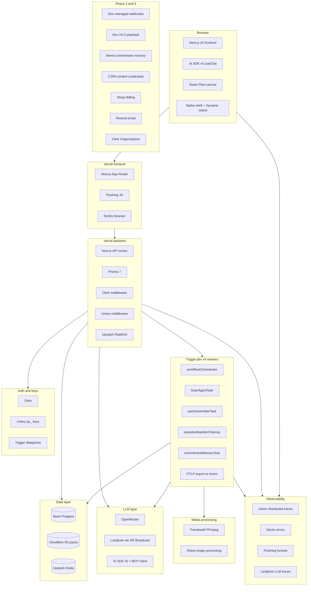
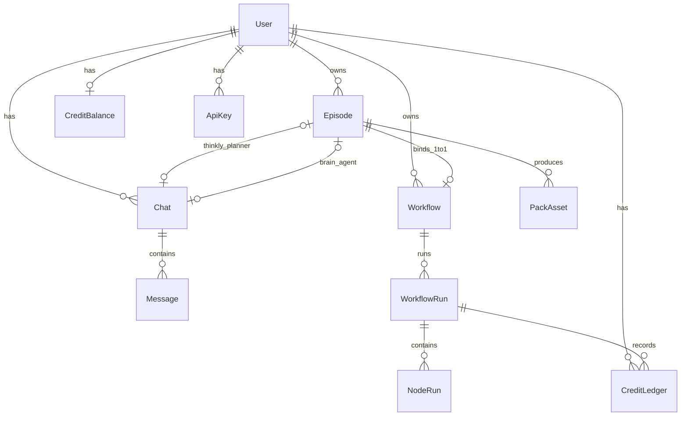

# Thinkly — The Idea, The System, The Bet

**Version:** 1.0 · **Date:** June 2026  
**Purpose:** Single source of truth for what Thinkly is, how we got here, what needs to be built, and whether this is worth the investment of time, money, and a YC application.  
**Companion:** `FUTURE_GROWTH.md` (full research archive), `learning/CHAT_SYSTEM_DESIGN.md` (Brain/MCP RFC), `thinkly-backend/prisma/schema.prisma` (current schema)

---

## Table of contents

1. [Where we started — and why it was wrong](#1-where-we-started--and-why-it-was-wrong)
2. [The thinking journey — briefly](#2-the-thinking-journey--briefly)
3. [Where we landed — the final idea](#3-where-we-landed--the-final-idea)
4. [Why this is defensible — the honest moat anatomy](#4-why-this-is-defensible--the-honest-moat-anatomy)
5. [Current system — what exists today](#5-current-system--what-exists-today)
6. [What needs to be built — complete picture](#6-what-needs-to-be-built--complete-picture)
7. [Production stack — the whole picture](#7-production-stack--the-whole-picture)
8. [The data model — full schema](#8-the-data-model--full-schema)
9. [Is this worth building? — validation framework](#9-is-this-worth-building--validation-framework)
10. [Is this YC-investable? — blunt verdict](#10-is-this-yc-investable--blunt-verdict)
11. [30-day action plan — what happens next](#11-30-day-action-plan--what-happens-next)

---

## 1. Where we started — and why it was wrong

The first version of Thinkly was described as a **"governed creative runtime"** — a DAG-based workflow builder for AI media pipelines with a credit ledger, MCP server, node-run audit trail, and an enterprise compliance story around EU AI Act provenance.

It was technically competent and strategically dead.

The problems were immediate on reflection:

**Problem 1: The competitive landscape had already moved.** By mid-2026, Figma acquired Weavy (now Figma Weave), Adobe shipped Project Graph, Canva acquired Simtheory and Ortto, and 40+ companies in the W26 YC batch were building workflow orchestration for creative AI. Building "another node canvas with a credit ledger" meant joining a pile of well-funded competitors with better distribution. The right move was not to fight on that terrain.

**Problem 2: The credit ledger was pitched as the moat.** The original positioning was essentially "Stripe for creative AI pipelines" — microcredit holds per node, reconcile on cancel, per-run cost visibility. These are important infrastructure details. They are not a product people buy. Nobody chooses a creative platform because of the billing primitives. The ledger is plumbing; it was being pitched as the kitchen.

**Problem 3: "24 vertical Sparklines"** — at one point the strategy document contained a grid of 24 target verticals (wedding AI, clinical AI, real estate, e-commerce, UGC for SaaS, localization, etc.). Each was a plausible market. Together they were evidence of no market conviction at all. A company that can be everything is nothing.

**Problem 4: The canvas was being sold as the product.** The React Flow canvas, the DAG editor, the node palette — these are the infrastructure that enables the product. They are not the product. The product is what happens after you run the graph.

The original framing needed to be abandoned. The underlying infrastructure (Trigger.dev orchestration, MCP server, credits, realtime) was solid. The product story was not.

---

## 2. The thinking journey — briefly

The document went through roughly six distinct strategic positions before arriving at the final idea. Here is the compressed version:

### Position 1 — Governed Creative Runtime (GCR)
"We are the execution layer with audit and budget governance for enterprise creative pipelines."  
*Problem:* Too B2B-first, too infrastructure-sounding, no consumer hook, and the ledger story is weaker than Stripe's actual primitives. Enterprise doesn't buy from zero-user startups.

### Position 2 — Sparkline (24 verticals)
"We serve 24 distinct creative verticals, each with a purpose-built blueprint template."  
*Problem:* Templates are features, not a company. You cannot simultaneously be wedding AI, clinical AI, and pitch AI with two engineers. Verticals become GTM after product-market fit, not before.

### Position 3 — Finish-line product ("Finish My Idea")
"Talk to Brain or open the canvas, get a polished pack you're proud to send."  
*Getting warmer.* The insight that creative work has a finish line — and most tools do not actually get you there — was right. But "Finish My Idea" is too generic. It describes everything and nothing. AlbumOS already owns the "finish line" framing for music. The word "finish" alone was not defensible.

### Position 4 — Sendable / anti-slop
"The last step before you attach your name. Plan-first creative packs that don't export until you'd actually send them."  
*Better, but still a feature.* The insight about AI slop destroying trust was accurate and timely. But "Sendable" positioned Thinkly as a quality filter, not a platform. Creators won't publicly admit they used an AI filter before sending. Enterprises can DIY this. The angle was psychologically correct but commercially thin.

### Position 5 — Green Room
"Private creative prep before a high-stakes send."  
*Right emotional register, wrong product definition.* Green Room captured the discretion and privacy angle correctly. But calling it a "room" made it sound like a collaboration tool, not a platform primitive. The language was good; the architecture was still undefined.

### Position 6 — Episodic Creative Close ← **This is it**
"Thinkly closes the episode. From 'I have an idea' to 'I'd put my name on this' in under 15 minutes — private, archived, done."  
*This is the idea.* An **episode** is a bounded creative project with a beginning, a middle (private prep), and a definitive end: the **sign-off and close**. Episodes produce a **pack** (the outputs). Closed episodes appear in a **sent grid** — a private credibility timeline. The sign-off is not just a UX button; it is a semantic event that locks the pack, triggers archival, and begins building commitment memory. No other product in 2026 has this primitive.

---

## 3. Where we landed — the final idea

### 3.1 The one honest sentence

> **Thinkly is where you close a high-stakes creative send — talk through it, build the pack privately, and ship with your name on it.**

### 3.2 The product in plain language

Every high-stakes creative send — a pitch to investors, a job application, a client proposal, a campaign brief — starts the same way: a messy idea, a blank screen, and anxiety about whether what you produce will represent you well.

Thinkly gives you a private episode room for that moment.

You describe the idea. Thinkly's planner (Thinkly Chat) asks 4–6 focused questions and produces a Blueprint — a structured plan. The Brain builds a generative workflow from that blueprint, runs it, and fills a Pack: a hero clip, copy variants, a summary, thumbnails. You review the outputs privately in the Green Room. You iterate if needed. You sign off. The episode closes. The pack is locked and archived in your Sent Grid.

From the outside, people see what you shipped. They never see the 14 rejected hooks, the workflow graph, or the three runs it took to get the hero clip right.

**The Sent Grid is your private credibility timeline.** Every closed episode is a timestamped, immutable record of something you decided was good enough to put your name on. After 10 episodes, it proves you finish things — to yourself first, and optionally to a reviewer via a share link.

### 3.3 Who this is for (primary and secondary)

**Primary — solo founders preparing a pitch:**  
A first-time founder preparing a seed pitch has a specific and high-stakes output need: a 15-second hero clip for Loom, three sharp investor hook variants for email, and a one-paragraph summary for the Docsend intro. They need to produce this in one evening without looking like they used generic AI. `pitch_cinema` is the template for them.

**Secondary — technical professionals with career-risk sends:**  
A senior engineer applying to a FAANG-tier role who needs a portfolio intro video, a crisp LinkedIn summary, and a set of project highlights. Not a volume need — a quality-and-confidence need. `career_credential` is the template.

**Tertiary (after wedge proves) — agencies with client deliverables:**  
A small creative agency that produces weekly hero packs for 3–5 DTC clients. Each client deliverable is an episode. The agency closes episodes and shares packs with clients via links. `client_pack` is the template.

**Not the user right now:** enterprise creative ops teams, pro video editors, general "AI creative" users wanting infinite generation. Those come after the wedge proves close rate.

### 3.4 The user experience — one real session

1. User opens Thinkly. Home is the **Sent Grid** — their closed episodes. It is empty. There is one button: **Start episode**.

2. They choose the `pitch_cinema` template. They type one sentence: *"I'm building a B2B SaaS for construction project management."*

3. **Thinkly Chat** asks 4 questions:
   - What is the unfair advantage?
   - Who is the specific investor type you are targeting?
   - Bold and urgent, or humble and data-led?
   - Do you have a product screenshot or brand image?

4. The user answers. Thinkly Chat produces a **Blueprint** — a structured plan: "Aggressive hook angle. Visual: dark industrial setting transitioning to clean SaaS UI. Three hook variants: problem-led, traction-led, vision-led."

5. User clicks **Activate**. The **Brain** reads the Blueprint and builds a workflow via the MCP server: `gptImage2` keyframe → `klingV3` motion → `openRouter` for three hook variants → `openRouter` for summary. Progress shows in chat: *"Building hero sequence..."*, *"Writing investor hooks..."*

6. Pack arrives in the **Episode Workspace**:
   - Hero clip: 20-second MP4
   - Hook A: "Construction projects fail because of communication. We fixed that."
   - Hook B: "3 of 5 projects run over budget. Every one of them used email to coordinate."
   - Hook C: "$180B spent annually on construction delays. We've cut that by 34% for 12 teams."
   - Summary: one paragraph, VC-voice

7. **Green Room.** User reads. Writes a private note: *"Hook B is too soft. Run the copy node again with sharper problem framing."* One node re-runs. New Hook B arrives. Better.

8. **Sign-off.** User clicks. Episode status → **closed**. Pack locked. `closedAt` written. `packHash` computed. Sent Grid shows the first thumbnail with a date stamp.

9. User attaches the hero clip to their Docsend. Pastes Hook C into the first investor email. The pack stays in their Sent Grid — a private record of something they actually shipped.

### 3.5 What this is NOT

| Not this | Why |
|----------|-----|
| Workflow automation platform | Users do not think of creative prep as automation |
| Infinite AI video generator | Volume is not the need; quality and close confidence is |
| ChatGPT + Canva combined | Open-ended tools; no episode, no sign-off, no archive |
| Frame.io or Ziflow | Post-production review; Thinkly is pre-send |
| AlbumOS | Music-only finish line; potential partner, not competitor |
| "Another AI tool" | The episode + close primitive is structurally different from run-and-export |

---

## 4. Why this is defensible — the honest moat anatomy

### Moat A — The episode primitive changes the architecture (4–6 months to copy)

An `Episode` is not a saved workflow. It is a **semantic lifecycle object** with state transitions, timestamp immutability, private context fields, and co-designed billing. Specifically:

- `Episode.status` gates what the system can do: no pack export before `closed`, no canvas mutation after `closed`, credit hold per episode (not per run)
- `Episode.closedAt` makes the pack immutable — the pack assembler stops writing, the workflow becomes read-only, the Brain session key is revoked
- `Episode.judgeContext` and `Episode.signOffNote` are private fields that feed the plan bias for future episodes without ever being exposed in the API
- `Episode.packHash` is a SHA-256 fingerprint of all pack assets computed at close — the foundation for verifiable provenance (C2PA, Phase 4)

To copy this, a competitor must redesign their workflow model (mutation rules change on every existing endpoint), their billing (run-scoped → episode-scoped), their UX language, their navigation, and their API surface simultaneously. A well-funded team does this in 4–6 months minimum. By then Thinkly has 50+ closed episodes and the next moat.

### Moat B — Commitment memory no one can buy (6+ months of data, then compounding)

After 50+ closed episodes, Thinkly has structured behavioral data that does not exist anywhere else:

- Which plan structures this user always rejects before signing off
- Which node combinations produce outputs they close on
- What audience framing they use (`judgeContext`)
- How many plan iterations they need before committing

This data is stored in `Episode.commitmentMeta` (structured JSON at close) and surfaced via Mem0 semantic search at plan time. The consequence: the third episode Thinkly helps a user close takes fewer iterations than the first, because the Brain's planning prompt is seeded with their prior commitment patterns.

A new entrant copying the architecture starts from zero on this signal. You cannot purchase it. It only exists because the sign-off primitive exists — which is the prerequisite for collecting it.

### Moat C — The Sent Grid creates archive lock-in

The Sent Grid is a private credibility timeline. It grows with every closed episode. The psychological value compounds: after 10 closed episodes, the grid is a record of 10 things you had the courage to commit to and ship. Switching to a competitor means starting over with an empty grid.

This is the same mechanism as GitHub's contribution graph. The moat is not the green squares — it is the years of history behind them.

### Moat D — MCP server is simultaneously Brain and public API

Thinkly's `/api/mcp` with 20 tools is the same surface the Brain uses internally AND the same surface external agents (Cursor, etc.) use for API access. Every tool built for Brain automatically becomes a capability for the public API. Every public API improvement automatically strengthens Brain.

Most competitors either have no public API (Mosaic, Martini) or maintain separate internal/external surfaces. The shared surface is architecturally unusual and creates compounding leverage.

### What is NOT a moat (honest)

- The node canvas (Figma Weave, Adobe Project Graph, ComfyUI all have this)
- The credit ledger (any platform can add usage metering)
- The chat interface (ChatGPT, Claude, and 40 W26 agents all have this)
- Multi-model LLM routing (OpenRouter makes this commodity)

The canvas, credits, and chat are **necessary infrastructure**. They are not the differentiation. The differentiation is the episode lifecycle that connects them into a close.

---

## 5. Current system — what exists today

### 5.1 Two-repo architecture

```
thinkly-frontend    Next.js 16, React 19, React Flow, Barba, Zustand, Tailwind
thinkly-backend     Next.js 16 API, Prisma 7, Trigger.dev v4, Unkey, OpenRouter
```

Frontend rewrites `/api/*` → backend. `@thinkly/shared` (node schemas, Zod) lives in backend, synced to frontend at build time via `pnpm sync-shared`.

### 5.2 What is actually working today

| Capability | Status |
|------------|--------|
| DAG workflow builder (React Flow canvas) | Working |
| Node execution via Trigger.dev v4 | Working |
| Credit hold + reconcile + ledger | Working |
| Public API `/api/v1/*` with Unkey `gx_` keys | Working |
| MCP server `/api/mcp` (20 tools) | Working |
| Outbound Svix-style webhooks | Working |
| OpenRouter + Transloadit (FFmpeg) in nodes | Working |
| Realtime run status via `useRealtimeRun` | Working |
| Barba transitions + Dynamic Island shell | Working |
| Upload route (Transloadit) | Working |
| OpenAPI 3.1 docs (Mintlify) | Working |

### 5.3 What is mock / not built yet

| Capability | Status |
|------------|--------|
| Chat (Thinkly Chat, Brain, Helper) | Mock UI only — no LLM, no persistence |
| Episode entity (the core of the new idea) | Not in schema |
| PackAsset entity | Not in schema |
| Sent Grid UI | Not built |
| Green Room sign-off | Not built |
| Blueprint engine | Not built |
| Brain MCP agent loop | Not built |
| `publicAccessToken` on MCP `start_run` | Gap — workaround documented in CHAT RFC |
| Pack assembler | Not built |
| Commitment memory | Not built |

### 5.4 Existing nodes (what the orchestrator can run today)

| Node | What it does | Provider |
|------|-------------|----------|
| `openRouter` | LLM text generation (any OR model) | OpenRouter |
| `gemini` | Gemini-specific LLM calls | OpenRouter (Gemini) |
| `gptImage2` | Image generation | OpenAI (stub in current env) |
| `klingV3` | Video generation from image+prompt | Kling (stub in current env) |
| `cropImage` | Crop/resize image via FFmpeg | Transloadit |
| `mergeVideo` | Concatenate video clips | Transloadit |
| `mergeAV` | Combine audio + video | Transloadit |
| `extractAudio` | Extract audio track from video | Transloadit |
| `requestInputs` | Scaffold — user input entry point | N/A |
| `response` | Scaffold — pack output assembly | N/A |

**Note on `gptImage2` and `klingV3`:** These return stub/demo media in the current environment. This is a hard blocker for the `pitch_cinema` wedge template demo. Real API access to Kling v3 and GPT Image 2 must be resolved before demoing to users or investors.

---

## 6. What needs to be built — complete picture

### 6.1 New nodes (extend the node library — considered done in the near term)

The current 8 executable nodes are a foundation. A production platform needs more. These are all additive — they do not change the orchestrator architecture, just the `@thinkly/shared` node catalog and corresponding Trigger tasks.

**Immediate priority (needed for wedge templates):**

| Node | Purpose | Provider |
|------|---------|----------|
| `voiceoverTTS` | Text-to-speech for hero clip narration | ElevenLabs / OpenAI TTS |
| `imageUpscale` | Resolution boost for pack assets | Magnific / Real-ESRGAN |
| `captionBurn` | Burn subtitles/captions into video | Transloadit FFmpeg |
| `videoResize` | Resize/crop to platform ratios (9:16, 1:1, 16:9) | Transloadit FFmpeg |
| `colorGrade` | Apply color LUT to video for brand consistency | FFmpeg |
| `backgroundRemove` | Remove background from image | Remove.bg / RMBG |
| `imageComposite` | Layer images with blend modes | Sharp / Canvas API |

**Second wave (platform completeness):**

| Node | Purpose | Provider |
|------|---------|----------|
| `audioEnhance` | Noise reduction, EQ on uploaded audio | Dolby.io / Adobe Enhance |
| `lipSync` | Sync dubbed audio to video | Sync.so / Hedra |
| `videoTranslate` | Translate + lip-sync to target language | Sync.so |
| `structuredExtract` | Extract structured data from document/URL | Jina / OpenRouter |
| `imageAnimate` | Animate still image (not full video) | Runway / LeiaPix |
| `musicGen` | Generate background music from prompt | Suno / Udio API |
| `screenRecord` | Screenshot or record a URL | Browserbase / Playwright |
| `pdfRender` | Render PDF to image sequence | Gotenberg |
| `socialFormat` | Auto-format pack assets for platform specs | Internal transform |
| `webhookNode` | POST result to external URL mid-graph | Internal |

**Enterprise / compliance nodes (Phase 3+):**

| Node | Purpose | Provider |
|------|---------|----------|
| `humanApproval` | Pause run; wait for human approve/reject via Trigger waitpoint | Internal + Trigger |
| `c2paSign` | Embed C2PA content credentials on close | `@contentauth/c2pa-node` |
| `safetyCheck` | Run output through content moderation | OpenAI Moderation / Perspective |
| `brandGuardrail` | Check output against brand guidelines (LLM judge) | OpenRouter |

### 6.2 Chat system (the Brain + Thinkly Chat + Helper)

This is the largest single build. Fully specced in `learning/CHAT_SYSTEM_DESIGN.md`. Summary:

**Three distinct chat modes:**

```
Helper (singleton)     — Read-only node catalog Q&A. Cheap model. No write access. Always available.
Thinkly Chat (many)   — Socratic planner. Produces a Blueprint. Never executes. Cheap model.
Brain (one per episode) — MCP agent. Imports Blueprint. Builds Workflow. Runs it. Streams results.
```

**Stack:**
- Vercel AI SDK v5 (`ai` + `@ai-sdk/react`) for streaming + tool UI
- OpenRouter as LLM gateway (one key, model routing by chat mode)
- `@ai-sdk/mcp` with Streamable HTTP transport pointing at `/api/mcp`
- New Prisma models: `Chat`, `Message` (see §8)
- New Trigger task: `brainAgentTask` — the AI SDK agent loop runs in Trigger, not in a serverless function (avoids timeout on long tool chains)

**The one critical gap to close first:**  
`POST /api/v1/runs` (what MCP `start_run` calls) does not return a `publicAccessToken`. The Brain cannot subscribe to realtime run updates without it. Fix: after `start_run`, the Brain calls `POST /api/chat/run-token` (new route) with the `orchestratorRunId` to mint a scoped token. The token is then used with `useRealtimeRun` in the chat UI. This is documented in CHAT RFC §7.4.

**Blueprint output contract (Thinkly Chat → Brain):**

```typescript
type Blueprint = {
  intent: string
  requestFields: RequestField[]
  nodes: BlueprintNode[]
  edges: BlueprintEdge[]
  rationale: string
  openQuestions: string[]
  slotMapping: Record<string, string>  // slotId → nodeId
}
```

The Blueprint is inert — it has no `workflowId`, it has never run, it cannot be executed. The Brain's first action on receiving a Blueprint is to call `create_workflow` via MCP, then audit the Blueprint against the actual node catalog, repair any errors, and build the graph.

### 6.3 Episode lifecycle (the core product primitive)

The Episode entity must exist before anything else. It is the semantic container that gives the rest of the system meaning.

**New routes:**

```
POST   /api/episodes                           Create episode
GET    /api/episodes                           Sent grid + open episodes
GET    /api/episodes/:id                       Episode detail
PATCH  /api/episodes/:id                       Update (title, judgeContext) while drafting
POST   /api/episodes/:id/activate-blueprint    Promote Blueprint → Brain → Workflow
POST   /api/episodes/:id/approve-plan          Green Room gate → completes Trigger waitpoint
POST   /api/episodes/:id/sign-off              { note } → signedOffAt → pack assemble → closed
POST   /api/episodes/:id/abandon               Soft delete, release credit hold
GET    /api/episodes/:id/pack                  Download bundle (closed only)
POST   /api/episodes/:id/share                 Generate signed share token (closed only, 30d TTL)
```

### 6.4 Pack assembler (new Trigger task)

After orchestrator success, a `packAssemblerTask` runs:
1. Reads `WorkflowRun` response node outputs
2. Maps output URLs/text to `PackAsset` slot IDs per template spec
3. Copies binary assets to Cloudflare R2 at path `packs/{episodeId}/{slotId}.{ext}`
4. Writes `PackAsset` rows with CDN URLs
5. Computes `packHash` = SHA-256(sorted asset URLs + closedAt timestamp)
6. Updates `Episode.status = ready`

On sign-off, `packAssemblerTask` marks assets immutable. No further writes to R2 paths under that episode.

### 6.5 Sent Grid UI

The home screen. Not a dashboard. Not a workspace. A grid of closed pack thumbnails — each showing the hero asset, the episode title, and the date closed. Clicking opens the episode workspace in read-only mode with pack download and optional share link generation.

**Key rules:**
- Only closed episodes appear in the default view
- Open/drafting episodes appear in a separate "in progress" section, smaller, below the grid
- No workflow IDs, node counts, or run times visible anywhere in the default view
- Pack assets load from R2 CDN — not from run outputs

### 6.6 Green Room (sign-off UI)

The Green Room is the episode workspace state when `status = ready`. It shows:
- Pack assets (hero clip, copy variants, summary) — the outputs only
- A plan summary (the Blueprint rationale, not the node graph)
- A private notes field (`signOffNote` — never leaves the server)
- Two actions: **Re-run a slot** (triggers a single node re-run) or **Sign off** (closes episode)

It does not show:
- The workflow graph (graph is behind a "Studio mode" toggle)
- Node logs or provider names
- Credit costs per node
- Raw prompt content

### 6.7 Wedge templates

Two templates for launch. Both in `workflow-templates.ts` plus accompanying Thinkly Chat system prompts.

**Template 1: `pitch_cinema`**

| Slot | Content | Node chain |
|------|---------|-----------|
| `slot_hero` | 15–30s hero clip | `gptImage2` → `klingV3` → optional `mergeAV` voiceover |
| `slot_hook_1` | Investor hook A (aggressive) | `openRouter` |
| `slot_hook_2` | Investor hook B (problem-first) | `openRouter` |
| `slot_hook_3` | Investor hook C (traction) | `openRouter` |
| `slot_summary` | 200-word VC-voice summary | `openRouter` |
| `slot_deck_thumb` | 1200×628 branded thumbnail | `gptImage2` |

Estimated cost: ~4.2 credits. Target time-to-ready: under 6 minutes active.

**Template 2: `career_credential`**

| Slot | Content | Node chain |
|------|---------|-----------|
| `slot_intro_video` | 45–60s professional intro | `gptImage2` (background) → `klingV3` → `mergeAV` (TTS voice) |
| `slot_linkedin_summary` | 300-word LinkedIn About | `openRouter` |
| `slot_project_highlight_1` | Project description + framing | `openRouter` |
| `slot_project_highlight_2` | Second project | `openRouter` |
| `slot_portfolio_thumb` | Portfolio header image | `gptImage2` |

Estimated cost: ~3.8 credits. Target time-to-ready: under 8 minutes active.

---

## 7. Production stack — the whole picture

### 7.1 Architecture overview



### 7.2 Integration rationale — every service justified

| Service | Role | Phase | Why this one |
|---------|------|-------|-------------|
| **Clerk** | Auth + session management | P0 live | Same-origin rewrite pattern; `userId` as PK; org support Phase 4 |
| **Neon Postgres + Prisma 7** | System of record | P0 live | Copy-on-write branching per PR for Episode E2E tests; PITR; serverless adapter |
| **Trigger.dev v4** | Orchestration + waitpoints + realtime | P0 live | Warm starts (100–300ms); waitpoints for Green Room gate; OTLP export; already deployed |
| **OpenRouter** | All LLM calls (chat + nodes) | P0 live | Single key; model routing; spend caps; Broadcast to Langfuse zero-code |
| **Unkey** | `gx_` API keys + Brain session keys | P0 live | Key metadata for episode scoping; per-key rate limits; already deployed |
| **Transloadit** | Upload assemblies + FFmpeg nodes | P0 live | Serverless-friendly; already configured; crop/merge/extract working |
| **Vercel AI SDK v5** | Brain streaming + MCP client | P1 | Only SDK with Streamable HTTP MCP transport + `useChat` + tool UI in one package |
| **Upstash Redis** | Chat ratelimit per userId | P1 | HTTP-based (works on edge + serverless); `@upstash/ratelimit` sliding window; complement to Unkey |
| **PostHog** | Episode close funnel analytics | P0 instrument | 1M events/mo free; server-side capture; session replay; north-star funnel out of box |
| **Langfuse** (via OR Broadcast) | LLM trace per episode | P1 | Zero-code setup via OpenRouter settings; tags `episode_id`, `chat_kind`, token cost |
| **Axiom** (via Trigger OTLP) | Distributed traces | P1 | `episodeId` ↔ `WorkflowRun` ↔ `NodeRun` in one queryable trace |
| **Sentry** | API + frontend error tracking | P1 | `episodeId` as tag; error budget per phase |
| **Cloudflare R2** | Pack archive + CDN delivery | P2 | Zero egress fees; S3-compatible presigned PUT; Tiered Cache; custom domain |
| **Trigger Waitpoints** | Green Room plan gate | P1 | Already in Trigger v4; billing pauses while user reviews; no custom polling |
| **Mem0** | Semantic commitment memory | P2 | `user_id` + `run_id=episodeId` scoping; async processing; hosted or self-host |
| **Svix SaaS** | Reliable `episode.closed` webhooks | P3 | Consumer-side compatible with current HMAC; retry dashboard; SOC2 |
| **Mux** | HLS playback for share links | P3 | Signed JWT URLs; instant clip trim; optional (raw R2 MP4 may suffice) |
| **Clerk Organizations** | Team sent library + reviewer roles | P4 | May replace custom `Organization` table; built-in SSO |
| **Stripe Billing** | Team tier invoicing | P4 | Usage records from credit ledger → invoices |
| **Resend** | "Pack ready" + reviewer invite emails | P3 | Low; only needed when async episodes exist |
| **C2PA (`@contentauth/c2pa-node`)** | Signed content credentials on MP4 | P4 | `BmffHash` pattern; `packHash` anchor already planned; org-tier only |

---

## 8. The data model — full schema

### 8.1 What exists today

```prisma
// thinkly-backend/prisma/schema.prisma — June 2026

model User          { id, workflows[], balance, ledgers[], keys[], createdAt }
model Workflow      { id, userId, name, nodes Json, edges Json, status, runs[], webhookUrl, webhookSecret }
model WorkflowRun   { id, workflowId, userId, scope, status, orchestratorRunId, inputValues, nodeRuns[], ledgers[] }
model NodeRun       { id, runId, nodeId, nodeName, status, inputs, output, providerUsed, creditCost, logs, ... }
model CreditBalance { id, userId @unique, balance Int (microcredits) }
model CreditLedger  { id, userId, amount, type, runId, nodeRunId, balanceAfter }
model ApiKey        { id, userId, keyId, maskedKey, rateLimitPerMin, rateLimitPerDay }
```

### 8.2 New models — P0 migration

```prisma
enum EpisodeStatus {
  drafting      // Thinkly Chat only — no credits, no workflow created
  preparing     // Brain building workflow via MCP
  rehearsing    // Plan approved; orchestrator running
  ready         // All required pack slots filled; Green Room shown
  closed        // Immutable — in sent grid; pack locked
  abandoned     // Soft deleted; credit hold released
}

enum EpisodeTemplate {
  pitch_cinema
  career_credential
  client_pack
  finish_my_idea
  custom
}

model Episode {
  id              String          @id @default(cuid())
  userId          String
  user            User            @relation(fields: [userId], references: [id])
  title           String
  template        EpisodeTemplate @default(custom)
  status          EpisodeStatus   @default(drafting)

  // Private context fields — NEVER returned in default API responses
  judgeContext    String?         // "seed investor at tier-1 fund"
  audienceNotes   String?         // any user framing notes
  signOffNote     String?         // user's private words at commitment moment

  // Workflow binding — strict 1:1
  workflowId      String?         @unique
  workflow        Workflow?       @relation(fields: [workflowId], references: [id])

  // Chat bindings
  thinklyChatId   String?         // the planner chat that produced the Blueprint
  brainChatId     String?         @unique  // the brain chat bound to the workflow

  // Lifecycle timestamps
  blueprintAt     DateTime?       // when Blueprint was activated
  planApprovedAt  DateTime?       // when user approved plan in Green Room
  signedOffAt     DateTime?       // when user clicked sign-off
  closedAt        DateTime?       // when pack was assembled and episode sealed

  // Commitment memory (structured — Mem0 semantic layer added P2)
  planIterations  Int             @default(0)
  commitmentMeta  Json?           // { rejectedBeats[], approvedTone, nodePref[], audience }

  // Immutable attestation
  packHash        String?         // SHA-256 of pack assets at close (written once, never updated)

  // Waitpoint token for Green Room gate
  planGateToken   String?         // Trigger waitpoint token ID

  packAssets      PackAsset[]
  createdAt       DateTime        @default(now())
  updatedAt       DateTime        @updatedAt

  @@index([userId, status])
  @@index([userId, closedAt])
  @@index([userId, template])
}

model PackAsset {
  id              String   @id @default(cuid())
  episodeId       String
  episode         Episode  @relation(fields: [episodeId], references: [id], onDelete: Cascade)
  slotId          String   // slot_hero | slot_hook_1 | slot_summary | etc.
  label           String   // "Investor hero clip"
  mediaType       String   // video | image | text | bundle
  url             String?  // R2 CDN URL — immutable on close
  textContent     String?  // for copy/text slots
  mimeType        String?
  fileSizeBytes   Int?
  durationMs      Int?     // for video/audio

  // Provenance — private by default; org audit export only
  workflowRunId   String?
  nodeId          String?
  nodeRunId       String?
  c2paManifestUrl String?  // Phase 4 — content credential URL

  createdAt       DateTime @default(now())

  @@index([episodeId, slotId])
}

enum ChatKind { helper thinkly brain }

model Chat {
  id          String    @id @default(cuid())
  userId      String
  user        User      @relation(fields: [userId], references: [id])
  kind        ChatKind
  title       String?
  episodeId   String?
  workflowId  String?   @unique  // Brain chats: 1:1 with workflow
  blueprint   Json?              // the Blueprint document (Thinkly Chat output)
  modelId     String?            // OpenRouter model slug used
  messages    Message[]
  createdAt   DateTime  @default(now())
  updatedAt   DateTime  @updatedAt

  @@index([userId, kind])
  @@index([episodeId])
}

model Message {
  id                String   @id @default(cuid())
  chatId            String
  chat              Chat     @relation(fields: [chatId], references: [id], onDelete: Cascade)
  role              String   // user | assistant | tool
  parts             Json     // AI SDK v5 message parts format
  orchestratorRunId String?  // when this message triggered a run
  workflowRunId     String?
  createdAt         DateTime @default(now())

  @@index([chatId, createdAt])
}
```

### 8.3 Workflow model extensions (add to existing)

```prisma
// Add to Workflow:
episodeId           String?   // soft back-link to episode
templateId          String?   // "pitch_cinema" etc.
blueprintSource     Json?     // the Blueprint that generated this workflow
isEpisodeLocked     Boolean   @default(false)  // true after episode.closed

// Add to WorkflowRun:
episodeId           String?
planApprovedAt      DateTime?
graphSnapshot       Json?     // frozen graph at run start (replay/audit)
```

### 8.4 Entity relationship



---

## 9. Is this worth building? — validation framework

### 9.1 The bet in plain language

The entire idea rests on one behavioral assumption: **users will complete a sign-off ritual on creative work before sending it.**

Not just generate. Not just download. Sign off. Commit. Close the episode.

If this behavior emerges, every moat in this document activates. The sent grid fills. Commitment memory accumulates. The archive creates lock-in. The product becomes genuinely hard to copy.

If this behavior does not emerge — if users generate and download and never sign off — Thinkly is a prettier AI video tool with a database of incomplete drafts. The moats are fiction.

This is the single most important unknown. Everything else (stack, nodes, integrations, moats, YC pitch) is downstream of this one question.

### 9.2 The 90-day falsification test

You need 15 users. Not beta testers. Not friends. **15 users who are actively fundraising or actively job-searching right now**, recruited cold or through warm intros where they genuinely need the output.

| Metric | Target | Kill signal |
|--------|--------|-------------|
| Episode started → pack ready | — | Measure drop-off, fix UX |
| Pack ready → sign-off (close rate) | ≥ 40% | < 20% → ritual is too heavy |
| Closed episode → pack attached to real send | ≥ 4 of 10 closers | < 2 → pack quality issue |
| Second episode within 7 days | ≥ 25% of closers | 0% → one-off tool, not platform |
| User says "I'd send this" unprompted | ≥ 3 of 5 interviews | "cool video" → wrong framing |
| Time to sign-off on `pitch_cinema` | Trending down across sessions | Stuck > 20 min → too many steps |

**If close rate ≥ 40% and ≥ 3 real sends are documented:** apply to YC. The story is there.  
**If close rate 20–40% and users cite quality:** fix the template and re-test.  
**If close rate < 20% and users say "I'll just download it":** the ritual is the problem. Explore lighter sign-off (one-click, no note) or remove the ritual from the critical path entirely.

### 9.3 The production blocker that must be resolved first

`klingV3` and `gptImage2` return stub/demo media in the current environment. The hero clip — the centerpiece of `pitch_cinema` — comes from `klingV3`. If the hero is a stub, the demo is a lie and the falsification test is invalid.

**This must be resolved before talking to any users.** Options:
1. Get real API access to Kling v3 and GPT Image 2 (preferred)
2. Redesign `pitch_cinema` to use only nodes that produce real outputs today (`openRouter` copy + `gptImage2` still images if that works)
3. Use a different video generation provider with working API access (Runway, Hailuo, Luma)

### 9.4 The competitive threat calendar

| Timeline | Threat |
|---------- |--------|
| Now | AlbumOS owns "finish line" for music — do not use that language |
| 3–6 months | Mosaic or a funded W26 agent adds "project close" view |
| 6–12 months | Canva ships "Publish to portfolio" as a Canva feature (not episode-semantics, but users won't care about the difference) |
| 12–18 months | Adobe adds send gate to Project Graph (Capsule seal + export) |

The window is real but it is 6–9 months of shipping, not planning. Every month spent on additional strategy documents instead of working product is one month closer to the window closing.

### 9.5 TAM reality check

The document has elaborate TAM calculations. They are mostly irrelevant at this stage. The honest sizing:

**Wedge market (pitch_cinema — active seed fundraisers):** ~200,000 active seed-stage founders globally per year. At $30/month average, that is a $72M ARR potential at full penetration. You need 0.1% of that to reach $72K MRR — a fundable milestone.

**Expansion market (career_credential — technical job seekers):** ~5M people per year who are actively seeking senior technical roles in competitive markets. Much larger, but harder to reach and the episode ritual may be lighter.

**Platform market (API + org tier):** If the episode primitive proves out with users, the API surface (MCP + `/api/v1`) becomes a distribution mechanism for agents and enterprise workflows. This is the $100M+ path — but it requires the wedge to work first.

**Honest conclusion:** The wedge market is not enormous. It is targeted, specific, and reachable. The platform expansion path is real but conditional on wedge proof. This is not a "spray and pray" TAM story — it is a "nail the wedge, then expand" story, which is exactly right for YC stage.

---

## 10. Is this YC-investable? — blunt verdict

### What YC will see if you show up right

- A product with a genuinely novel primitive (episode close + sent grid)
- A credible technical stack that real YC companies use in production
- A specific and testable wedge (pitch_cinema for fundraising founders — their audience)
- A demo that shows a real user closing a real episode in under 15 minutes
- A north-star metric they can evaluate (close rate + real sends)
- A competitive angle that is not "we're better than ChatGPT" but "we are the only product where done is a semantic event"

**That is a fundable YC application.**

### What will kill it

- Showing up without closed episodes — pitching architecture instead of product
- `klingV3` stub media in the demo — a fake hero clip destroys credibility instantly
- Leading with the credit ledger, the MCP server, or the node canvas as the pitch — those are infrastructure
- Talking about 24 verticals or enterprise GCR — those were early drafts, not the story
- Close rate data from 3 friends instead of cold-recruited founders who were actually fundraising

### The YC one-liner that actually lands

> "Forty companies in W26 built agents that start creative work. We built the first one that closes it — private prep, one blueprint, one pack you'd actually put your name on. The sent grid is your record of things you shipped, not things you tried."

### The partner's hardest question — answered

**"What stops Canva from adding a 'close' button?"**

Answer: "A Canva close button is a save state. Our close is a semantic event that locks the pack, computes a content hash, feeds structured data into a private commitment model, and changes what the system offers you next time. Canva would need to redesign their data model, billing, and UX language simultaneously — that's 6–9 months for a 120M-user platform where the episode ritual would confuse 95% of their users who just want to make a flyer. By then we have 500 closed episodes and a commitment memory layer nobody can buy."

### YC stage verdict

| Dimension | Score | Notes |
|-----------|-------|-------|
| Novel insight | ✓ Strong | Episode close as a semantic primitive is not in the market |
| Technical credibility | ✓ Strong | Stack is production-grade and realistic |
| Market | ⚠ Narrow but clear | Seed founders is small but reachable and directly relevant to YC audience |
| Traction | ✗ None yet | Zero closed episodes — this is the only thing that matters right now |
| Team signal | Unknown | Depends on execution speed from here |
| Competitive defense | ✓ Reasonable | 4–6 month copy window is honest and defensible if data moves fast |

**Net:** Apply when you have 10 closed episodes with ≥ 3 documented real sends. Not before. Not after you have 100 more strategy documents.

---

## 11. 30-day action plan — what happens next

This is the only thing that matters. Every other section of this document is background.

### Week 1 — Schema and API (no UI)

- [ ] Resolve `klingV3` and `gptImage2` stub issue — get real video output from at least one provider
- [ ] Write and run Prisma migration: `Episode`, `PackAsset`, `Chat`, `Message` + `Workflow`/`WorkflowRun` extensions
- [ ] Implement `/api/episodes` CRUD (create, list, get, patch, sign-off, abandon)
- [ ] Write and run unit tests for episode status transitions

### Week 2 — Core UI

- [ ] Build Sent Grid (`/episodes`) — closed pack thumbnails, date, title. No other nav.
- [ ] Build Episode Workspace shell (`/episode/:id`) — status banner, pack slot areas, sign-off CTA
- [ ] Add `pitch_cinema` template to `workflow-templates.ts`
- [ ] Wire episode creation → template picker → episode workspace

### Week 3 — Chat and Brain

- [ ] Implement Thinkly Chat (AI SDK v5, OpenRouter, Blueprint output contract)
- [ ] Implement Brain (AI SDK v5, `@ai-sdk/mcp`, episode-scoped Unkey key per §8.2)
- [ ] Close the `publicAccessToken` gap via `POST /api/chat/run-token` route
- [ ] Test end-to-end: episode → Thinkly Chat → Blueprint → Brain builds workflow → run

### Week 4 — Pack and close

- [ ] Implement `packAssemblerTask` in Trigger — maps run outputs to `PackAsset` slots
- [ ] Set up Cloudflare R2 bucket, CDN custom domain
- [ ] Implement Green Room UI — pack review, private note, re-run single slot, sign-off
- [ ] Implement sign-off API + `packHash` computation + `isEpisodeLocked` flag
- [ ] Add PostHog funnel events (server-side) + Axiom OTLP on Trigger workers

### Week 5–6 — Falsification cohort

- [ ] Recruit 15 users who are actively fundraising or job-searching — cold, not friends
- [ ] Give them access — no hand-holding, just the product
- [ ] Measure: close rate, time to sign-off, real sends, second episode rate
- [ ] Conduct 5 user interviews post-close (or post-abandon)
- [ ] Make kill/iterate/scale decision from data, not from this document

### What to defer until after week 6

- Second template (`career_credential`) — only if `pitch_cinema` closes
- Gallery and share links
- Commitment memory (Mem0 layer)
- Org features, team tier
- C2PA signing
- More node types beyond what `pitch_cinema` needs
- More strategy documents

---

## Appendix: Evolution of the idea (compressed)

For historical context — this is where `FUTURE_GROWTH.md` has 42 sections of detail:

| Phase | Position | Why abandoned |
|-------|----------|--------------|
| v1 | Governed creative runtime / GCR | Infrastructure pitch; no consumer hook; ledger isn't the product |
| v2 | 24 vertical Sparklines | Templates aren't a company; no conviction signal |
| v3 | "Finish My Idea" — general finish-line | Too generic; AlbumOS owns the language; no send anxiety hook |
| v4 | Sendable / anti-slop | Psychologically right; too thin commercially; creators won't admit it |
| v5 | Green Room | Right register; undefined architecture; sounds like collaboration tool |
| **v6** | **Episodic creative close** | **Episode + sign-off + sent grid = structural primitive. This is the one.** |

The infrastructure built for v1 (Trigger orchestration, credits, MCP, canvas) turns out to be exactly the right foundation for v6. Nothing needs to be thrown away. The product layer is what changes.

---

## §12. The B2B case — software businesses run on

> *Software which people play with leaves. Software businesses run on stays.*

Every consumer use case in this document (the solo founder closing a pitch, the engineer building a career pack) is a wedge, not a ceiling. The episode primitive is structurally more valuable to agencies and companies than it is to individuals — because at the business level, the sign-off is not a personal ritual. It is a **quality gate in a production workflow**.

This section answers the question: how do companies and agencies actually use Thinkly, what do they pay for, and why do they not leave?

---

### 12.1 The B2B insight — companies do not want to play, they want a closed loop

For a solo user, signing off is a confidence ritual. For a business, signing off is **accountability infrastructure**. Consider what a small creative agency does every week:

1. A client briefs them on a deliverable: "We need a 30-second hero for Q3 campaign launch."
2. The team generates 40 AI variants across three tools.
3. A creative director reviews and picks 4.
4. Account manager sends 4 to the client for approval.
5. Client approves 1.
6. Team assembles the final deliverable.
7. Someone attaches their name to it and sends it.

Steps 2–6 are entirely in Slack, email, shared drives, and ChatGPT. There is no record of who approved what, what was rejected and why, or what the final pack contained at the moment of sign-off. Two weeks later, a client disputes a detail. Nobody can reconstruct what was committed to.

**Thinkly's episode model is native to this workflow.** Each client deliverable is an episode. The sign-off is the account manager's approval gate. The sent grid is the agency's delivery record. The pack hash is the immutable commitment anchor.

The agency does not need to be sold on "AI creative tools." They already use them. They need the episode layer on top — the structured close that turns a pile of AI outputs into a committed deliverable.

---

### 12.2 Who the B2B users are — three specific profiles

#### Profile 1 — Small creative agency (5–20 people, 10–30 client accounts)

**What they do:** Produce weekly hero packs, ad variants, campaign briefs for DTC brands, SaaS companies, or hospitality clients.

**Their current pain:** Deliverables live in Notion + Dropbox + Figma + ChatGPT with no clean provenance. Client approvals happen in email threads that nobody archives correctly. When a campaign underperforms, there is no audit trail of what the creative commitment was.

**How they use Thinkly:**
- One episode per client deliverable
- Account manager opens episode, briefs Thinkly Chat
- Brain builds the pack (hero clip, 3 copy variants, thumbnail, summary)
- Creative director reviews in Green Room, iterates on 1–2 slots
- Account manager signs off and generates a **share link** — a read-only pack view the client sees
- Client approves via a simple CTA on the share page (optional, Phase 3)
- Episode closes; pack is in the agency's Sent Grid permanently

**What they pay for:**
- Team workspace (shared Sent Grid, shared credit pool)
- Per-episode credit usage (4–8 credits per deliverable)
- Share links with optional client approval gate
- Delivery history export (PDF audit log for client contracts)

**Annual contract estimate:** $300–600/month for a 5-person team at 40 episodes/month = $3,600–7,200 ARR per agency.

#### Profile 2 — Founder / growth lead at a Series A–B startup (in-house creative ops, 2–4 people)

**What they do:** Run performance creative for paid acquisition. Weekly cadence: new hero variants for Meta, YouTube, LinkedIn. Judgment calls on which creative to ship are high-stakes and high-frequency.

**Their current pain:** AI generates 30 variants. Nobody has time to review all 30. The ones that ship are whoever has production access that day. Post-mortems are impossible because nobody logged what was actually sent vs. what was discarded.

**How they use Thinkly:**
- `client_pack` template variant renamed as `performance_creative`
- Growth lead opens episode per campaign / per channel / per week
- Brain produces 6 hero variants (different angles, different hooks)
- Growth lead reviews 6, keeps 3, re-runs 1 with adjusted hook
- Signs off — 3 committed variants go into the Sent Grid
- Pack is downloaded and uploaded to Meta / Google via existing workflow
- Sent Grid becomes their **creative performance archive** — closed episodes can later be annotated with outcome data (CTR, ROAS) when Phase 3 ships

**What they pay for:**
- Creator plan ($80–120/month) + credits
- Later: performance annotation layer (phase 3 feature — annotate a closed episode with external metric)
- Later: API access to trigger episode runs from their internal tools

**Annual contract estimate:** $1,000–1,500 ARR per growth team, but acquisition is lower friction (self-serve).

#### Profile 3 — Boutique consulting firm / professional services (1–5 people, proposal-heavy)

**What they do:** Win clients through proposals, decks, and case studies. Each proposal is a high-stakes creative send. The quality difference between a polished proposal and an AI-generated one is the difference between closing and losing the deal.

**Their current pain:** Proposals take 4–6 hours to assemble. AI tools produce the content fast but the finishing work (design, formatting, tone consistency, one last polish pass) takes as long as writing from scratch used to. The "send with my name on it" anxiety is real and constant.

**How they use Thinkly:**
- `proposal_pack` template (variant of `finish_my_idea`)
- Consultant describes the prospect, the problem, and the proposed solution in Thinkly Chat
- Brain produces: 2-page exec summary, 3 differentiators (copy), hero visual, cover slide (image)
- Consultant reviews, adjusts tone in one copy node re-run
- Signs off — episode closes
- Downloads the pack, drops it into their proposal template in Notion or Pitch
- The Sent Grid shows a history of every proposal they have committed to — useful for personal retrospectives and for demonstrating output consistency to new hires

**What they pay for:**
- Solo or small team plan ($40–80/month)
- Credits per proposal (~3–5 credits each)

---

### 12.3 The agency feature set — what the B2B product looks like

These features are additive on top of the episode core. They do not change the primitive. They extend it for team and accountability contexts.

#### Team Sent Grid
A shared library of closed episodes organized by client, campaign, or project tag. Every team member's closes are visible to the workspace owner. Privacy model: episode content is visible within the team; `judgeContext` and `signOffNote` remain private to the individual who wrote them.

#### Client Share Links (Phase 2)
After close, generate a time-limited (30-day TTL) read-only share page. The page shows the pack (hero clip, copy, summary) without exposing the workflow graph, node logs, or credit costs. An optional `Approve` button on the share page records the client's approval as a metadata event on the episode — not a gate, just a timestamp.

#### Episode Tags and Folders (Phase 2)
Tag episodes with `client:Acme`, `campaign:Q3_launch`, `type:hero`. Folder view filters the Sent Grid. Export a folder as a ZIP (all pack assets) or a PDF delivery log.

#### Delivery Log Export (Phase 3)
A PDF (generated server-side via Puppeteer or equivalent) listing all closed episodes in a date range, with episode title, template used, pack hash, closed timestamp, and optional client approval timestamp. Designed to be attached to client contracts or agency SOW documents as a delivery record.

#### Performance Annotation (Phase 3)
After close, an episode can receive external outcome data: CTR, ROAS, conversion rate, engagement. This is a manual entry or a webhook-received field. It feeds back into commitment memory — if high-CTR episodes consistently used "problem-first hooks," the Brain learns to bias toward that structure for similar audience contexts.

#### Team Credit Pools and Caps (Phase 3)
Workspace owner sets a monthly credit budget. Team members draw from the pool. Owner sees per-member usage. Alerts when 80% consumed. This is additive over the existing per-user ledger — workspace has its own `CreditBalance` row.

#### Reviewer Roles (Phase 4)
A `reviewer` role can view the Green Room and add comments without being able to sign off. The account manager or creative director retains sign-off authority. Useful for agencies where a client-side contact wants visibility without the ability to close on behalf of the agency.

---

### 12.4 Why agencies stay — the B2B moat

For solo users, the Sent Grid is a personal credibility timeline. For agencies, it is a **client delivery record**. It answers: "What exactly did we commit to, and when?"

After 6 months of usage, an agency's Sent Grid is a production archive of everything they shipped — organized by client, dated, with pack hashes as integrity anchors. Switching to a new tool means:
- Losing the delivery history
- Rebuilding the workflow templates from scratch
- Re-training the Brain's commitment memory (per-user and eventually per-workspace)
- Migrating client share links

That is not a switching cost they will accept lightly. The tool becomes **infrastructure**, not a toy they play with. This is the exact quality the line describes: software businesses run on stays.

---

### 12.5 The B2B pricing architecture

| Plan | Who | Monthly | Credits included | Overage |
|------|-----|---------|-----------------|---------|
| **Solo** | Individual professionals | $39 | 80 credits (~16 episodes) | $0.50/credit |
| **Creator** | Freelancers + consultants | $79 | 200 credits (~40 episodes) | $0.45/credit |
| **Team** | Agencies + startups (up to 8) | $249 | 600 credits pooled | $0.40/credit |
| **Studio** | Agencies (up to 20) | $599 | 1,600 credits pooled | $0.35/credit |
| **Enterprise** | Custom | Custom | Custom + usage records | Negotiated |

Credits are consumed per episode run (~4–8 per episode depending on template). The pricing is designed so that a 5-person agency closing 2 episodes/week (~40 episodes/month) is comfortably on Team at $249/month.

**Annual contract logic:** Enterprise and Studio customers are offered 20% discount on annual commit. At $599/month Studio, that is $5,750 ARR per agency. 50 Studio agencies = $287,500 ARR. 50 is a realistic target after wedge proves.

---

### 12.6 The B2B GTM — how to actually reach agencies

**The wrong approach:** Cold outbound to creative agencies. "We built an AI creative platform" is spam in every creative director's inbox in 2026.

**The right approach — three specific entry points:**

#### Entry 1 — The account manager problem (warm, specific)
A solo founder or small agency account manager who personally closes a pitch pack on Thinkly and immediately sees its applicability to their work. They come in as a consumer (`pitch_cinema`), leave as a team champion. This is the PLG motion: the individual user converts the team.

Nurture path: after first closed episode, an in-app message says: "Share this pack with a client? Invite a reviewer?" That is the team onboarding trigger, not a cold sales email.

#### Entry 2 — Content marketing to creative ops leads
Publish a case study format: "Agency X closed 40 deliverables in 30 days with a 100% delivery log" — not "AI made their videos faster." The value prop is accountability and record-keeping, not speed. This resonates with operations-minded creative leads who are tired of email threads as the source of truth.

#### Entry 3 — Template marketplace for agencies (Phase 2)
Publish agency-specific templates in a public gallery: `proposal_pack`, `client_hero_monthly`, `campaign_launch`. Each template is a closed episode spec — slot definitions, node chains, suggested copy angles. Agencies discover Thinkly through the template and adopt it because the template already fits their workflow.

---

### 12.7 The B2B validation test (parallel to consumer falsification)

Alongside the 15-user consumer cohort in Week 5–6, run a parallel B2B test with 3–5 small agencies (5–10 people):

| Question | Target signal |
|----------|--------------|
| Does the account manager see the Sent Grid as a delivery log immediately? | Yes → naming + framing is right |
| Does the team lead want to see all team closes in one view? | Yes → Team Sent Grid is a must-have, not a nice-to-have |
| Is the share link shown to actual clients? | Yes → the agency trust signal is real |
| Does any agency pay before Phase 3 features exist? | Yes at Team tier → B2B pull is real, not assumed |
| Would they cancel if the Sent Grid were removed? | Yes → stickiness is real |

If 3 of 5 agencies show a share link to a client within two weeks: the B2B path is real. Build Team Sent Grid as P2.

---

*§12 added June 2026 — B2B expansion layer on top of the episode primitive. Consumer wedge proves first; agency features ship P2.*
